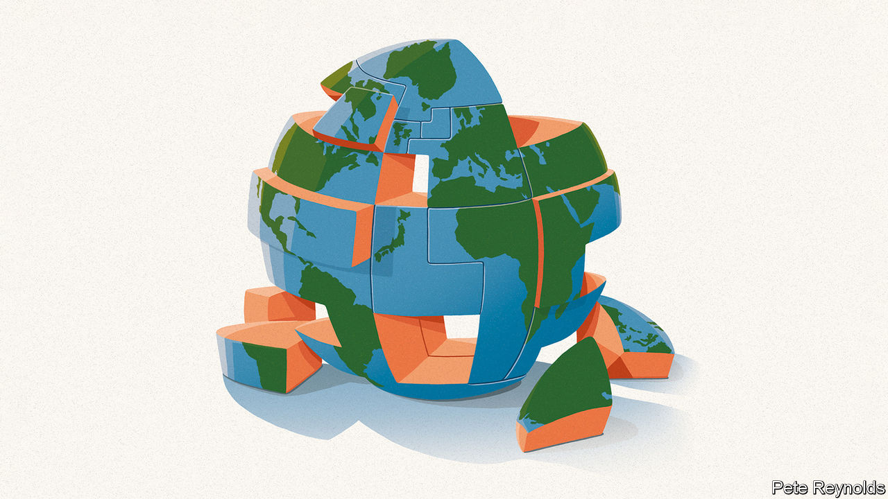

###### Reinventing globalisation

# The tricky restructuring of global supply chains 

##### Why too much resilience is dangerous 

 

> Jun 16th 2022 

Three years ago  used the term “” to describe the fragile state of international trade and commerce. After the go-go 1990s and 2000s the pace of economic integration stalled in the 2010s, as firms grappled with the aftershocks of a , a populist revolt against open borders and President Donald Trump’s . The flow of goods and capital stagnated. Many bosses postponed big decisions on investing abroad: just-in-time gave way to wait-and-see. No one knew if globalisation faced a blip or extinction.

Now the waiting is over, as the pandemic and war in Ukraine have triggered a once-in-a-generation  in boardrooms and governments. Everywhere you look, supply chains are being transformed, from the $9trn in inventories, stockpiled as insurance against shortages and inflation, to the fight for workers as global firms shift from China into Vietnam. This new kind of globalisation is about security, not efficiency: it prioritises doing business with people you can rely on, in countries your government is friendly with. It could descend into protectionism, big government and worsening inflation. Alternatively, if firms and politicians show restraint, it could change the world economy for the better, keeping the benefits of openness while improving resilience. 

After the Berlin Wall fell in 1989, the lodestar of globalisation was efficiency. Companies located production where costs were lowest, while investors deployed capital where returns were highest. Governments aspired to treat firms equally, regardless of their nationality, and to strike trade deals with democracies and autocracies alike. Over two decades this gave rise to dazzlingly sophisticated value chains that account for half of all trade: your car and phone contain components that are better travelled than Phileas Fogg. All this kept prices low for consumers and helped lift 1bn people out of extreme poverty as the emerging world, including China, industrialised.

But hyper-efficient globalisation also had problems. Volatile capital flows destabilised financial markets. Many blue-collar workers in rich countries lost out. Recently, two other worries have loomed large. First, some lean supply chains are not as good value as they appear: mostly they keep costs low, but when they break, the bill can be crippling. Today’s bottlenecks have reduced global gdp by at least 1%. Shareholders have been hit as well as consumers: as chip shortages have stalled car production, carmakers’ cashflows have dropped by 80% year on year. Tim Cook, the supply-chain guru who runs Apple, reckons such snafus could reduce sales by up to $8bn, or 10%, this quarter. Covid-19 was a shock, but wars, extreme weather or another virus could easily disrupt supply chains in the next decade.

The second problem is that the single-minded pursuit of cost advantage has led to a dependency on autocracies that abuse human rights and use trade as a means of coercion. Hopes that economic integration would lead to reform—what the Germans call “change through trade”—have been dashed: autocracies account for a third of world gdp. Vladimir Putin’s invasion of Ukraine has painfully exposed Europe’s reliance on Russian energy. This week McDonald’s in Moscow, which opened in 1990, restarted under local control. Big Macs are no longer on the menu. Meanwhile, President Xi Jinping’s ideological and unpredictable China has a trade footprint seven times as big as Russia’s—and the world relies on it for a variety of goods from active pharmaceutical ingredients to the processed lithium used in batteries.

One indication that companies are shifting from efficiency to resilience is the vast build-up in precautionary inventories: for the biggest 3,000 firms globally these have risen from 6% to 9% of world gdp since 2016. Many firms are adopting dual sourcing and longer-term contracts. The pattern of multinational investment has been inverted: 69% is from local subsidiaries reinvesting locally, rather than parent firms sending capital across borders. This echoes the 1930s, when global firms responded to nationalism by making subsidiaries abroad more self-sufficient. 

The industries under most pressure are already reinventing their business models, encouraged by governments that from Europe to India are keen on “strategic autonomy”.  is copying Elon Musk’s Tesla by moving towards vertical integration, in which you control everything from nickel mining to chip design. Taiwan’s electronics assemblers have cut their share of assets in China from 50% to 35% since 2017 as clients such as Apple demand diversification. In energy, the West is seeking long-term supply deals from allies rather than relying on spot markets dominated by rivals—one reason it has been cosying up to gas-rich Qatar. Renewables will also make energy markets more regional.

The danger is that a reasonable pursuit of security will morph into rampant protectionism, jobs schemes and hundreds of billions of dollars of industrial subsidies. The short-term effect of this would be more volatility and fragmentation that would push prices yet higher: witness President Joe Biden’s consideration of new tariffs on solar panels, which he paused this month in the face of shortages. The long-run inefficiency from indiscriminately replicating supply chains would be enormous. Were you to duplicate a quarter of all multinational activity, the extra annual operating and financial costs involved could exceed 2% of world gdp. 

The trouble with safe spaces

That is why restraint is crucial. Governments and firms must remember that resilience comes from diversification, not concentration at home. The choke-points autocracies control amount to only about a tenth of global trade, based on their exports of goods in which they have a leading market share of over 10% and for which it is hard to find substitutes. The answer is to require firms to diversify their suppliers in these areas, and let the market adapt. Will today’s governments be up to the task? Myopia and insularity abound. But if you are a consumer of global goods and ideas—that is to say, a citizen of the world—you should hope globalisation’s next phase involves the maximum possible degree of openness. A new balance between efficiency and security is a reasonable goal. Living in a subsidised bunker is not.■


