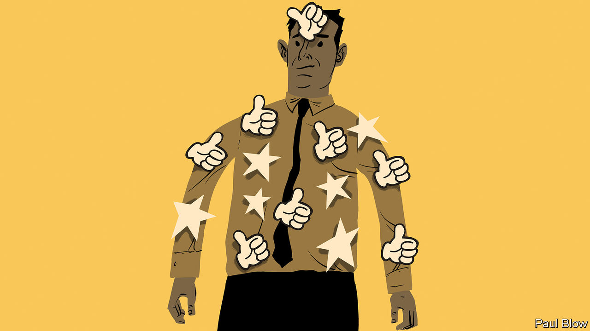

###### On nuclear weapons, California, Southern Baptists, animals, management

# Letters to the editor 

##### A selection of correspondence 

 

> Jun 16th 2022 


Nuclear horrors

I was a 13-year-old schoolgirl on the summer morning when a nuclear weapon detonated above Hiroshima. Trapped beneath the debris, I listened to my classmates call for their mothers while they burned alive. Later I walked through streets that had been transformed in a literal flash into something beyond nightmares. People staggered towards me, blackened, burnt and swollen, their skin hanging off them, begging for water, begging for help. But there was no water, there was no help. 

Thank you for pointing out the dangers of fading memories and weakening moral revulsion of nuclear war (“A new nuclear era”, ). Too often I read articles discussing nuclear weapons in abstract, analytical terms, as if they were chess pieces. I have dedicated my life to raising awareness of the terrible risks and appalling human consequences of nuclear weapons, as have many of my fellow survivors. But each year we grow fewer, our voices fainter. I hope your article will encourage younger readers to act and organise against these weapons, before it is too late.

setsuko thurlow

Survivor of Hiroshima


Any use of nuclear weapons would have catastrophic consequences, ranging far beyond the area in which they were detonated. A single nuclear detonation would probably kill hundreds of thousands of civilians and injure many more; radioactive fallout could contaminate large areas across many countries. Widespread panic would trigger mass movements of people and severe economic disruption. Multiple detonations would be much worse. 

Nuclear weapons are therefore not the preserve of a few powerful states, but a global problem affecting all humanity, like climate change and pandemic diseases. They require a global response. This is the purpose of the un Treaty on the Prohibition of Nuclear Weapons. With the entry into force of this treaty in January 2021, nuclear weapons are now comprehensively prohibited under international law, as has long been the case for biological and chemical weapons. Prohibition does not magically solve the problem, but it is a crucial first step in delegitimising these weapons. 

From June 21st to 23rd, the parties to this treaty will convene in Vienna for their first meeting, to plan the next steps in taking forward their mission. This will include dealing with the risks inherent in nuclear deterrence, recent nuclear threats and assisting victims of past nuclear explosions, such as weapon tests in the Pacific and Kazakhstan. I urge your readers to encourage their governments, whether or not they have joined the treaty, to participate.

alexander kmentt

President-designate

First Meeting of States Parties to the Treaty on the Prohibition of Nuclear Weapons


 


Your assessment of the growing risks posed by nuclear weapons was accurate and alarming (“Thinking the unthinkable”, ). But Russia’s reckless actions have not brought about a new nuclear era; they have just highlighted the unacceptable dangers of the existing one. For decades we have been told that nuclear deterrence is essential for maintaining peace and security. Now we see the true face of deterrence strategy: nuclear-armed states are using the threat of these weapons to coerce and intimidate, to facilitate aggression, to restrict the range of responses, and to provide a cover for war crimes.

The world will never be safe as long as any country has nuclear weapons. The only way to prevent nuclear coercion is to use this moment to stigmatise nuclear threats and to eliminate the weapons entirely. We need to increase political and economic pressure on Russia to end the war and to engage in serious disarmament negotiations. This in turn means engaging the other nuclear states in disarmament efforts.

Russia’s actions have made two things clear. Legitimising nuclear deterrence means providing nuclear blackmailers with power and cover; and global nuclear disarmament is not some Utopian goal, but an urgent security imperative.

beatrice fihn

Executive director

International Campaign to Abolish Nuclear Weapons


 


Early summer coolness

A note on the Californian summer (“Talk to him, Goose”, ). We enjoy a coastal phenomenon in California known as the marine layer. Locals refer to the early summer as May grey and June gloom. With this cool chill in the air, we are served the literal and otherwise perfect cover to sport those “fur-collared jackets” that Tom Cruise wears in “Top Gun”, along with our Ray-Bans while riding Kawasakis along the beach.

suzanne franklin


 


The religious mindset

As Lexington noted, Southern Baptists have been weakened by groupthink (). This is a cognitive error to which religious fundamentalists seem especially vulnerable. Groupthink and projection of blame are the usual response to ideas and evidence that challenge any group's core beliefs. In science, basically every theory is tentative and open to refutation. Christian fundamentalists believe in the inerrancy of the Bible, so they are prone to attacking anyone who points out its many internal contradictions. When fundamentalist ministers commit sexual abuse, they often project their own libido onto the object of their sexual interest, believing that their victim bears full responsibility for the abuse. 

One must question belief in progress when we remind ourselves that it is now more than 1,600 years ago since St Augustine converted to Christianity, only after his friend, the bishop of Milan, taught him to read the Bible allegorically rather than literally.

richard waugaman

Clinical Professor of Psychiatry

Georgetown University

 

Imagine being a bird

The reviewer of James Bridle’s book “Ways of Being” was right to invoke Ovid in trying to understand the “otherness” of animals and other forms of intelligence (“Arrival of the interspecies”, ). Science can do only so much. What we need is imagination, to put ourselves in the minds of animals. 

Ted Hughes was an enthusiast and translator of Ovid, and a great poet of animals. Perhaps the finest of his animal poems “Hawk Roosting” from the collection “Lupercal” puts us tantalisingly in the mind of the hawk. It knows no past and no future, only the present, something that is almost impossible for us to imagine. 

The last four lines are: The sun is behind me/Nothing has changed since I began/My eye has permitted no change/I am going to keep things like this.

mike stephenson


 


Just can’t get the staff

Bartleby’s insight that “managers can harness the power of small gestures to make a real difference to their teams” () reminded me of my good old days at ibm. One of my subordinates liked to say that he would be a better leader if only he had better followers.

alvin ginsburg


