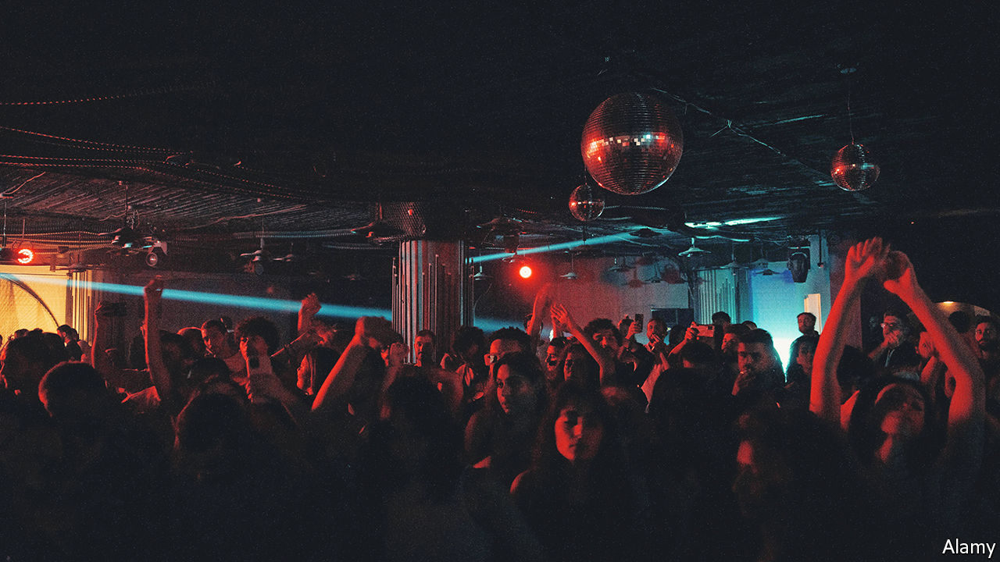

###### Little left to steal

# Bashar al-Assad is hollowing out Syria’s ravaged state 

##### Protection rackets and drug-dealing are big sources of income 

 

> Jun 16th 2022 

Forget flamboyant Arab dictators in military attire laden with medals or clad in swirling tribal robes. Bashar al-Assad, Syria’s president, is the picture of modesty. Usually he wears no jewellery, no wedding ring nor even a glittering watch. His preferred garb is a plain black suit and tie. His speeches are a cure for insomnia. Yet in a region of kleptocratic rulers, few have plundered their country so completely.

Life for his people should have improved after the defeat of Islamic State in 2019 and the regime’s recapture of large chunks of rebel-held territory. Instead it is worse. Electricity is more often off than on. The population of the areas under the regime’s control has halved since the start of the rebellion in 2011; 90% of them live in poverty, many surviving on foreign aid and remittances. The currency has lost 90% of its value. Officials blame Western sanctions, covid-19, the collapse of banks nextdoor in Lebanon and, most recently, the war in Ukraine, a big source of wheat. But a prime cause is Mr Assad’s cannibalising of his country. “He rules like a Mafia boss,” says a confidant who recently defected.

Copying Saudi Arabia’s crown prince, a few years ago Mr Assad decided to shake down the monied establishment. Senior businessmen were summoned to the Damascus Sheraton Hotel. Some of those who refused to hand over assets or shares were detained for further interrogation in Branch 251, one of his security service’s detention centres in Damascus that is notorious for torture. Rami Makhlouf, Mr Assad’s first cousin and the regime’s top middleman, was put under house arrest. Several of Syria’s richest men—bankers, traders and a winemaker—fled. Hundreds of businesses were seized or closed.

A shabbier crop of tycoons took their place, according to a report by Harmoon, a think-tank based in Istanbul. Many are warlords who launder the proceeds of smuggling. Rather than invest in manufacturing enterprises which the regime might seize, they prefer to own fancy restaurants. A new one recently opened in Damascus, with Lamborghinis and Teslas parked outside. Racketeering is rife. Thousands are said to have passed through Branch 251 for not paying protection money.

Mr Assad also makes a fortune from gas, petrol and electricity. While ordinary Syrians are often in the dark and immobile, he supplies Lebanon’s power brokers, who pay in dollars. Hizbullah, Lebanon’s Iranian-backed political movement-cum-militia, gets fuel as a reward for fighting for Mr Assad’s regime. Another presidential scam is the sale of passports to the many Syrians desperate to leave. Agents charge $1,000 for fast-track processing or to get names cleared from blacklists at checkpoints.

Mr Assad’s most lucrative source of revenue is drugs. According to the New Lines Institute for Strategy and Policy in Washington, 15 factories within his fief produce captagon, an amphetamine; another 20 smaller outfits make the stuff near the borders with Lebanon and Jordan. Some have diversified into crystal meth. So large is the operation that Syrians call it the , or syndicate. Bedouin once used to smuggle pills in sheep stomachs and vegetable trucks. These days illicit drugs are exported in armoured vehicles protected by drones and heavy weapons. 

Mr Assad dismisses claims of involvement. But comrades who have recently turned against him say the operates out of the financial department of the presidency, supervised by an aide described as “Syria’s Pablo Escobar” after a dead Colombian drug lord. This shadowy figure is said to co-ordinate transport onto ships off the Mediterranean coast, using his private security company to escort convoys. He also summons businessmen on Mr Assad’s behalf with demands for contributions to the Syria Martyrs’ Fund, another nice earner. Traders are said to arrive at the presidential palace with suitcases of cash.

Some say Mr Assad’s narco-business allows him to buy the loyalty of his fellow Alawites, the Muslim religious minority that has long served as his regime’s base. Many Syrians from the Sunni majority were chased off their land, swathes of which were handed to Alawites, who at first cheered on the regime’s brutal repression. But in the end few benefited from Mr Assad’s demographic engineering. 

Recently many Alawites have deplored Mr Assad’s rapprochement with Sunni leaders, especially in the United Arab Emirates, sensing a betrayal. They also disliked his decision to free hundreds of Sunni detainees during the recent fasting month of Ramadan. They are angered, too, by cuts in the subsidies for basic food and fuel. Protests on- and off-line have been growing. “The groups who fought for Mr Assad have turned against him,” says an Alawite defector. A new cyber-crimes law punishes anyone who “stirs up negative public opinion” with years in jail.

With his Russian ally distracted by the war in Ukraine, Mr Assad is less confident of his own security. On June 10th Israeli missiles struck Damascus’s main airport; some say it will be out of action for weeks. Reports in Israel’s press say Mr Assad’s palaces could be next. Syrians fear being drawn into a war as an ally of Iran. 

Yet the general impoverishment has advantages for Mr Assad. Seeing the wreckage of the country, fewer foreigners are keen to fight for what is left of it. And even as Syria’s currency collapses, those in Mr Assad’s inner circle with dollars are still able to thrive. Besides, most people seem crushed and pliant. “However bad things get,” says a un official, “Syrians are too tired to return to war.” ■

