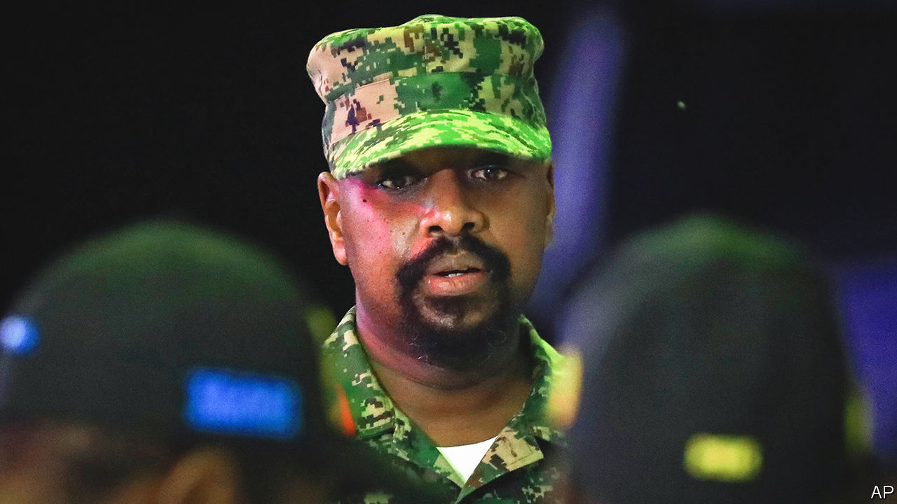

###### The son also rises

# Is Uganda heading for a dynastic succession? 

##### It would set the country on a dangerous course 

 

> Jun 16th 2022 

He is the son of the president and a vainglorious Twitter user. He is also a belligerent general whose soldiers are accused of kidnapping and torturing opponents. And in a series of extravagant birthday parties and public events, Lieutenant-General Muhoozi Kainerugaba is stirring talk of a future presidential bid. “Uganda belongs to Team mk!” he boasts in one tweet. “We will not stop until we are in complete control!” runs another. 

What does this mean? “I’m mostly talking about the young generation and their interests,” says General Kainerugaba, dressed in combat uniform at an army base. Does he want to be president? “It’s not something I’ve yet fully assessed and there are still things I want to do in the military.” Will he stand in the next election? “I am not considering running in 2026,” he says. 

Divining Uganda’s future is like peering into thick fog while walking on the edge of a cliff. In 1986, when General Kainerugaba was a schoolboy, his father Yoweri Museveni marched into power at the head of a rebel army, soon winning support from the West. The talk back then was of restoring democracy and peace. These days the main question is whether the 77-year-old will ever step down, having removed all obstacles to remaining president for life. 

If Mr Museveni has a plan, he is not letting on. He faces the same challenge as all ageing autocrats: how to preserve his position as his vigour wanes. Others in Africa (and elsewhere) have built dynasties. Togo and Gabon are ruled by the sons of dead dictators. Last year Mahamat Idriss Déby Itno took over in Chad after the death of his father. In Cameroon the son of Paul Biya, who has ruled for even longer than Mr Museveni, is said to covet the top job. 

Mr Museveni practises a personalised style of leadership which has enfeebled institutions, replacing them with informal networks of power. His wife Janet, the education minister, has a web of well-placed friends and relatives. His brother, Salim Saleh, a retired general with tentacular business interests, is considered the country’s second-most powerful man. 

These networks could unravel when Mr Museveni is gone. There is a lesson in Angola, where José Eduardo dos Santos stepped down in 2017 after 38 years in charge, only to see his children prosecuted for corruption. When power is concentrated in one family, it is safest to keep it there. 

That may explain the ascent of General Kainerugaba, who was promoted to the post of commander of the land forces last year. His first name, “Muhoozi”, means “avenger”—because, according to the president, “This is the one who will avenge me in case something is done to me.” A generation of officers have risen alongside him, often passing through Special Forces Command (sfc), a feared presidential guard. In a sign of his growing clout he was recently dispatched to mend relations with Rwanda, ending a three-year border closure. 

There is, however, one snag in bequeathing power: General Kainerugaba himself. He shows none of Mr Museveni’s charisma or nous. Old friends who trained with him at Sandhurst, a British military academy, remember an avid  reader who was obsessed with soldiering. On Twitter he brags that his parties have “the hottest women on earth”. His erratic tweets about the conflicts in Congo, Ethiopia and Ukraine jar with official policy and befuddle diplomats.

More troubling still is his record on human rights. During last year’s general election, the security forces allegedly abducted hundreds of opposition activists and tortured them, sometimes by electrocution or applying hot irons to bare skin. Mr Museveni said 242 people were detained by military intelligence and 53 were held by sfc, which was then under the command of his son, who was named in a complaint in 2021 to the International Criminal Court alleging abuse by the security forces. In another case Kakwenza Rukirabashaija, a writer, was dragged from his home by soldiers after insulting Mr Museveni and his son on Twitter. He reappeared a month later with scars on his back. He alleges that he was tortured at sfc‘s headquarters under the supervision of General Kainerugaba. 

 “That’s a figment of his imagination,” says General Kainerugaba in response. As for the detained activists, they were held by “another unit, not sfc”. What about the shooting dead of more than 50 people during riots in 2020, when he was a presidential adviser? “Every soldier has a right to self-defence,” he says, insisting he played “no role” on the day. He cannot explain what threat was posed by the likes of Amos Ssegawa, a schoolboy shot while walking home with his mother.

Moreover, the coronation of General Kainerugaba is far from assured. It is whispered that some in the president’s family have doubts. In January Odrek Rwabwogo, a son-in-law to Mr Museveni, warned that those “pushing narrow succession agendas” could generate a “backlash” against the ruling party. The president has never made his own preference clear and may be testing his son in the spotlight. “He wants to see: can this country stomach a family succession?” suggests Andrew Mwenda, a journalist and close friend of the first son. Barring ill health, few expect Mr Museveni to step down before he dies. 

But the push for the son could take on a life of its own. General Kainerugaba tells  he wanted to retire from the army in March—a prerequisite for entering politics—but was persuaded otherwise. He says young people are pleased that he has been “protecting them, fighting for them, securing the country”. His backers paint the 48-year-old as the antidote to Bobi Wine, a singer who ran against Mr Museveni in the most recent election. 

They are deluding themselves. Ugandans are fed up with joblessness and corruption. Mr Museveni relies on violence and patronage to maintain his grip. “To think that he can switch in anyone else using the same manipulative methods he has been using is really playing Russian roulette,” says Mugisha Muntu, who led the army in the 1990s. “Something always gives.”

Another disenchanted veteran, Kizza Besigye, compares the country to an absolute monarchy. He has run four times for president against his old comrade, and been tear-gassed and arrested for his troubles. He has just spent two weeks in jail for protesting against rising consumer prices. “Whereas the military captured the power of Uganda, the family captured the military,” he says. A chaotic transition can still be avoided. But the fog is as thick as ever, and the cliff edge nears. ■

