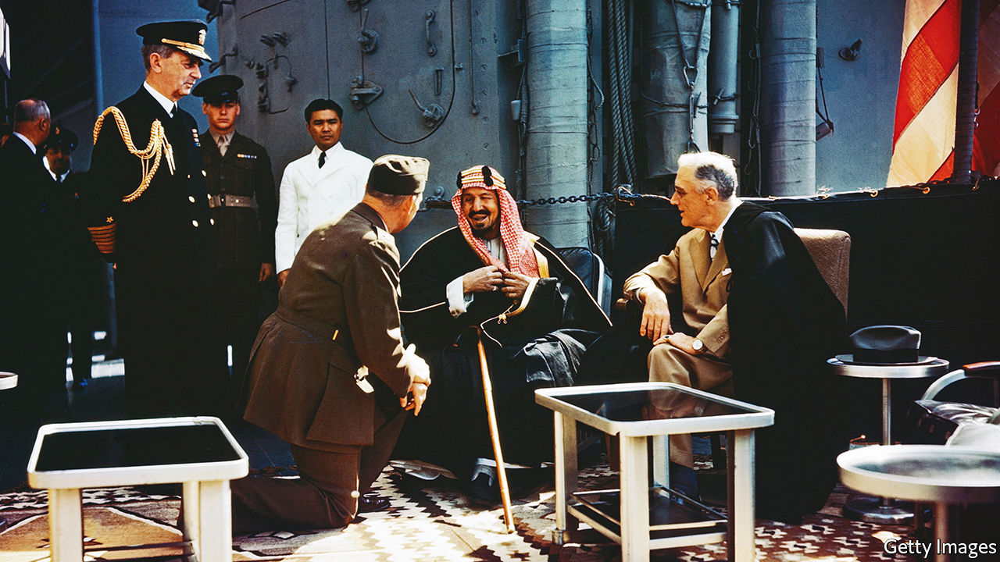

###### Change you can’t believe in

# Joe Biden’s Middle East policy looks a lot like his predecessor’s 

##### The nuclear deal is out, the Saudis are in, and human rights are barely on the table 

 

> Jun 16th 2022 

Joe biden wants you to know his trip is not about oil. You may think otherwise. He once vowed to make Saudi Arabia a “pariah” and has refused to talk to Muhammad bin Salman, the crown prince. Now he is rushing off to the kingdom, the world’s second-biggest oil producer, at a time of sky-high oil prices, and will meet the prince after all. But his administration insists that oil is not the focus of his flying visit. “It has to do with much larger issues,” Mr Biden said on June 12th.

Such protestations may be a tacit admission that the trip, planned for next month, is unlikely to do much to reduce the oil price. Such realism has been in short supply since Mr Biden took office. He at first promised a different Middle East policy from his predecessor’s. He would restore the nuclear deal with Iran, signed in 2015 but abandoned by Donald Trump in 2018. He would shun the Saudis. And he would put human rights at the centre of America’s foreign policy.

None of that has happened. Mr Biden has overpromised and underdelivered. His tone has differed from Mr Trump’s; American officials argue there are some policy differences, too. As well as seeking to revive talks with Iran, they have more keenly sought a ceasefire, which is now holding, in Yemen. But the substance is increasingly similar: many of Mr Biden’s policy outcomes are the same as Mr Trump’s. 

Start with the nuclear deal, known as the Joint Comprehensive Plan of Action (jcpoa), which eased sanctions on Iran in return for curbs on its nuclear programme. Mr Trump hoped to beggar Iran into stopping nuclear work altogether and changing its foreign policy. But his so-called “maximum pressure” campaign failed. Iran did not bend, but resumed prohibited nuclear work and launched attacks on American allies in the region.

Rather than return to the old deal, Mr Biden sought what Antony Blinken, his secretary of state, called a “longer and stronger” agreement. But negotiations in Vienna did not start until last April, just two months before a presidential election in Iran. The president it brought to power, Ebrahim Raisi, is a hardliner even by Iranian standards. Unsurprisingly, he is less amenable to a deal than his predecessor.

Still, Iran and America were close to one this spring. One of the final sticking-points was America’s labelling of the Islamic Revolutionary Guard Corps (irgc) as a terrorist organisation. American negotiators had offered last year to reverse that, which would have been controversial but meaningless, as the irgc would have remained under a heap of other sanctions. But Mr Biden hemmed and hawed for months about whether to agree before deciding not to.

The talks are now at a standstill. The International Atomic Energy Agency, the un’s nuclear watchdog, reported last month that Iran has 43kg of uranium enriched to 60% purity, a bomb’s worth of fissile material if enriched up to 90%. Even those in Washington who still hoped for a deal think it is dead, though they doubt Mr Biden’s team will admit it. They grumble that the president burned through political capital for a year to negotiate with Iran, only to duck a hard decision at the end.

He has done the opposite with Saudi Arabia. Boycotting Prince Muhammad was popular with Democrats angered by his ties with Mr Trump, his war in Yemen and his role in the murder of Jamal Khashoggi, a Saudi journalist butchered in 2018. But this was never sustainable. Saudi Arabia has been a close American ally since 1945, when Franklin Roosevelt met King Abdulaziz on an American warship (pictured above). Prince Muhammad will probably ascend the throne soon and may stay on it for decades. Not talking to him is not an option.

But Mr Biden seems to have reversed himself in the worst possible way. Despite his protestations, many in Washington see oil as the main point of his trip. Yet the Saudis are reluctant to break their so-called opec+ agreement with Russia and pump more. Some cartel members are already struggling to meet output quotas. The Saudis insist that even if they did open the oil taps, bottlenecks at refineries would still keep petrol prices high. 

The benefit to Prince Muhammad is clearer. He will have the pleasure of an American president bending the knee. Mr Biden may bring other goodies. Brett McGurk, his top Middle East adviser, has been negotiating a deal over the status of Tiran and Sanafir, two islands in the Red Sea that Egypt agreed to cede to Saudi Arabia in 2017 but whose transfer has been held up by Israeli security concerns. There is talk of America negotiating fresh defence pacts with other Gulf states.

The administration hopes Saudi Arabia may take a step towards normalising relations with Israel. Two of its neighbours in the Gulf, Bahrain and the United Arab Emirates (uae), did so in 2020. Some American officials bet that closer Israeli-Arab ties will allow them to reduce Uncle Sam’s presence in the region: if those countries can protect each other, there will be less need for American security.

Saudi Arabia and Israel have compelling reasons, chiefly their shared hostility towards Iran, to pursue warmer ties. Barring drastic change in either country, Saudi recognition of Israel seems a question of when rather than if. But the Saudis are unlikely to make a deal on Mr Biden’s timetable. Instead they will probably drag the process out, hoping to pocket as many gains as possible before signing up. 

Mr Biden will stop in Israel before flying on to Saudi Arabia. He cannot be entirely sure who will greet him: the fractious coalition elected last year is teetering near collapse. America has donned kid gloves in dealing with Naftali Bennett, the prime minister. It fears its criticism of Mr Bennett may help Binyamin Netanyahu, his predecessor, who is plotting a comeback from the opposition benches.

As a result Mr Biden’s people have been mealy-mouthed about the expansion of Jewish settlements in the West Bank and the daily abuses of occupation. They have spoken lamely about the killing of Shireen Abu Aqleh, a Palestinian-American journalist shot dead in the West Bank last month (witnesses and forensic evidence indicate she was shot by an Israeli soldier).

In the Middle East, at any rate, human rights have not been the centrepiece of Mr Biden’s foreign policy; they are barely on the table. Diplomats trumpet the decision in January to cut $130m in military aid to Egypt (10% of its overall annual package) because it refused to take a few modest steps to improve its ghastly human-rights record. But officials in Cairo see it the other way round: they can rebuff America and still take home more than $1bn.

All of this disappoints many Democrats. The fault is not Mr Biden’s alone: Iran was an obstinate negotiating partner. But they point to a broader failure to rethink America’s role in the region, which three successive presidents have been eager to shrink. The Middle East has changed dramatically in the past decade. American policy has yet to change with it. ■

