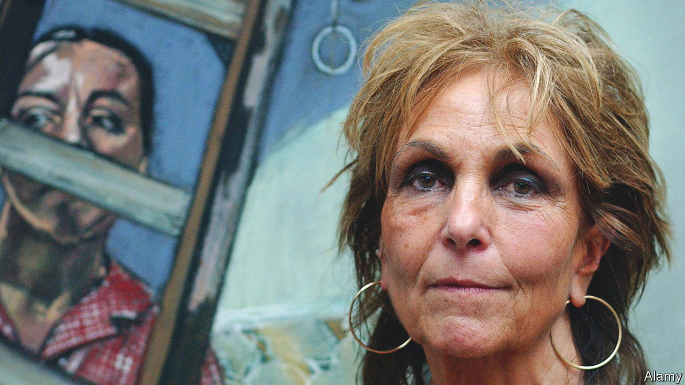

###### Paint power

# Paula Rego was a painter of rage, longing and loneliness 

##### The Portuguese-British artist died on June 8th, aged 87 

 

> Jun 15th 2022 

Always obey your man, ’s grandmother told her. Never say anything against him. Never cross him. Whatever he wants, you do. When, at a party, the 17-year-old art-school student, then still a virgin, met Victor Willing, a rising (and married) star at the Slade School of Fine Art in London, he pushed her into a little side room and instructed her to pull down her knickers. She did as she was told. An only child born into upper-middle-class privilege in a Portugal that was authoritarian, repressive and deeply conservative, she was an obedient girl, or so it seemed.

Her mother, stern and unyielding, certainly cleaved to those mores; Paula once painted her as a cabbage and decades later as a spider. But her father was a subversive influence. Liberal and anglophile, he thought Portuguese society was no place for women. He read her Dante’s “Inferno” from the edition scarily illustrated by Gustave Doré, and encouraged her to pick up a pencil and draw. For her 14th birthday he gave her a copy of Alfred Barr’s “Fantastic Art: Dada and Surrealism”, which turned out to be an inspired choice. Soon afterwards he supported her application to the Slade.

In the course of her relationship with Willing she endured several abortions. When she found herself yet again pregnant by him in 1955, it was her father who defied convention and brought her back to Portugal to have the baby she now wanted. Willing in time divorced his wife, and in 1959 she married him. In the turmoil of the Portuguese revolution in 1974, when the family business collapsed, they moved back to Britain. 

Theirs was a stormy union, but Willing, like her father, sparked her creativity, encouraging her to dig deep to shape and sharpen her artistic ideas. When he strayed, which he often did, she said nothing, but used her art to exact her revenge. Working on “Stray Dogs”, a picture inspired by a newspaper report about how the burghers of Barcelona put down poisoned meat in the streets to deal with the animals, she painted her nemesis as a fat reclining brown blob with a pinky-yellowish tongue, long and lascivious.

Painting became her way of making sense of the world, and revenge was not all she used it for. Inspired by the dark, cruel Portuguese fairy tales she had heard from her grandmother’s maids—as well as by “Snow White”, and a childhood sighting of the devil in the fire—she created stories of her own, using a brush instead of a pen. When she had the tale she wanted to tell, she would withdraw in her mind to a place she knew. She would remember the room, draw in the furniture, and then set the story there. 

She refused to conform to the ideal female form; from the beginning her women were fat, sexual, creepy, with splayed hairy legs and skirts lifted. Her first major work at the Slade, a reworking of Dylan Thomas’s “Under Milk Wood”, was set in a Portuguese kitchen, with squawking chickens and muscled women in aprons. “Gutsy”, she liked to call them. 

The brush was her obvious instrument, or weapon, but her favourite was the pastel stick; it was fiercer, harder and more aggressive, though she delicately rubbed on softer pastels afterwards. Like her Surrealist hero, Max Ernst, she honed in on the strange and the dark and liked to draw the viewer into her delight at the anti-social side of humanity: because she did delight and laugh at it, with a child’s ardour, even as she drew horrors. Not surprisingly, the painting she liked best was Ernst’s depiction of the Virgin Mary spanking the infant Jesus.

On and off she turned to political subjects, especially anything to do with Portugal. But decades of Jungian therapy, begun after a bout of deep depression in the late 1960s, made her political grievances take on a personal cast. That change was summed up in “The Dance”, a vast painting of three couples dancing in a mountain landscape by moonlight. Two women danced with a small child, one man with a woman who was pregnant. All represented domesticity. In the centre a handsome man with slanting eyes, Willing, danced with a blonde. On the left she herself was dancing, tall (taller than that blonde) strong, resolute and self-reliant. Her message was that women did not have to be domestic prisoners. They could work, like her, and artists were strongest when they worked and lived—and danced—alone. 

A decade later, after a referendum in Portugal had failed to legalise abortion, she started work on a series of large pastels depicting women curled up like a fetus or sitting open-legged on pails, pots or basins, usually alone. One was a schoolgirl in uniform. Both lovers and abortionists had exploited these women; they were coerced as well as defiant. But despite her own history they were not, she said, about her. The Portuguese press used the series to support a second, successful, referendum in 2007. A decade later she still thought they were the best work she had ever done.

In her mind’s eye

Like Goya, she was late in discovering graphic arts: prints, etching, aquatints, lithographs. But she tackled those slow, layered, nerve-racking processes as boldly as usual, pressing on, fearing nothing except that she might not reach what she saw in her mind’s eye. The prints and etchings she made of English nursery rhymes, such as “Hey Diddle Diddle”, “Humpty Dumpty” and “Three Blind Mice”, were among the most popular images she created. Not that she set out to please anyone. 

Asked once why she painted, she said it was to give fear a face. Obedience, or at least a longing to oblige her father, had led her to draw as a child; disobedience turned her into a great artist. Her husband understood that about her, as he did so much else. At 53, and with more than three decades still ahead of her, she was widowed. Afterwards, in a secret file called “Adieu”, she found a note he had written to her. Enjoy life, he said. It’s all there is. Trust yourself and you will be your own best friend. I know you will paint even better. And she did. ■

