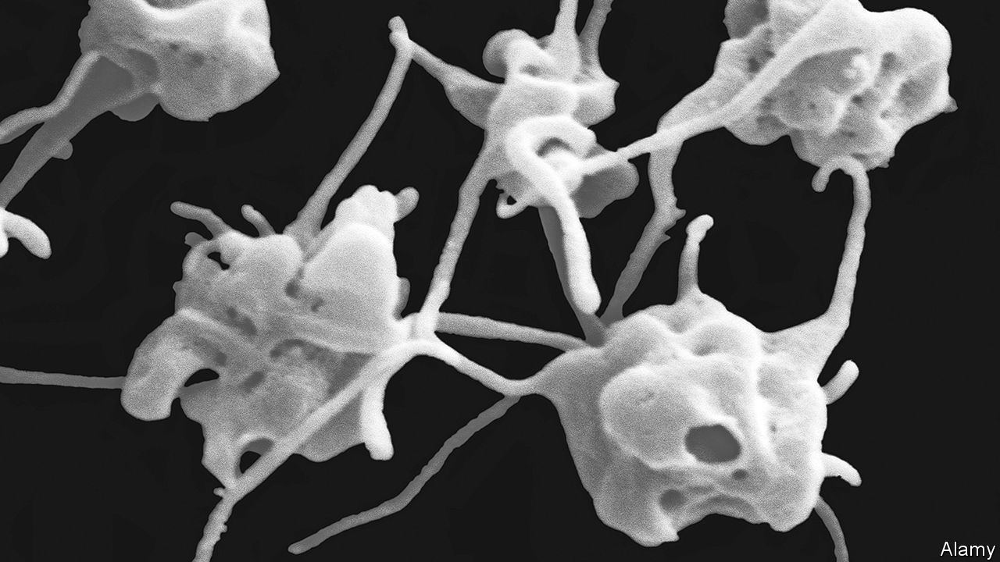

###### Stent technology

# How to hide surgical implants from the immune system 

##### Paint them with platelets 

 

> Jun 15th 2022 

Platelets play an essential role in healing. These curious beasts (pictured above), are cell fragments rather than complete cells—though they are still surrounded by cell membranes. Their main job, in collaboration with a protein called fibrin, is to stem the flow of blood from wounds by causing clots. They also encourage the regeneration of damaged tissue. 

This sort of activity at wound sites might normally draw the attention of the immune system, but that does not happen because platelets carry special proteins in their membranes which render them invisible to immune surveillance. Now, Wang Yunbing at Sichuan University in China writes in  that he has developed a way to apply these membranes to medical equipment of the sort destined for installation inside the human body. That may stop the immune system attacking such grafts as foreign objects.

The idea of coating equipment with platelet membranes has been around for a while. Since the relevant proteins were characterised 20 years ago, they have been used on numerous occasions to disguise nanoparticles employed for drug delivery. That involves manipulating the surface electric charges of the nanoparticles to make them sufficiently and uniformly negative in a way which encourages the membrane to fuse with them. 

For such small objects, this is reasonably simple. But not for large ones. Manipulating charge uniformly across a wide area is tricky, and no one has yet done it well enough to achieve successful fusion. Dr Wang therefore wondered if it might be possible to entice membranes to fuse to a large surface by manipulating that surface in other ways. Besides being attracted to negative charges, platelet membranes also spread easily and defect-free over “superhydrophilic” (exceptionally water-loving) surfaces. With this in mind, he tested a superhydrophilic material based on a substance called polydopamine, which he knew from previous work binds to a range of materials including plastics, metals and ceramics. So he gathered a team of colleagues together to fuse it to a metal stent.

Stents are used by heart surgeons to open up blood vessels that have got clogged. They are extremely effective at keeping people alive, but do attract the attention of the immune system, causing inflammation of the tissues around them, which results in scarring. If enough scar tissue forms, that can itself impede blood flow. Worse, it can result in part of the scar breaking off and causing a stroke or pulmonary embolism. Over the past two decades, types of stent have been designed that slowly release anti-inflammatory drugs and so reduce these risks. But success is not guaranteed, and the consequences of failure are severe. 

The team coated their experimental stents by dipping them in a solution of dopamine and a substance called sodium periodate. They then charged the coated stent to an appropriate negative voltage and dropped a suspension of “platelet-derived extracellular vesicles” (small bubbles of membrane that platelets can be induced to cough up by appropriate treatment) onto it, before incubating it at 37°C for a couple of hours. 

Hidden in plain sight

This done, examination with a microscope indicated that the stent was indeed covered in platelet membrane. But, to be sure the immune-shielding proteins were still there, the team used two special techniques, immunofluorescence and western blotting, to check for their presence. 

The acid test, however, was to try out the stents in animals. To that end they picked a group of rabbits and implanted into their abdominal aortas stents which had no coating, stents coated only in polydopamine, and stents which had also had platelet membranes attached to them. After eight hours, they removed some of the stents and looked for a build-up of inflammatory cells. They left the rest in place, allowed the animals to recover from the surgery, and then let them go about their lives for a month before killing them and collecting their stents for analysis. 

As expected, even after eight hours, let alone a month, the uncoated and the polydopamine-coated stents were saturated in cell growth triggered by immune activity. On both occasions, however, the membrane-coated stents were clean.

Translating this preliminary result in rabbits into a clinical application in human beings will be a hard graft, as it were. How long the coating will last remains unknown. And rabbits are not people, so the details of their physiologies are different. But as a start, Dr Wang’s work is remarkable, for it opens a whole, new avenue of investigation into the problem of sustaining medical implants. ■


