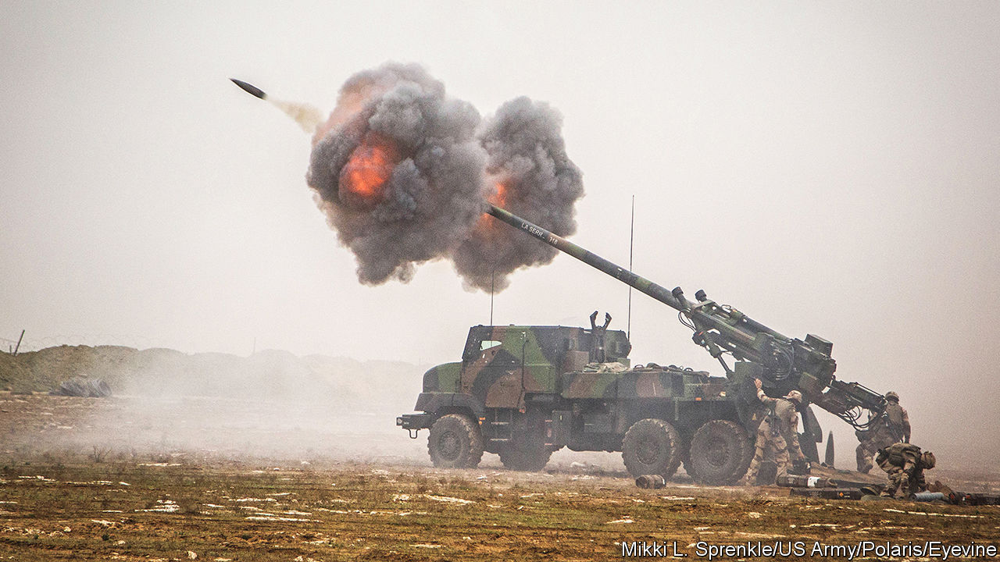
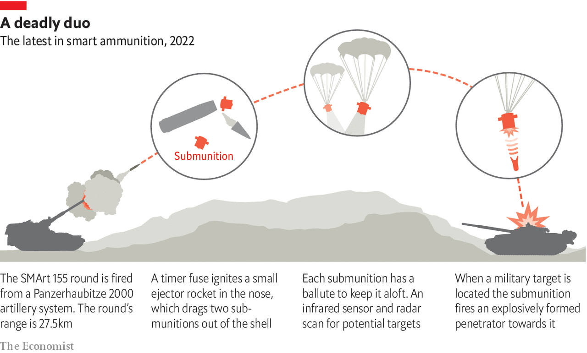

###### Artillery technology

# The modern cannons that may make the difference in Ukraine 

##### Who will pound harder? 

 

> Jun 15th 2022 

“Hard pounding this, gentlemen, but we will see who can pound the longest.” Thus spoke the Duke of Wellington on the afternoon of the battle of Waterloo, when Napoleon’s guns were pasting his troops. Those words come to mind as the war in Ukraine descends into an extended artillery duel, focused on the Donbas, in the country’s east. Phillip Karber is a former American marine who now leads the Potomac Foundation, a research and policy outfit in Virginia, and who regularly visits the war’s front lines to study the fighting. He reckons Russian artillery barrages are now responsible for about 80% of Ukrainian casualties. Figures on the other side are no doubt similar.

Whoever wins this duel will therefore probably win the war. And Ukraine is pinning many of its hopes of doing so on the sophisticated guns and ammunition it is receiving from well-wishers in the West.

Top of the list at the moment is the French caesar system (pictured above), made by Nexter, a firm in Versailles. This can hurl shells about 40km, which is 16km farther than the firm’s previous model, the trf1, could manage. So far, France has anted-up five or six of a promised dozen caesar howitzers, enabling Ukrainian crews to smash targets 50% farther away than they could manage just a few weeks ago.

Top guns

The secret of caesar’s range is its detonation chamber—the part of the gun where the propulsive charge explodes. At 23 litres, it is roughly four litres larger than the trf1’s chamber and can thus be packed with about 30kg of propellant. To contain this propellant’s explosion, the chamber is made of a stronger steel alloy than is used in the trf1. (The recipe for this is closely guarded.) To stop energy from the blast escaping through the barrel’s rifling grooves, shells are fitted with a ring of softer metal that creates a tight seal. And to give shells more time to gain speed, a caesar’s gun barrel is, at just over eight metres, about two metres longer than the trf1’s.

 


There are other tricks to boost range. For long shots, a ring-shaped “base bleed” device is often screwed onto the bottom of a shell. In flight, this gizmo releases compressed gas that fills what would otherwise be a trailing area of low pressure. That reduces drag-inducing turbulence enough to add several kilometres to a projectile’s range. Some shells are also designed with pop-out fins large enough to provide a “gliding phase” of flight. Nexter plans to introduce one such in 2025. 

A far more expensive approach is to put rocket engines on shells. On May 31st America announced it would send Ukraine guided rocket systems. The m142 High Mobility Artillery Rocket System, known as himars, can fire a munition called atacms a staggering 300km. Ukraine, however, is to receive shorter-range gmlrs rockets. These, which cost about $160,000 a pop, can reportedly punch a 91kg warhead into a moving vehicle more than 70km away. The Russian Smerch and Uragan rocket artillery in wide use in Ukraine offer less precision but more punch. Those systems fire 280kg warheads.

A three-man himars crew can launch a salvo without leaving the lorry’s armoured cab. And Lockheed Martin, the American firm that makes gmlrs rockets, says the satellite-guidance kit works even amid jamming. Britain and another, unnamed, country are meanwhile sending a similar system, mlrs, to Ukraine. Training people to use this sort of kit will take three weeks. But Ukraine is unlikely to receive the 60 launchers that an adviser to Volodymyr Zelensky, the country’s president, has said would be needed to halt Russia’s advance.

As for the accuracy of non-rocket-propelled artillery, Nexter says that, at ranges up to about 30km, caesar drops unguided 43kg shells within 140 metres of the target. In practice, precision is often greater than this. In one test in windless weather a caesar howitzer lobbed eight out of eight shells into a “box” 40 metres square, says Olivier Fort, a former colonel who led studies in artillery doctrine for the French army, and is now Nexter’s programme manager for future artillery. bae Systems, a British arms giant, offers similar accuracy. In good weather its archer howitzer lands unguided rounds within about 20 metres of targets 30km away. Ukrainian officials have requested archer guns.

Staying alive

Even temperatures matter. Andrii Moruha, a Ukrainian veteran who now works for Come Back Alive, a local charity that, among other endeavours, trains artillery crews in the country’s east, says every drop of 10°C shaves about 55 metres off a 4km shot. Artillery crews routinely loft instruments on a helium balloon to measure temperatures and wind speeds. Systems also take into account the temperature of the propellant loaded into the detonation chamber. Doppler radars clock the speed of projectiles as they leave the gun barrel. 

Today’s nato standard for shell size is another plus. nato artillery rounds have a diameter of 155mm, 33mm more than munitions fired by much of Ukraine’s legacy Soviet fare. The extra calibre roughly doubles the amount of explosive that fits inside. If tanks are separated by just ten or so metres, as many of Russia’s have been in this conflict, a single 155mm shell can obliterate one and disable two others. Shot for shot, Western artillery is deadlier than Russia’s guns, says Dr Karber, who was himself injured by shrapnel from a Russian barrage in 2015.

These bigger calibres have also helped engineers design specialised munitions such as incendiary and illumination rounds. nato armies now fire dozens of shell types, including ones fitted with delay fuses that detonate after penetration, in order to wreak greater destruction. These rounds are optimised to punch deep into a specific material, such as steel, concrete or soil. With the latter, the idea is to generate a bunker-collapsing shock wave. A nato 155mm anti-personnel airburst shell that uses a radar fuse to detonate at programmable heights sprays enough shrapnel to kill exposed infantry across a hectare.

That is fearsome firepower. But to be effective, an artillery crew must also avoid enemy fire. Operators of spotter drones consider enemy artillery positions a priority. And then there is the matter of counter-battery radars. These lorry-mounted systems work out where incoming shells were fired from. One such system that Russia is using against Ukraine, the Zoopark-1m, can simultaneously pinpoint the origins of a dozen incoming 155mm shells from as far away as 12km. But cobra, a European-made counter-battery radar that Germany is supplying to Ukraine, can do likewise for as many as 40 artillery pieces roughly 100km away.

These radars crunch numbers fast. The technology has allowed Russian units to hammer Ukrainian artillery positions just four minutes after they fire an opening shot. Perhaps it is little wonder, then, that artillery technologists are obsessed with shortening the time it takes to drive into a position and “shoot and scoot”. 

With caesar, a crew can prepare an initial shot in just 40 seconds. The gun can then be fired ten times a minute, four times more often than was possible with the trf1. To help achieve such performance, Nexter redesigned the mechanism that seals the detonation chamber. After a final shot, the gun is ready to drive away within 40 seconds. As for bae’s archer, it can fire four shells 40km and drive off before the first one hits its target 55 seconds later. Jim Miller, a former American-army gunner who is now vice-president for combat systems with bae in Virginia, puts it thus: “If anyone shoots back, they’re just hitting the ground where you used to be.”

Those operational speeds are made possible in part by hydraulic autoloaders. A good example is that in the Panzerhaubitze 2000, an artillery piece made by Krauss-Maffei Wegmann, in Munich, of which Germany has said it is sending Ukraine a dozen. Inside the armoured vehicle which carries the gun a robotic arm slides on a track, grabs a shell stored upright on a rack and places it flat on a conveyor, which carries it to a hoist mechanism. Here, it is lifted and placed into the cannon’s breech. A pneumatic “flick rammer” shoves the round into the chamber. The system loads and fires a round in six seconds, though a special burst mode can shoot three rounds in ten seconds.

Firing rates have also been improved by better software. To aim shots at Russian-backed separatists in 2014, Mr Moruha used a pen, paper and calculator to work out the trajectory. That took several minutes. Today, Ukrainian units usually type target co-ordinates from a drone (or, less frequently, a forward observer) into software that immediately determines the necessary adjustments. With today’s best artillery, barrel settings are precise enough to adjust distant landing spots in increments of a mere 20 metres or so. 

Another advance has been a shift from towed to self-propelled guns mounted on a wheeled or tracked chassis, of which caesar and the Panzerhaubitze 2000 are good examples. Towed artillery takes longer to move, especially off road. Brent Eastwood, a one-time infantry officer who left the American army in 2004, likens positioning the towed artillery common in his day to manoeuvring “a Winnebago rv”. Moving such equipment away from a firing position can take as long as five minutes. Improvements in counter-battery radars have turned that delay into a death trap.

Then there are guided artillery shells. With fins to steer them in flight, the West’s best are accurate to within a metre or two. The Excalibur S, for example, uses a scanner in its nose cone to spot an infrared laser beam aimed by a drone or forward observer. Its maker, Raytheon, says the round can fly 40km and hit a moving vehicle.

Other sorts need no laser to “paint” their destination. One such is the smart 155 produced by Diehl and Rheinmetall, a pair of German firms. While descending on an area with potential targets in it, the 47kg shell ejects two submunitions (see diagram on previous page). Each of these has a so-called ballute (a cross between a balloon and a parachute) to keep it aloft for as long as possible, and an infrared sensor and a radar that together scan for potential targets. If an object’s scanned signature matches something in a library of military targets which the submunition carries in its memory bank, the submunition fires an explosively formed penetrator at the target. Nexter and bae produce a similar system called 155 bonus, though its two submunitions descend on winglets rather than ballutes.

Smart shells do have drawbacks. Some use the global positioning system, which is jammable, to work out where they are. And a shell packed with electronics has less room for explosives. Those electronics, moreover, have a tendency to degrade over the course of time. Such a shell may thus have a shelf life as short as 15 years. That might not sound too bad. But a single 155 bonus shell costs about $40,000, an order of magnitude more than a standard round, so reordering is expensive.

I need ammunition, not a ride

How much firepower of this sort has been sent to Ukraine is not public information. But the Ukrainians claim it is insufficient. A colonel who requested anonymity laments that his country remains “in waiting mode” for these systems. Andrew Milburn, founder of Mozart Group, a charity that trains soldiers in Ukraine, agrees. Mr Milburn, who was until 2019 a colonel in the American Marine Corps and who led special operations in the Middle East, reckons not enough high-tech Western artillery has been sent to give the Ukrainians an edge.

Perhaps, though, the balance of power will change anyway. According to Molfar, a Ukrainian intelligence firm with eight analysts who collect data on Russian artillery shots, the accuracy of Russian artillery strikes is broadly declining. (Users of the information Molfar provides include the Security Service of Ukraine, known as the sbu, and America’s defence department.) Russia’s stocks of precision shells are therefore probably dwindling.

Aiming is another difficulty. Mr Milburn says Ukraine suffers from a woeful shortage of longer-range reconnaissance drones like the ScanEagle, a product of Insitu, a subsidiary of Boeing. He says many more such drones are needed to transmit the co-ordinates of targets to the fire-direction centres that assign shots to artillery crews. But Russia also appears to be struggling to collect good data on targets.

Olga Khmil, one of Molfar’s intelligence analysts, says Russia is now using group channels in messaging apps like Telegram to aim its artillery better. Russians pretending to be Ukrainians on these channels feign fear of shelling in order to elicit information about infrastructure that has and has not been hit. On May 24th the sbu revealed an even more devious approach to such espionage. The agency said it had discovered that Russian intelligence was using smartphone games to induce unwitting youngsters to snap and upload geotagged photos of critical infrastructure, military and civilian. In exchange, players receive virtual prizes of no value outside the video-game world. And Russia gets to wreck their country. ■


