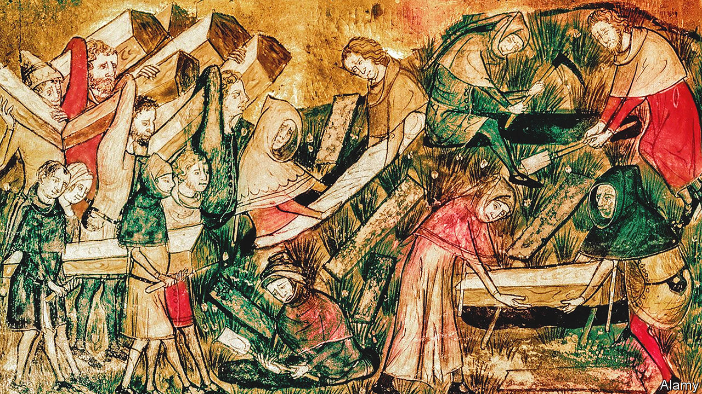

###### Pandemics

# The origin of the Black Death 

##### It probably started in Central Asia, around 1338 

 

> Jun 15th 2022 

History’s deadliest  was the Black Death, an outbreak of  that ravaged Europe, the Middle East and north Africa between 1346 and 1353. Where it struck, it killed up to 60% of the population. Even after this first, exceptionally lethal wave had passed, local plagues continued for about 500 years, and the disease still spills over into people from rodent “reservoirs” from time to time. 

Insight into the Black Death’s origins came in 2012, when Cui Yujun’s team at the Beijing Institute of Microbiology and Epidemiology sequenced genomes of, the plague bacterium, collected from five countries. Dr Cui’s results suggested four lineages of the bug had emerged in quick succession during an evolutionary big bang. Calculations based on the estimated speed of evolution led them to suggest this so-called polytomy happened between 1142 and 1339.

A paper published this week in , by a team led by Maria Spyrou of the University of Tübingen, in Germany, builds on Dr Cui’s work. It claims an ancestor of all four lines existed in part of modern-day Kyrgyzstan as recently as 1338—the near-most extremity of Dr Cui’s distribution. This suggests the explosion of diversity he observed was a direct precursor to the plague’s devastating irruption.

Dr Spyrou and her colleagues concluded this by analysing samples from two cemeteries alongside Lake Issyk-Kul, near the border with Kazakhstan. The gravestones here, which are disproportionately marked with dates corresponding to 1338 and 1339 ad, have attracted plague scholars’ attention for decades, both because of the high mortality rate they imply and of the epitaphs’ invocation of an unnamed pestilence as the cause of death. Not until now, however, has dna analysis been brought to bear on the question.

The study just published began when Philip Slavin, a historian at the University of Stirling, in Britain, traced bodies exhumed from the Issyk-Kul cemeteries to a museum in St Petersburg. He then called Dr Spyrou, who is an expert in the genetic analysis of ancient dna. She and her team extracted dental pulp from seven individuals whose epitaphs suggested they were plague victims. They chose this tissue for testing because it is protected from decay by the tooth’s enamel.

When they compared what they had found with previously published  genomes, they noted two things. First, dna from three of the bodies indicated they had indeed been plague victims. Second, two of the genomes involved could plausibly have come from a common ancestor of all four known  branches. This suggests, they say, that the Issyk-Kul outbreak was a crucial moment in the history of the Black Death, and dates the polytomy to the first half of the 14th century. Dr Spyrou suspects it began in marmots, which to this day remain a plague reservoir, and spread to people as a zoonosis—a transfer from another animal species—which is how many new human pathogens get going.

Dr Spyrou’s proposal conflicts with a high-profile hypothesis published recently by Monica Green, a historian of medicine, that the Black Death was spread westwards by the advance of Mongol armies under Genghis Khan’s successors throughout the 1200s. This would explain historical mentions of pestilence dating to this period (during the Mongol siege of Baghdad in 1258, for example). It does, however, depend on the polytomy having happened in the 1200s (the middle of Dr Cui’s estimate), rather than the 1300s. In a paper proposing this timeline, published in 2020 in the , Dr Green wrote that her version of events could be falsified by the discovery of the right kind of ancient dna. It is just such evidence that Dr Spyrou claims to have found.

Dr Green disagrees. She says she admires Dr Spyrou and her colleagues’ facility with dna extraction, and agrees Issyk-Kul is a plausible place for the polytomy. But she questions their conclusion that the polytomy happened shortly before the burials. There is no reason, after all, why something resembling the common ancestor should not hang around for a while, even when its “daughter” strains are established. Though the stakes are lower than in the case of covid-19, the debate on the Black Death’s origin is just as fraught. ■


