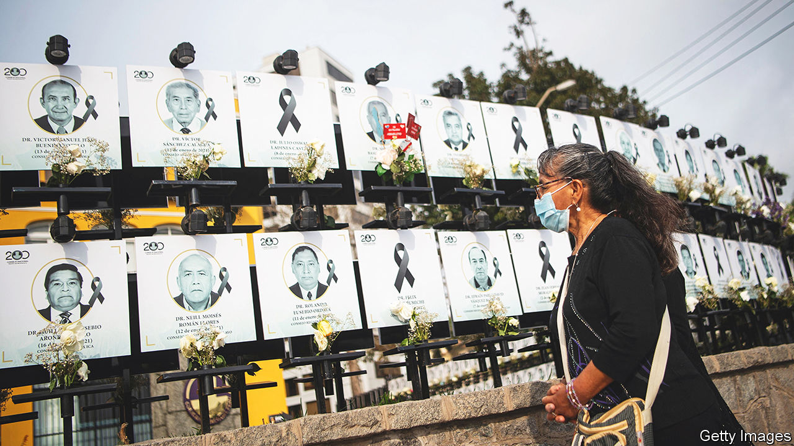
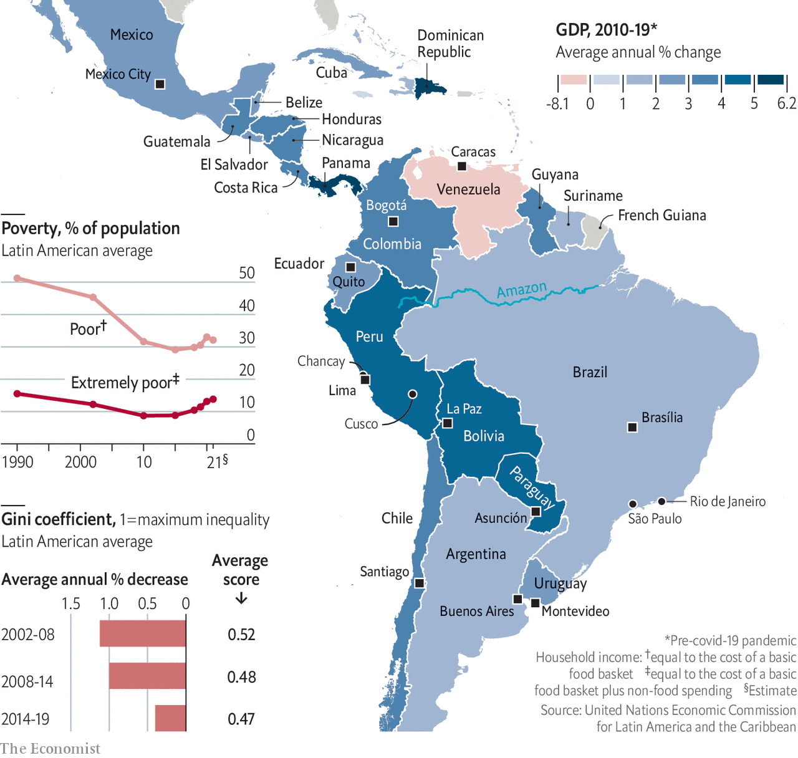

###### Trapped

# A region caught between stagnation and angry street protests 

##### Latin America is stuck in a development trap, argues Michael Reid 

 

> Jun 16th 2022 

They stare out in black and white, a double row of portraits winding the full length of the curving wall of the clifftop mansion overlooking the Pacific that is the headquarters of Peru’s medical association, and then even continue into the garden. They are “the heroes of medicine”, records a plaque: the 551 doctors who died of covid-19 in Peru from the start of the pandemic in 2019 to the end of September 2021. Even as Latin America begins to leave covid behind, this poignant memorial is a reminder of what a savage toll it has wreaked. With just 8% of the world’s population, the region has suffered 28% of the officially recorded deaths from the disease. In ’s reckoning of “excess deaths” per 100,000 people (the total number above the normal mortality rate), it trails only Europe.

Covid has starkly exposed the fragilities of government in Latin America. “The health system reflects all the disparities, inequalities and inefficiencies of the country,” says one health official in Peru. “It arrived when we had no plan and no leadership.” Officials had drawn up a strategy that required an extra $465m of spending on equipment and intensive-care beds. Although Peru’s public debt was relatively small (at 35% of gdp), they were given less than $1m. Health care is fragmented into five different systems. Francisco Sagasti, the country’s caretaker president from November 2020 to July 2021, says he found that there was not even a single database of doctors. 

Peru, which heads the World Health Organisation’s rankings of excess deaths from covid for 2020-21, may just have been an extreme case. Yet in much of Latin America, what are in effect developing-world health systems have to serve a population that is older than, for instance, Africa’s but also suffers rich-world disorders of poor diet, obesity and diabetes. Some countries have coped better than others. But in Brazil and Ecuador as well as in Peru, patients were left in the street for lack of beds and oxygen supplies.

The region is now bouncing back quickly from the pandemic. After a slow start, most governments did quite well on vaccines: three-quarters of South Americans are fully jabbed, a higher share than in Britain or the United States. A recent survey in São Paulo by Todos pela Saude, a non-governmental organisation, found that 85% of those sampled had antibodies for covid-19, either from infection or from vaccination. Latin America’s gdp contracted by 7% in 2020. Only the euro zone, with a fall of 6.1%, came close to doing as badly. But thanks partly to emergency public spending, Latin America rebounded by 6.8% in 2021, compared with the euro zone’s growth of 5.3%. 

A bigger worry is that, when covid-19 arrived, the region was already suffering from stubborn and deep-rooted problems that the pandemic merely made worse. Economically, the 2010s were a “lost decade” (echoing that of the 1980s), during which growth averaged just 2.2% a year. That is barely above the rate of population increase, so average living standards stagnated. It was below the world average of 3.1%, meaning that far from converging with richer countries, Latin America was falling further back. The slowdown coincided with the end of the commodity boom of the 2000s, which had helped South American producers of oil, minerals and foodstuffs. Now only a fresh commodity boom, intensified by Russia’s war on Ukraine, stands between the region and a return to growth rates of 2% or less.

This long period of relative economic stagnation has brought frustration over lack of opportunities, especially for younger Latin Americans, who have more education than their parents but whose expectations of good jobs have all too often been dashed. And this new social frustration has coincided with a marked political deterioration. Not only is democratic politics across the region discredited by the perception (sometimes exaggerated) of corruption, and by the corrosive cacophony of social media. But also politics is increasingly dysfunctional and unstable, suffering from fragmentation, the weakening of political parties and polarisation to the extremes. These are ills of the democratic world in general, but they are peculiarly acute in Latin America. 

 


It all adds up to a vicious circle and a development trap. Politicians across Latin America have proved unable to agree upon and implement the reforms that the region needs if it is to grow faster, which foments more social discontent, which in turn makes both politics and government harder. In a report last year, the un Development Programme highlighted Latin America’s toxic combination of high inequality and low growth, which it says are caused in part by a concentration of economic and political power; in part by widespread “political, criminal and social” violence; and in part by systems of social protection and labour-market regulation whose very design introduces economic distortions. “It’s very hard to have sustained growth when you have this much political volatility and so little willingness to do anything that improves productivity,” says Andrés Velasco, a former finance minister of Chile now at the London School of Economics. 

Democracy at bay

Despite everything, democracy has survived in the region. But it is under greater strain than at any time since the military dictatorships of the 1960s to 1980s departed as part of what Samuel Huntington, a political scientist, labelled the “third wave” of global democratisation, in which Latin America played a prominent part. In Venezuela and Nicaragua presidents who were originally freely elected went on to erect dictatorships. In Venezuela in April the tame national assembly hand-picked a new Supreme Court stuffed with supporters of Nicolás Maduro’s civilian-military dictatorship. Ahead of a farcical election in Nicaragua in November 2021, the sinister regime of Daniel Ortega and his wife, Rosario Murillo, imprisoned seven electoral rivals and shut down the remaining independent media. In El Salvador Nayib Bukele, a millennial conservative, is following a similarly autocratic path. His draconian policies towards criminal gangs and against covid-19 have made him the most popular president in the Americas and brought him a landslide victory in a legislative election, which he then used to take control of the courts.

Regionwide polls suggest that between 50% and 60% of respondents still support democracy. And in general, Latin American elections continue to be free and fair—“the single most important achievement of the process of democracy-building of the past 40 years”, according to Kevin Casas-Zamora of International idea, a Stockholm-based inter-governmental body that promotes democracy. “The problem is all the rest.” Never strong, the rule of law is weakening further. Latin American governments may sometimes be heavy-handed but they are also often both weak and inefficient. Elections provide an important safety valve. But the legitimacy they bestow and the hopes they arouse can be quickly corroded by governments’ poor performance in office. That has given rise to a growing belief in an efficient autocrat, a strongman who gets things done in the style of Mr Bukele—even though history suggests that he is likely to leave his country even worse than he found it.

Elsewhere discontent has taken various other forms. In 2018 Brazil and Mexico, which between them account for more than half of Latin America’s population and a roughly similar proportion of its total economic output, both elected populist presidents. Jair Bolsonaro, a hardline conservative, and Andrés Manuel López Obrador, who claims to be of the left, disagree about much but they share a contempt for independent institutions, including electoral authorities, independent media and civil society. Mr Bolsonaro, who wants to win a second term in the election in October, has sought, in the mould of Donald Trump, to cast doubt on the integrity of the voting system. Mr López Obrador wants an electoral reform that would put the electoral authority under closer government control.

A second manifestation of discontent is a pervasive anti-incumbent mood. This has seen the opposition of whatever colour win almost every election since the end of the commodity boom. Nowadays political cycles and government honeymoons are notably short. And a third and perhaps most dramatic sign of grievances is massive, and sometimes violent, street protests, widely dubbed “social explosions”. These occurred in Brazil in 2013 and 2015 and spread to Venezuela in 2017, to Nicaragua in 2018, to Ecuador and Chile in 2019 and to Colombia in 2021, as well as to communist Cuba in the same year, and to Peru in 2020 and 2022.


What is striking about this is that Chile, Colombia and Peru had until recently been three of Latin America’s more successful countries. Poverty had fallen. So in most Latin American countries did income inequality in the 2000s, although it remains higher than anywhere else bar Africa. The fall came because the expansion of education reduced the salary premium attached to it and the commodity boom created more demand for unskilled labour in services. But that progress has now stalled. And the protests were about multi-dimensional forms of inequality—a sense of unequal and unfair opportunities and access to public services, from parks to justice. They expressed, too, a deep-rooted popular mistrust of institutions, political parties and leaders. 

The anti-incumbent mood has brought a crop of left-wing leaders to power, prompting excited talk of a new “pink tide”—a term that harks back to the election of Hugo Chávez in Venezuela in 1998, followed among others by those of Luiz Inácio Lula da Silva in Brazil and Evo Morales in Bolivia. The trend may be reinforced: Lula is the narrow front-runner ahead of Brazil’s election. But Colombia’s run-off on June 19th looks a tight race between two populists: Gustavo Petro on the left and Rodolfo Hernández, a millionaire businessman, on the right. Most of the new presidents lack legislative majorities, and so may struggle to get much done. 

Take Peru, which suffers to the point of caricature many of the current ills of Latin American politics. Its party system has disintegrated. Ten parties share the 130 seats in the Congress. Most are mere electoral platforms run as businesses for hire, without ideology, programme or activists. A presidential election last year pitted Pedro Castillo, a rural schoolteacher with no previous political experience running for a Marxist party, against Keiko Fujimori, the daughter of a former autocrat who was discredited by undeclared party financing. Neither took more than 15% of the vote in the election’s first round. Mr Castillo won a run-off by just 45,000 votes out of 17.6m. In his first ten months in office he got through more than 50 ministers and three cabinets while surviving corruption allegations and two attempts at impeachment. His approval rating sank to 19% in April. 

In Chile Gabriel Boric, a “libertarian socialist” and former student leader who is still only 36, is a more accomplished figure. But his inexperienced team is struggling to make progress with his promise to create a universal welfare state. His approval rating in one poll fell from 51% to 36% in his first three months in government. Mr López Obrador is an exception: in his fourth year in office he has an approval rating of around 60%, despite an unremarkable record on the economy and crime. That is partly because of his image as a saintly man of the people, but partly also because he has redistributed public money towards cash-transfer programmes and real wages have been rising. Yet he may find the rest of his term more difficult.

In Brazil a deep recession in 2015-16 together with anger over corruption paved the way for Mr Bolsonaro, a political outsider, to reach power. He is a demolition merchant, rather than a consensus builder. His pro-market economy minister, Paulo Guedes, has failed to deliver many of the proposed economic reforms that might have raised Brazil’s anaemic growth rate.

The pandemic has brought Latin America additional burdens. One is a further loss of social cohesion, as the better-off were protected by private health care. In its aftermath governments face demands for additional spending, on health care, education and the social safety-net even as rising interest rates push up the cost of debt servicing. Take public spending on health care: before the pandemic in Latin America it was worth just 3.8% of gdp, compared with an average of 6.6% in the oecd group of mostly rich countries. All this points to the need for more taxes (revenues average just 19.8% of gdp in Latin America, compared with 33.5% in the oecd)—and greater efficiencies in spending. Neither of these will be easy, but they are essential for the new social contract that the undp and others advocate.

And now, inflation again

Second, inflation has returned to a region with a long history of it, but one that had been largely overcome. Argentina and Venezuela excepted, one achievement of the past two decades was that most Latin American governments pursued broadly responsible monetary and fiscal policies. That enabled them to provide aid during the pandemic: emergency spending totalled 4.6% of gdp in 2020 alone, not as much as in Europe or the United States but more than in past slumps. In some countries, such as Brazil and Chile, stimulus continued into 2021 and produced a sharp rise in inflation even before the impact of the Ukraine war on energy and food prices. Now inflation is heading into double digits. “Before the war I would have said it would take two years for inflation to return to target”, says Ilan Goldfajn of the imf. “Now it looks more persistent”. Several governments, including Mexico’s and Peru’s, have resorted to indiscriminate subsidy to stop fuel prices rising. 

Higher prices come even as wages have fallen. gdp has recovered faster than employment, especially of women. Many of the new jobs are informal. Although aid cushioned the blow, poverty has risen. The un Economic Commission for Latin America and the Caribbean (eclac) reckons that poverty affected 32% of the region’s population in 2021, up from a low of 29% in 2015. The middle class, defined by the World Bank as those on an income of $13 to $70 a day, made up 37% of the population before the pandemic. The bank reckons that food-price inflation may shave more than two percentage points from that number in several countries. For some, hunger is a real risk. 

Latin America is a large and heterogeneous region, of 20 countries and more than 600m people (excluding the Guyanas and the English-speaking Caribbean). Some parts of it continue to do well. One is Uruguay, long an egalitarian country which enjoys strong parties, political stability and steady economic growth. Sadly it has only 3.5m people. The Dominican Republic, Panama and Paraguay enjoy growth and stability, too, albeit with more corruption, crime and inequality. Costa Rica, another small and long-established democracy, is suffering political decay with a proliferation of parties and the election in April as president of Rodrigo Chaves, who campaigned as a populist. Across the River Plate from Uruguay, Argentina is a sad story of chronic decline that has continued under the squabbling Peronist government of Alberto Fernández and his vice-president and internal opponent, Cristina Fernández de Kirchner (no relation). 

This special report will focus mainly on the larger and more representative countries in a region that ought to matter more to the rest of the world. It was long part of the West—“the Far West” in the term of Alain Rouquié, a French writer. Now it is the subject of geopolitical competition between the United States and China. What follows will argue that continued muddling through will place democracy at increasing risk in Latin America. Reforms are long overdue. The problem is that they have become much harder to do. And that is partly because Latin American societies have become both more diverse and more demanding—and are enamoured of some distinctly divisive ideas.■

