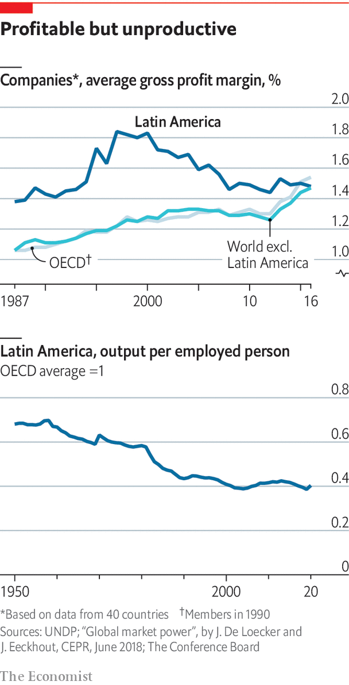

###### The economy

# A region that seems unable to reach its potential 

##### How can Latin America become more productive? 

 

> Jun 16th 2022 

The headquarters of Creditas is a sleek glass tower near São Paulo’s ring road, furnished with rows of computer terminals, modish sculptures and swing-seats for relaxation. The offices have space for 2,700 workers. The firm designed them before the pandemic, when it had 1,200 staff. Now it has 4,000, almost a fifth of them digital developers and some based in Mexico and Spain. Creditas offers loans secured against homes, cars and pay cheques at much lower interest rates than banks. It raises the money in the markets and uses venture capital to finance technology and customer acquisition. It is one of a clutch of startups that are shaking up Brazil’s financial system. The banks had inefficient branch networks and charged high margins on a low volume of business. “We have forced the banking industry to change,” says Sergio Furio, Creditas’s founder, who is Spanish. “They now speak a different language, cutting costs and automating.” 

Long a digital laggard, Latin America is catching up as consumers turn to their computers to buy goods and services. The number of fintechs in the region more than doubled between 2018 and 2021, to 2,482 (a quarter of the global total), according to the Inter-American Development Bank (idb). Venture-capital funds poured $15.7bn into the region last year, more than the combined total for South-East Asia, Africa and the Middle East. 

 


Fast-growing, innovative firms like Creditas are an exception in Latin America’s business landscape, which is dominated by a small number of old-established large companies, many of them family-run conglomerates, and a mass of unproductive small firms. Half the region’s workforce labours in the informal economy, a number that hasn’t varied much for decades. This is both a cause and a consequence of low growth and low productivity.

Latin American workers are only about a quarter as productive as those in the United States. To make matters worse, this figure has been falling for most of the past four decades. Total factor productivity has been stagnant over that period. Capital investment in the region, which reached 21% of gdp during the commodity boom, was only 17% in 2020, according to eclac. Such growth as there has been has come mainly from the expansion of the labour force. But this is set to tail off as the region experiences a demographic transition (though there is still much scope for more women to work outside the home).

Several things lie behind this dispiriting performance. Start with a lack of competition and the prevalence of oligopolies. These arise partly because most Latin American economies are relatively small and are geographically distant from the main centres of the world economy. But firms are also quite protected. Governments slashed tariffs in the 1990s as Latin America seemed to open up to the world. But plenty of non-tariff and regulatory barriers remain. According to the undp, Latin America’s formal firms have long enjoyed bigger mark-ups than those in most oecd countries. As monopoly power has also grown in rich economies over the past decade, the rates of return have converged. But that is a case of the world becoming more like Latin America, not the other way round.

Expensive and unequal

Such monopoly rents are key to Latin America’s extreme inequality of income and wealth. They also reflect lobbying power. “Each market distortion has an owner,” notes Zeina Latif, a consultant in São Paulo. Some of those are labour unions, which block changes to labour laws that make hiring prohibitively expensive. The protection of incumbent firms means they get away with poor management, a lack of innovation and a lack of investment, points out William Maloney of the World Bank. With the partial exception of Brazil, Latin American countries invest less in research and development than their income level should suggest. And because they do not invest enough in technology, when they have faced competition in the form of Chinese rivals some have simply packed up rather than trying to compete. This happened to car-parts firms in Colombia that were studied by Mr Maloney. The labour force lacks skills and training. The region has a chronic shortage of engineers and scientists (and produces too many lawyers). Less than 30% of pupils aged 12 met minimum standards in science in 2019, according to unesco.

Another consequence of protectionism is that Latin America does not export as much as it should, given its many free-trade agreements. It also helps explain why commodities, which enjoy a comparative advantage, have such weight in the region’s exports. Colombia has not exploited its export-manufacturing potential because the incentive to do so has been scarce, owing to protection against imports, deficient transport infrastructure and expensive logistics, says a study by economists at the central bank. The result is that Colombia has a persistent current-account deficit, and is uncomfortably dependent on exports of oil and coal, fuels that face an uncertain future.

Argentina is the pathological case of all such ills. Because of protectionism it suffers from a chronic shortage of foreign exchange, even as distortions and subsidies conspire against investment and innovation. All this undermines confidence in the peso, the prime symptom of the country’s decline. Some Brazilians now worry that their country is going the same way.

Not all is gloom, especially in countries that have tried to integrate more into the world economy. Since the North American Free Trade Agreement (nafta) came into force in 1994, northern Mexico has seen steady economic growth. It is benefiting from “near-shoring”, or the shortening of supply chains by American firms because of the pandemic and rising tensions with China. This is happening in industries from building materials to textiles and toys. Mexico has been taking business from China, claims Luis de la Calle, an economist. But he adds that “Mexico is many different countries in one.” The south and centre of the country resemble Central America, held back by poor transport links and education and anti-enterprise politics. Northern Mexico would be doing even better if Mr López Obrador had not frightened private investors with his energy nationalism and what an American official calls “arbitrary treatment” of her country’s investors.

Latin America is “unusual because it is outside all value chains”, notes Mr Velasco at the lse. Its manufacturing is too backward to export finished goods, and too far away to export components, as South-East Asia does. That makes diversification harder. Some has happened in Chile and Peru, driven mainly by agro-industry. But the pipeline of new products in Chile has dried up and in Peru new irrigation projects are stymied by interminable legal wrangles. In both countries governments have tried to facilitate new products through prompter certification and the co-ordination of private and public actors. This has been more effective than old-fashioned industrial policy, in which Latin America has a long and expensive history of failure.

Some say the search for growth should start at the bottom. “We should forget about the idea that the modern sector will absorb surplus labour,” says Piero Ghezzi, a former minister in Peru. “The only way to improve productivity is to do so in micro and small businesses. Diversification is about giving value to what you have.” He now provides loans on commercial terms to 250 young coffee farmers in the Andes who got money from public sources for organic and fair-trade certification and moved from subsistence to productive enterprise. “It’s not a moonshot. It’s about small improvements on the ground.”■

