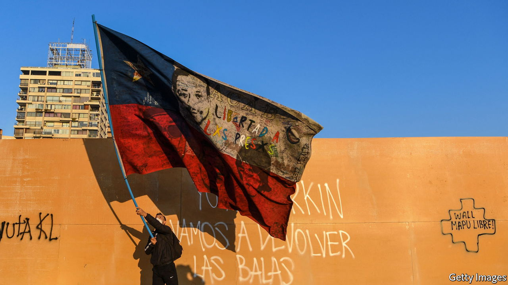

###### Social trends

# Latin American society is modernising, mostly for the better 

##### Universal policies are more important than group rights 

 

> Jun 16th 2022 

It was a timeless scene. On Easter Thursday several hundred people were gathered in the cavernous Basilica of Guadalupe, built at the spot in the northern suburbs of Mexico City where a 16th century Amerindian shepherd reportedly had a vision of the Virgin Mary. Some sat on wooden benches, others knelt on the marble floor. They were mainly middle-class or poorer, and copper-skinned. Some came to fulfil vows to give thanks for the overcoming of illness or other troubles. 

Standing outside the basilica, Marcela, a young architect from Cusco in Peru, waited for her grandparents and father, who wanted to visit on the first day of their holiday. She would prefer looking at Mexican urban architecture. “Things are changing now, each generation thinks differently,” she said. Her grandparents’ generation grew up in a hierarchical and more deferential society, where public policies about family, gender and sex were ruled by a monolithic Roman Catholic morality. 

Marcela’s generation of Latin Americans are not only more diverse religiously, with the rise of evangelical Protestantism and secularism. They also have a greater sense of rights and freedoms, the result of urbanisation, more disposable income, the expansion of higher education and, more recently, exposure to the digital world. In 2000 only 21% of 18- to 24-year-olds in the region were enrolled in higher education. By 2013 that figure had leapt to 43%, according to the World Bank. Poverty fell from 45.3% in 2002 to 29.81% in 2018 and the lower-middle class grew.

Yet this generation has grown up in a badly fractured society. Latin America has failed to redistribute enough or offer anything resembling equal opportunities. “The poor and lower-middle classes live in different neighbourhoods, attend different schools, visit different health clinics and make do with…pensions and health schemes that are less generous,” concluded researchers at the Inter-American Development Bank in 2020. Much of the expansion of higher education took place in poor-quality private institutions whose graduates may never recoup their investment through higher salaries. 

The sense of unfairness lies at the root of many social explosions. “If young people don’t take the reins of this country, nobody will save us,” Álvaro Herrera, a music student from Colombia told , a Spanish newspaper, after he was beaten by police for taking part in a peaceful demonstration. “This isn’t about parties or ideologies, it’s about dignity.” The impact of the pandemic on school closures has made matters worse. 

Rights for all

The cause of human rights was central to the establishment of democracy. It has since expanded to include socio-economic rights and a social safety-net. But there is growing demand for other rights, ranging from the environment to the situation of women and people of indigenous or African descent.

Environmental consciousness is growing. Polls have long shown greater awareness of climate change in Latin America than elsewhere, perhaps because of the region’s vulnerability. Chile, which is highly dependent on natural resources, is suffering worsening droughts. The Pinochet dictatorship of 1973-90 made water rights into private property and allowed uncontrolled pollution in “sacrifice areas”. A convention set up after the social explosion of 2019 to write a new constitution has declared water a public good and given more clout to environmental regulators. Seven Latin American countries have now ratified the Escazu Agreement, a treaty requiring more openness and consultation on green issues. 

Changes in environmental policies are forcing new attitudes on businesses, especially in extractive industries. The risk is that regulation becomes a cover for the anti-capitalism that infects some environmental ngos, which continue to target big mining. In the recent past, some mining companies were indeed cavalier about environmental damage. But now most environmental harm is committed by informal or illegal miners who dredge rivers and dump untreated toxic waste. 

Several governments now take climate change more seriously. Fully 40% of the World Bank’s lending to the region is climate-related, much of it aimed at reducing emissions in agriculture and forestry, more efficient use of water and electric-bus fleets. Brazil was a leader in curbing deforestation a decade ago. Under Mr Bolsonaro, who has dismantled much environmental enforcement, it has become a global environmental pariah.

Feminism is now a significant political force. Women’s right to abortion has made progress. In February Colombia’s Constitutional Court decided by five votes to four to decriminalise abortion on any grounds in the first 24 weeks of pregnancy. In 2020 Argentina’s Congress voted to do likewise in the first 14 weeks. Abortion is legal in Mexico and partly so in Chile. Although Mr López Obrador has clashed with feminists—as he so often does with civil society in general—he has appointed many women to his cabinet. By law, parties in Mexico must present an equal number of women and men as candidates for Congress. Women’s participation in the region’s labour market (44% in 2021) has grown in this century, though it still lags behind that of men (67%), according to the International Labour Organisation. Gay rights, too, have made big strides, with half a dozen countries legalising gay marriage and a number banning discrimination.

“Yes, the feminist movement is changing attitudes,” says Ana Pecova, an activist in Mexico City. “Perhaps there are changes we haven’t been able to measure because we’ve focused on symbolic things.” These include violence against women, part of general violence in Latin American societies but with an element of femicide, or the killing of women because they are women. The pandemic brought an increase in gender violence in the home, a global trend. And feminist advances are contested ground. In May Peru’s Congress took steps to weaken sex education and the teaching of gender equality.

Black and indigenous Latin Americans, who make up around 25% and 8% of the population respectively, suffer from discrimination and lower incomes. But they gain more recognition than they did. In Brazil the approval in 2012 of quotas for university entrance based partly on race and partly on social class increased the numbers of low-income and black students, mainly in the humanities. These graduates are starting to take up professional jobs, according to Michael França, an economist at Insper, a university in São Paulo, who is black. More broadly, Brazilian society has started to face up to past and present racial issues, he thinks. 

Recognition of inequality is important in overcoming it. But considering people in terms of their group identity rather than as individuals can create problems of its own. Chile’s constitutional convention has defined the country as not just “intercultural” but “plurinational” and said that indigenous people should have their own legal system, following the line of constitutions in Ecuador and Bolivia. In Ecuador Leonidas Iza, president of the Confederation of Indigenous Nationalities, says that plurinationalism is essentially a demand for respect, for the recognition of indigenous cultures and languages. “We are Ecuadorean. We’ve never proposed a [separate] state within the state,” he asserts. 

The plurinational effect

In Chile, too, plurinationality may be mainly symbolic, but some worry that it may not be. It could mean that the same crime receives a different punishment depending on the ethnic identity of the offender, or that basic laws and rules vary around the country. Adolfo Millabur, an indigenous representative in the constitutional convention, argues that Mapuche territory was invaded by Chile in 1860, and that “Western ways were imposed by violence.” He says that plurinationality would change “the distribution of power” and pave the way for the restitution of land that was previously occupied by non-Mapuche farmers and forestry companies.

As Francis Fukuyama, a political scientist, has pointed out, left-wing identity politics tends to stimulate its equivalent on the right. Between them, he argues, they undermine the pursuit of common goals by collaboration and consensus that lies at the heart of a successful democracy. This has happened in Brazil. Mr Bolsonaro tapped the resentment of social conservatives at “gender ideology” (the teaching of sex education and tolerance in schools), of lower middle-class whites over university quotas and of farmers against environmental controls. Something similar risks happening in Chile, where José Antonio Kast, of the hard right, won 45% in the presidential election in a backlash against the political correctness of the convention.

The demand for plurinationalism is an indictment of the neglect and discrimination suffered by indigenous peoples and should be a call to remedy that. But it also questions the central narrative of Latin American identity over the past century or more: that the region is a melting pot of Europeans, Amerindians, the descendants of African slaves and in some countries Asian immigrants, too, and the racial mixing of all these. 

Latin America’s history is being re-evaluated in the light of such political concerns. Claudia Sheinbaum, the mayor of Mexico City, removed a statue of Christopher Columbus even though she is herself a Mexican of European Jewish descent. She argues that Latin America still suffers from residues of colonialism and its caste society. But she concedes that after the European conquest “a very rich  culture was born” that it is important to recognise. Amid all its other pressing tasks, the region needs to reconcile itself to its history and refine a fresh narrative capable of emphasising the many things that Latin Americans have in common. But that also means making equality of opportunity more than a mere slogan. In this sense it does not help that the very idea of meritocracy is under attack.■

