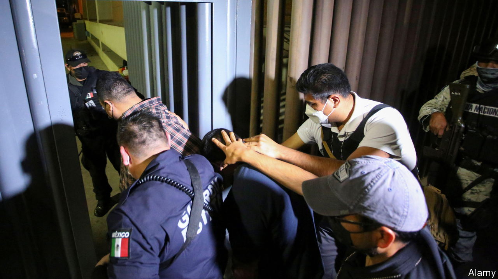
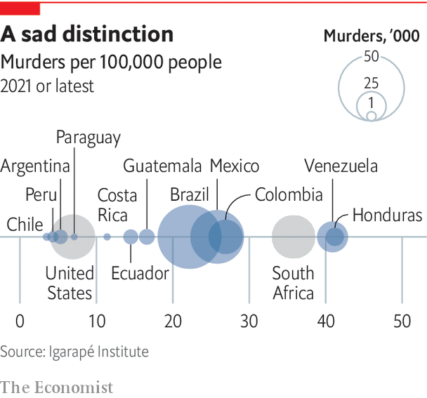

###### The state

# The deficiencies of the Latin American state loom large 

##### Enter the political demolition squads 

 

> Jun 16th 2022 

As a special prosecutor for corruption in Guatemala since 2015, Juan Francisco Sandoval worked with a un commission to secure convictions against a president and a vice-president. In mid-2021 he was fired by Guatemala’s attorney-general, Consuelo Porras. She accused him of an “ideological” approach and procedural mistakes. He thinks it was because he had uncovered enough evidence to open an investigation against Alejandro Giammattei, Guatemala’s current president, over allegedly paying bribes to secure a docile legislature, having received them from a construction company and several Russian and Kazakh businessmen with mining interests. In 2020 Mr Sandoval found a pile of cash equal to $16m in a house in Antigua Guatemala that he links to the president, who denies any wrongdoing. 

Mr Sandoval now lives in Washington, dc. He fled Guatemala “because my life was in danger”, he says. “I knew they would start to persecute me…They have planted evidence. The intention is to frame me.” In all, 22 former Guatemalan judges or prosecutors are in exile, ten face charges back home and one is in jail. Their plight shows how hard it is to make lasting progress in fighting corruption in Latin America. The un commission had enjoyed wide public support, but the politicians rebelled against it and Mr Giammattei’s predecessor, Jimmy Morales, expelled it in 2019. “There is a confluence of interest between corrupt politicians and the economic oligarchy,” says Mr Sandoval. 

The victory of these interests highlights two problems that are widespread in Latin America: the weakness or absence of the rule of law, and the capture of the state by private interests. Democratisation across the region brought welcome attempts at judicial reform. Many countries replaced fusty procedures in which judges investigated crime and trials were conducted on paper. They brought in independent prosecutors and oral trials. Unfortunately, these changes coincided with an expansion of organised crime in Latin America, for which they were wrongly blamed. The rule of law depends not just on judges but on having the right ecosystem, from police to prisons. 

Its weakness in Latin America is shown not just by impunity for the corrupt but by a chilling statistic: with 8% of the world’s population, the region accounts for 37% of all murders, according to the un. Once largely confined to Colombia, Peru and Bolivia, drug mafias have spread throughout Latin America and diversified into extortion and human trafficking. After several gang-related prison massacres, Ecuador last year imposed a state of emergency that was renewed in three provinces in April. In February the United States temporarily suspended the import of avocados from Mexico after one of its plant-health inspectors was threatened.

 


There have been some successes, but they tend to be local and hard to sustain. In Colombia the murder rate fell from 69 per 100,000 people in 2002 to 25 in 2017, thanks to a security build-up followed by a peace agreement between the government and farc guerrillas. But the impetus has been lost and the rate has edged up, partly because of the politicisation of the security forces under Ívan Duque, president since 2018. Parts of Brazil, such as São Paulo state, have seen a successful shift to more community policing. And crime has fallen in Mexico City, thanks to a tough and energetic police chief and increases in police numbers and wages.

Yet swathes of rural Mexico are under the control of criminal gangs. There are fewer murders, but that is mainly because the army has scaled back its operations against the gangs. Two of the bigger mafias have consolidated their grip and achieved criminal monopolies in areas previously bloodily contested, reckons Eduardo Guerrero, a security consultant. He adds that elections last year suggested that organised crime is penetrating local politics. Extortion is a drag on economic growth, discouraging small businesses from expanding. Venezuela’s government does not control the “mining arc”, a large area of the south that is dominated by paramilitary gangs and Colombian guerrillas, according to Ricardo Molina, who was Mr Maduro’s environment minister.

At the car wash

Guatemala is not the only place where the fight against corruption has faltered. Operation Lava Jato (Car Wash), launched in Brazil in 2014, exposed bribes and contract padding by construction firms. Prosecutors have secured convictions against some 200 business people and politicians, including Lula. But Sérgio Moro, the judge who jailed Lula, notched up fatal own goals. Leaked messages showed he had breached judicial impartiality by coaching the chief prosecutor in the case. He undermined judicial independence by becoming justice minister in Mr Bolsonaro’s government. Brazil “has lost its appetite for fighting corruption”, laments Oscar Vilhena Vieira, a law professor at the Fundação Getulio Vargas, a university. Similarly, in Peru judges placed two former presidents and Ms Fujimori in preventive detention. But after seven years of investigation prosecutors secured only a handful of convictions, mainly against minor figures.


“The single most acute barometer of the state of democracy is judicial independence,” argues Mr Casas-Zamora of International idea. The picture is mixed. Most judges in Brazil are independent, reckons Mr Vieira. The Supreme Court has survived threats from Mr Bolsonaro. Its equivalent in Mexico has not fallen wholly under the sway of Mr López Obrador. The Constitutional Court in Colombia remains independent. But chief prosecutors in all three countries are loyal supporters of their presidents. In Argentina Ms Fernández de Kirchner has failed to subjugate the courts, but other branches of the state are less resistant to political takeovers.

“State weakness is the single most important source of Latin America’s chronic problems, including social inequality, economic stagnation and poor governance,” concludes Sebastián Mazzuca, an Argentine political scientist at Johns Hopkins University, in a recent book. Most Latin American countries had consolidated their grip over their territory by 1875. But where European states were honed by war, the imperative in Latin America was trade, and that brought deals with local potentates, Mr Mazzuca says. What emerged were “patrimonial” states, in which private and public interests were muddled, rather than having impersonal and disinterested bureaucracies.

Modern state-building did take place in the mid-20th century in Brazil, Mexico and other countries but it was then undermined by populism, a political impulse pioneered by the region. Democratisation brought more reforms. Central banks, finance ministries and electoral authorities became islands of technical excellence. This even spread to social policy through targeted and politically neutral cash transfers for the poor. But state weaknesses remain stark. In Brazil, for example, Mr Bolsonaro has stuffed the public sector with soldiers and police, dismantled environmental controls, placed ill-qualified ideologues in charge of education and slashed the budget for universities and scientific research. “There was a sense that we were building a country,” says Fernando Reinach, a former science minister. “Now the feeling is that we are destroying it.” In Mexico Mr López Obrador has slashed public-sector salaries. Many experienced officials have departed from ministries and regulatory agencies.

The destruction has been especially swift in Peru. To give jobs to its supporters Mr Castillo’s government has lowered qualifications for posts, says Carolina Trivelli, a former minister for social development. The director of a state technological institute learned of his sacking in the official gazette; he has been replaced by a political hack. In May Peru’s Congress voted to gut the powers of an independent regulatory agency that supervises standards in universities. 

Latin American conservatives have never had much problem with patrimonialism. But the left is now assaulting the principle of civil-service meritocracy on the grounds that it benefits a “neoliberal” elite. “Behind the changes in the state in Mexico there’s a redistribution of power, with new groups coming in,” says an official in Mr López Obrador’s government. They are drawn mainly from newer universities and local government. In Argentina public-sector jobs have long been rewards for those who deliver the vote for Peronists in the poorer suburbs of Buenos Aires. Yet the left ought to have an interest in high-quality public services. It is striking that left-leaning economists so often favour a big role for the state for which it is not technically equipped.

A study by caf, a development bank, found that the quality of government in Latin America is thought to be lower than anywhere else in the world bar Africa. And on many indicators it seems to be declining. The idb reckons that public spending worth as much as 4.4% of gdp is wasted, often because of inefficient procurement. And the combination of relentless media scrutiny with judicial persecution in the name of anti-corruption has driven many good, honest people out of public service or led graduates to avoid it. Those who remain are scared to take decisions, especially on public contracting. It all adds up to yet another development trap. ■

