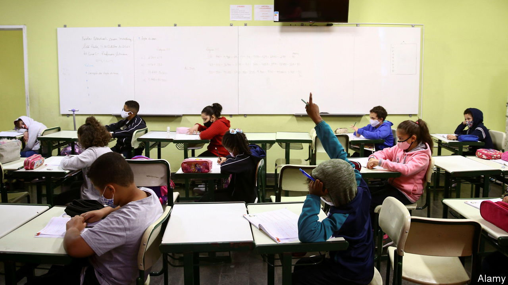

###### Education

# The high cost of schools closed by covid 

##### Making up for Latin America’s lengthy school closures 

 

> Jun 16th 2022 

Dom agnelo cardeal rossi school is on the south-western edge of São Paulo, more than an hour’s taxi ride from the city centre. It is in Vila do Sol, a community that was once one of the most violent in Brazil. Today it is poor but hard-working, a place of car-repair workshops, dingy lunch counters and small stores. In late March the school was humming with controlled ebullience, its 1,540 pupils aged six to 14 enjoying being back in the classroom for the first time in almost two years.

Getting there was a struggle, as successive waves of covid-19 saw partial re-openings and their reversal. The school tried distance teaching, with printed material and a free chip with internet time. But “many homes don’t have a good signal,” says Fátima de Almeida, the headmistress. The long break has been punishing. “Fifth-year pupils are mentally reaching second- or third-year level, because of the lack of socialisation and the loss of links with teachers,” she says. “We’ve seen more aggression, anxiety and panic.”

The school is trying to make up for lost time. The state government doubled resources for remedial teaching and provided a psychologist. Several classes of Portuguese and maths now often have two teachers. Ms de Almeida is seeking parental consent for a longer school day. São Paulo state is relatively well-off and well-governed. Elsewhere the picture is bleaker. Latin America vies with South Asia for having seen the longest school closures during the pandemic. Pupils have lost between one and two years of learning, reckons Emanuela di Gropello of the World Bank. Educationalists fear that many, especially girls, may drop out of school early. 

How much of the lost learning can be recovered? The answer starts with assessing pupils’ level of learning, hiring more teachers and scheduling extra classes in holidays or after school. There is an opportunity to improve teaching methods and simplify curricula, focusing on maths, reading and social and emotional skills, says Ms di Gropello. Even so, there will be lasting harm. The bank thinks the future earnings of affected pupils might be 10% lower than they otherwise might have been.

Inequalities will widen. Poor children, with weak or non-existent internet connections, suffered disproportionately. Before the pandemic, 15-year-olds in Latin America were on average three years behind their peers in the oecd in reading, maths and science, according to pisa international tests. They will now lag further behind. They may ask why politicians, teachers and parents did not push for schools to reopen sooner.

