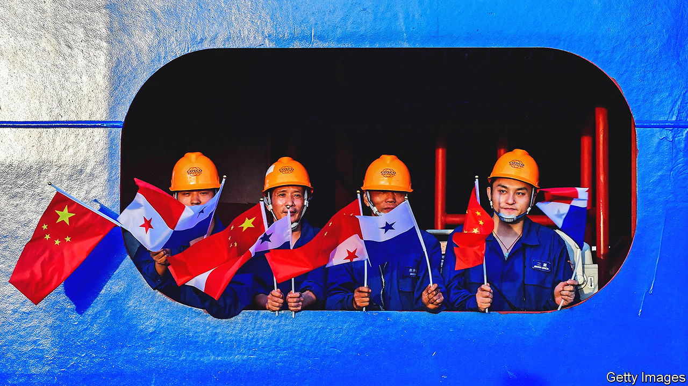

###### Latin America in the world

# The rival influences of the United States and China 

##### A region divided against itself 

 

> Jun 16th 2022 

In a trench beside the Pan-American highway at Chancay, 65km (41 miles) north of Lima, boring machines dig a tunnel beneath a sand hill. Under its other slope, by the ocean, Chinese-made giant trucks deliver rubble to extend the land into deeper water, already partly enclosed by a breakwater. They are creating a new port able to take the world’s largest container ships. The $1.3bn first stage, due to be completed in 2024, involves four quays. The final plan calls for 15 quays and a large industrial park that would make Chancay the biggest port on the Pacific coast of South America, with the aim of becoming a trans-shipment centre for the region.

The port is being developed by Cosco, a Chinese shipping and logistics giant, with Volcan, its Peruvian partner. Gonzalo Rios, one of the managers, stresses that it is a market-driven private-sector project. Since it is close to Callao, Lima’s large modern port, some are sceptical that it can attract sufficient shipping unless it becomes a strategic beachhead for Chinese firms. Either way, it is a sign of changed geopolitical times in Latin America.

China is now a bigger trading partner than the United States for all the main Latin American economies except Mexico and Colombia. It is also an important investor, initially in oil and mining and more recently in infrastructure and manufacturing. The United States still matters, especially as a private investor and because of its sway in international financial institutions. But it has lost influence, partly because of its own political gridlock. It lacks ambassadors in eleven posts in Latin America. China’s diplomatic operation in the region is now more effective. Europe has also long been an important trading partner for Brazil and Argentina. In 2019 it concluded a trade and co-operation agreement with Mercosur, a block based on those two countries. But it has yet to be ratified, mainly because of European hostility to Mr Bolsonaro’s environmental destruction.

Most Latin American countries do not want to have to choose between the United States and China, as Donald Trump once suggested. At Mr Trump’s insistence, nafta was renegotiated. The United States-Mexico-Canada agreement that replaced it includes clauses aimed at blocking Chinese trade and investment. Mr Bolsonaro, a fan of Mr Trump, has been hostile to China. Brazil remained in the brics group that includes China, India, Russia and South Africa. But the president’s family and Ernesto Araújo, his first foreign minister, made intemperate criticisms of China. In response Xi Jinping’s government quietly made clear that Argentina is a rival partner in South America. Only this month did Mr Bolsonaro talk for the first time to both Joe Biden and Alberto Fernández, Argentina’s president. He has “done a remarkable job of isolating Brazil from the world”, says Matias Spektor of the Fundação Getulio Vargas.

Latin America’s preference for a multipolar world to one of geopolitical confrontation has led some to question whether it is still part of the West. Its stance on Russia’s invasion of Ukraine has been ambivalent. Most Latin American countries voted at the un to condemn this. But some tempered their position. Mr Fernández visited Russia and China shortly before the war began. He said his country should be the “gateway” for Russia in Latin America. Venezuela and Nicaragua are close allies of Vladimir Putin. “We don’t want the multilateral order to fall apart,” says a Mexican official, who opposes Russia being kicked out of the g20. “But that doesn’t mean we’re not on the side of democratic institutions.” 

Internal differences

Latin America’s internal political fragmentation is mirrored at regional level. Attempts at deeper integration have faltered. Mercosur, founded in 1994 as a putative customs union, was a cornerstone of Brazilian foreign policy. But it is declining into irrelevance, partly because agribusiness (whose main market is China) has eclipsed manufacturing. The Pacific Alliance founded in 2011 and comprising Chile, Colombia, Mexico and Peru has lost momentum. “Latin America doesn’t count for anything in the world,” laments Enrique Iglesias, a veteran Uruguayan leader. “We are silent. If the big countries don’t lead the process of integration and commit to it, efforts will be very limited.” Two core institutions that link Latin America and the United States, the idb and the Organisation of American States, are troubled, with leaders who do not command support and deep divisions over the treatment of Venezuela. 

Indeed, the issue of what to do about Venezuela has split Latin America. Mr Trump’s policy of seeking regime change through sanctions imposed in 2019 initially attracted support. But it failed. Today Mr Maduro is stronger than before, and the economy is reviving thanks to de facto dollarisation. The opposition is weakened. Juan Guaidó, its titular leader, was once recognised as the legitimate president by some 60 countries; today only a handful still do so. The Biden administration, and many Latin Americans, believe that negotiation with Mr Maduro, hard though that will be, is the only option. “Otherwise, it’s [like] Cuba, and we don’t want to be having this conversation in 60 years’ time,” says an American official.

Divisions over democracy overshadowed the Summit of the Americas in Los Angeles in early June. Mr Biden did not invite Cuba, Venezuela or Nicaragua, which caused Mr López Obrador and three other leaders to stay away. To the frustration of many Latin Americans, policy in Washington appears to be driven by the imperatives of domestic policies.

Latin America cannot change this unless it makes itself a more important partner. And that requires a more pragmatic, issue-based, approach to regional integration. Latin American countries have had to absorb 6m migrants from Venezuela and many are countries of transit for other immigrants. Mr Biden is now pushing for a regional approach to the problem. With interest rates rising, Latin America should be leading discussions about international help to middle-income countries to boost economies and respond to climate change. As always, more intra-regional trade is one of the best routes to economic growth. 

“We have to stop creating [regional] organisations based on the ideology of the governments of the day,” Chile’s Gabriel Boric argues. “It’s important that Latin America once against has a voice in the world.” For that, it needs to rediscover a path of progress.■

