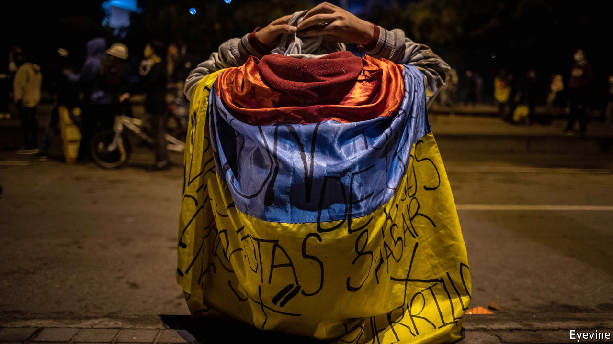

###### The future

# The urgent need to reform political systems 

##### Politics needs to be rebuilt from the ground up 

 

> Jun 16th 2022 

If any latin american country had a chance of moving to a new social contract, political renewal and a more productive economy, it was surely Chile. In November 2019, as protests raged in the streets, politicians agreed to a constitutional convention, charged with drawing up a new constitution to replace the existing one, whose origins date back to the Pinochet era (though with later amendments). But the convention tilted more to the left than did public opinion. It is torn between trying to reform Chile and trying to refound it from first principles. And it has conflated a demand for social rights with identity politics. The text will not be finalised until July 4th. A dwindling band of optimists still hopes to see a workable document. But the auguries are not good: the draft has 499 articles. “We are losing an opportunity to have a constitution for a developed country and not for a typical Latin American country,” says Rodrigo Valdés, a former centre-left finance minister.

If the new constitution is rejected in a referendum in September, as seems possible, it will leave Chile in political limbo. It would also be a fatal blow to Gabriel Boric’s young government, whose core programme is to increase tax revenues in order to create a universal welfare state in place of Pinochet’s “subsidiary state”, in which the market played a big, but for many unsatisfactory, role in providing health care, education and pensions. 

Chile’s travails highlight broader problems. Latin America’s left tends to be too Utopian, populist and anti-capitalist. The right fiercely defends its privileges and monopoly rents in the name of freedom. And the political centre has collapsed. Its failure is linked to that of liberal technocrats, brought up in a segregated upper-middle class that has too little knowledge of everyday realities. Take Colombia, where Mr Duque’s government produced a sensible tax reform in 2021 that led only to riots and protests from which the government never recovered.

“Top-down reforms have failed,” concludes Sofía Ramírez of México Cómo Vamos, a pressure group. “The road is bottom-up, the middle class to local power.” Mayors tend to be closer to the people than Congresses, and local government is a solid recruiting ground for national office. But mayors can also be corrupt and incompetent. And the region’s political systems are failing in their most basic function of channelling interests upwards and then arbitrating among them. 

Politics suffers from design defects. Uniquely in the democratic world, Latin America combines directly elected executive presidents with legislatures chosen by proportional representation. That makes it hard for governments to command parliamentary majorities that will enact reforms. This mattered less when presidents were popular and parties were fewer and were more open to negotiation. But those days have long gone. Many Latin American academics now favour parliamentarianism. But presidentialism is an indelible part of the political culture. This issue has not been a matter of serious debate, even in Chile’s convention.


Another issue is the weakness of political parties. Laura Chinchilla, a former president of Costa Rica, argues for rules to ensure that parties have a life between elections. There should be a middle ground between turning parties into protected fiefs and making it too easy to create new ones. Populist leaders have abused referendums. But politicians could seek better mechanisms for participation, such as consultative committees of citizens. “There is a demand from society to be heard,” says Ms Chinchilla.

Latin America’s problems are partly those of success, since they reflect the fact that it has more educated people. After more than 30 years of democracy, younger generations take freedom for granted. There is polling evidence that societies as a whole are less polarised than their political elites. And for at least 200 years Latin Americans have expressed wonder at their own potential. The region faces no serious danger of war and is far from the world’s most acute conflicts. Its vast natural resources should help it benefit from the green-energy transition, since it produces much of the world’s copper and lithium and has untapped potential in renewable energy and green hydrogen. Its people mainly speak just two closely related languages. Despite everything, it has retained democratic freedoms. Respondents tell pollsters they are happy, thanks to family, friends and the fiesta, the eternal pleasures of Latin American life.

Yet in the past few years Latin America has started to lose thousands, perhaps tens of thousands, of its best-educated and brightest citizens. They have found more security and opportunity in the United States or Europe. Unless it can find a way to make its political systems more effective and responsive, Latin America’s relative decline will only continue.■

