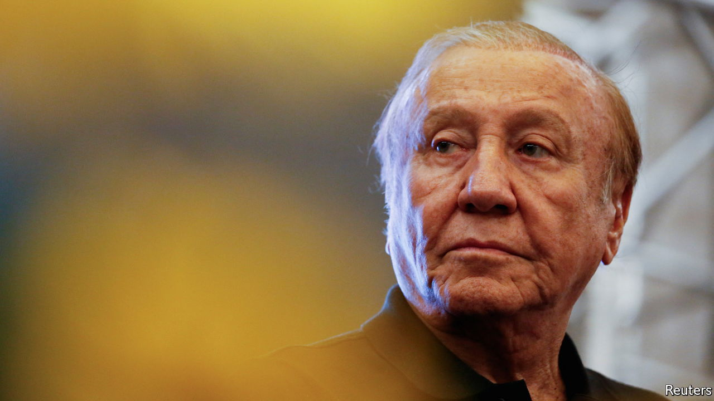

###### Here comes Rodolfo

# Colombia’s presidential run-off on June 19th is close 

##### Rodolfo Hernández is riding a wave of anti-establishment fervour 

 

> Jun 16th 2022 

The casa nariño does not look like the headquarters of a political campaign, despite being recently named after Colombia’s presidential palace. The two-storey house in Bucaramanga, a sleepy mid-size city, has just one or two campaign posters on the walls. A handful of supporters mill around outside, selling homemade hats and shirts. Yet this is where Rodolfo Hernández, a 77-year-old civil engineer, millionaire and former mayor of Bucaramanga, has based a threadbare campaign for president which has made him a surprise front-runner. Polls suggest he is tied with Gustavo Petro, a leftist former guerrilla, ahead of the run-off on June 19th.

When Mr Hernández renamed the property last year, his ambition to become president looked forlorn. As mayor of Bucaramanga Mr Hernández became a local celebrity for running an austere, budget-balancing city government after decades of rampant corruption. But his short temper, manifested in profanity-laced diatribes against the city’s political establishment and an incident in which he slapped a city councillor, made him as many enemies as friends. Elsewhere, few had heard of him.

What explains his rise? “Hernández has no filter,” explains Luna Mantilla, a 17-year-old volunteer for his campaign, wearing a pin emblazoned “Logic, ethics and aesthetics” (a campaign slogan inspired by Immanuel Kant, Mr Hernández’s favourite philosopher). “Other politicians, they only say what they really think when they’re away from the cameras. The engineer has always been his true self,” she adds. 

In a normal election year, Mr Hernández’s unfiltered style and frequent gaffes would have been a liability. But 2022 has been far from normal in Colombia. After the upheaval of the pandemic, a devaluation of the peso and spiralling inflation, many voters have lost faith in the political establishment. In a survey in May some 74% of those asked believed the country was heading in the wrong direction. Corruption is felt by many to be the country’s biggest problem. 

Mr Hernández has run on a simple message: “Don’t rob, don’t lie, don’t betray and zero impunity.” Yet his success is also partly due to a clever social-media campaign run by a tiny staff of young supporters out of the repurposed bedrooms of the Casa Nariño. On TikTok, a video-streaming app, Mr Hernández has 600,000 followers. He posts about five videos a week. 

In a similar vein, viral WhatsApp groups bring together  in different parts of the country. Jeiver Sánchez, a 38-year-old owner of a car shop, comes from a small town in Vichada, an eastern province that Mr Hernández appeared never to have heard of in an interview in February. This oversight did not deter Mr Sánchez. He uses WhatsApp to corral his friends into caravans to drum up support for the candidate. According to Rest of World, a tech news website, the campaign also uses Wappid, a marketing tool, to boost its presence on social networks. 

Many voters are likely to plump for Mr Hernández reluctantly, in the hope of stopping Mr Petro. His programme remains flimsy. Much like Nayib Bukele, the president of El Salvador and one of Mr Hernández’s idols, he talks a lot about clamping down on corruption, without going into much detail on how he would do so. (In July Mr Hernández himself is due to stand trial on a corruption charge involving the licensing of a rubbish-collection service which allegedly would have benefited his son. He denies wrongdoing.)

Mr Hernández’s programme defies categorisation. It includes proposals that would never pass muster with Congress or the courts, such as fully legalising cocaine. He has said he would decree a state of emergency upon taking office, allowing him to overrule Congress for 90 days. That points to his most consistent instinct: an autocratic approach to governing. 

But Mr Hernández may not be as anti-establishment as he sounds. He has met business leaders since early 2021, says Germán Calle, a friend. Mr Calle adds that Mr Hernández is forming a “cabinet of businesspeople” to work in parallel with his government if he is elected, with a direct line to the president. That may reassure investors. But for people like Mr Sánchez and Ms Mantilla, who want radical change, the septuagenarian politician may end up being something of a disappointment. ■

