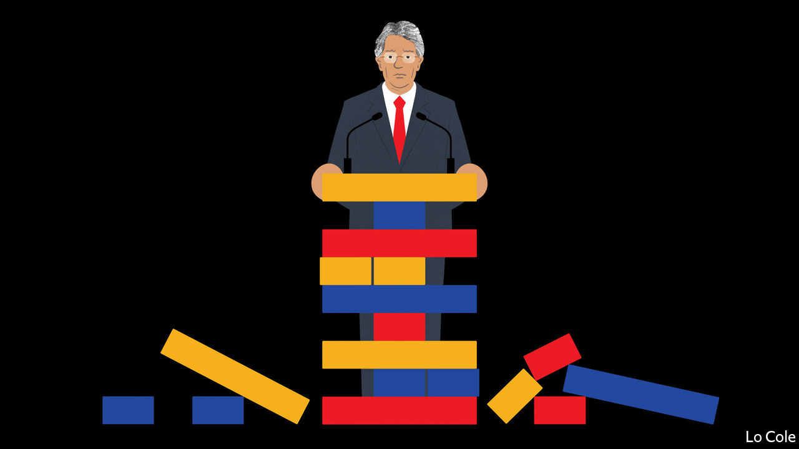

###### Bello

# Ecuador’s president has little chance of implementing reforms 

##### A rare liberal government in Latin America is stymied by the opposition and protests 

 

> Jun 16th 2022 

In 2019 an uprising by Ecuador’s indigenous movement and its allies brought mayhem to Quito, the capital, and forced the centrist government of Lenín Moreno to cancel a rise in fuel prices, a climbdown from which it never recovered. This week conaie, the indigenous federation, was on the march again. It blocked roads, including the highway connecting Ecuador to Colombia, in a trial of strength for Mr Moreno’s successor, Guillermo Lasso, a conservative former banker. This time the demands are vague. The protest, which conaie says will be “indefinite”, is one more difficulty for a president facing a proliferation of problems after just one year in office. 

Mr Lasso promised a business-friendly government that would boost languishing economic growth and plug a chronic fiscal deficit. He has proposed tax and labour reforms and measures to attract private investment. He got off to a strong start thanks to a successful vaccination campaign. But he won last year’s run-off election for the presidency mainly because of popular distaste for his opponent, the nominee of Rafael Correa, a populist leftist strongman who governed from 2007 to 2017. In an earlier legislative election, Mr Lasso’s party won only 12 of the 137 parliamentary seats. The result is that the National Assembly, which has a left-of-centre majority, has blocked his reform bills. The government’s only significant legislative achievement, a tax reform that mainly increases the burden on the rich, was adopted by decree. 

The economy is recovering from the pandemic, albeit slowly. Inflation, at 3.4%, is among the lowest in Latin America, partly because Ecuador has used the us dollar as its currency since 2000. The recent surge in the oil price has provided a windfall, and means the government may manage to balance the books this year for the first time since 2000. Mr Lasso insists that he has “built a bridge” to a better country. Yet Ecuadoreans do not see the improvement. Rather, they worry about a crime wave, much of it linked to drug gangs. That did not start with Mr Lasso, but he has to deal with it. Murders almost doubled last year, and 380 people have died in prison massacres since the start of 2021. There are complaints, too, of a decline in the quality of public services, from the speed of passport renewal to the availability of medicines.

In a speech in May marking his first year in office Mr Lasso offered up a long list of spending promises, including extra police. But few are holding their breath. “This is a government that works in silence,” he said, which may be one of its problems. His approval rating, which soared to over 70% because of the vaccination campaign, has dropped to under 30%. That makes him vulnerable.

The opposition is flexing its muscles. Last month it ejected the speaker of the National Assembly, who was friendly to the government. Supporters of Mr Correa are backing conaie’s protests. “The opposition is moving from a position of blocking everything to one of destabilisation,” says Sebastián Hurtado, a political analyst. “The more radical groups are seeking to exploit the situation.” That may explain why the government this week arrested Leonidas Iza, the Marxist president of conaie, holding him responsible for “vandalistic actions” which it said included attacks on police cars, commercial farms and an oil-pumping station. Though quickly released again, he faces charges. 

Much depends on whether bus and truck operators join the protests. The rampage in Quito in 2019 damaged the indigenous movement’s reputation among city folk, and Mr Lasso froze fuel prices last October. That could help him weather the protests, but does not ensure more lasting success. “The government won’t be able to get reforms,” says Mr Hurtado. “He’s a lame duck for the rest of the presidential term.” 

Before Mr Correa, who benefited from a huge oil windfall, each of the previous five presidents lasted only two years on average. Could that be Mr Lasso’s fate? Some of his advisers want him to invoke a constitutional device whereby he could call a fresh general election, risking his own job in the hope of securing a more pliant legislature. So far he has rejected that option. “Ecuador doesn’t need more elections,” he said last month. “What Ecuador needs is to be governed, and governed well.” 

Indeed so. The question is whether the country will allow a broadly liberal government to try to do just that or instead plunge back into a labyrinth of instability and populism.


