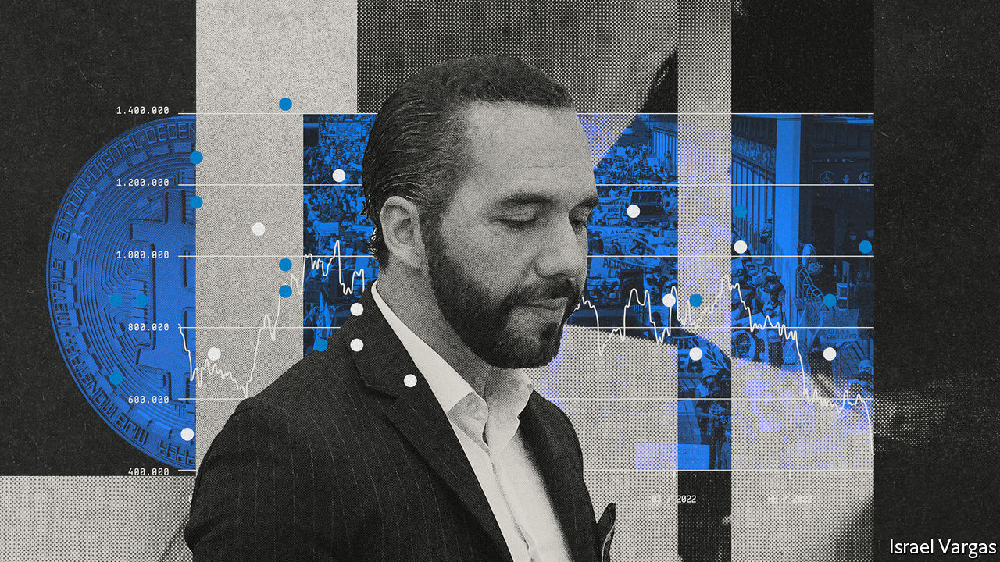

###### Cryptocracy

# El Salvador’s government is gambling on bitcoin 

##### President Nayib Bukele has already lost around $50m in public funds 

 

> Jun 16th 2022 

When a president boasts that he manages the country’s wealth from his smartphone while naked, it hardly inspires confidence. Even less so in a country that has a debt-to-gdp ratio of 84% and least of all when the president is investing in bitcoin, which this week fell to its lowest value in 18 months. Welcome to El Salvador, which became a tech bro’s playground a year ago, when President Nayib Bukele, its social-media-obsessed leader, made the cryptocurrency legal tender. 

In June last year, at a cryptocurrency conference in Miami, Mr Bukele announced that the Central American country would be the first to adopt bitcoin as an official currency, alongside the American dollar. In September, a day before passing the so-called bitcoin law, which made it compulsory for businesses to accept the cryptocurrency, Mr Bukele also started to use public funds to invest in bitcoin.

Today passengers arriving at the airport in San Salvador, the capital, are greeted by a blue atm labelled “Chivo” (“Cool”), the name of the country’s digital wallet, at which bitcoin can be bought or converted into cash. Hotels in El Zonte, a beach town that was a testing ground for bitcoin thanks to the arrival of an American crypto advocate there, loudly advertise that they accept the cryptocurrency. The government plans to issue “volcano bonds”, which would be partly backed by bitcoin, to fund the building of “Bitcoin City”, a tax haven powered by geothermal energy from a volcano, in order to attract crypto miners.

But all the hype notwithstanding, introducing bitcoin as legal tender has not been a wild success. For a start, few ordinary folk use it. Most Salvadorean adults downloaded the Chivo wallet, which the government promoted by giving the bitcoin equivalent of $30 to everyone who signed up. But fewer than half of them have continued to use it after spending this gift. Bitcoin, which has lost 70% of its value since November, is far too volatile to be a good store of value, especially in a country where gdp per person is $4,400. (This has not deterred the Central African Republic, which is even poorer, from following El Salvador’s lead and adopting bitcoin in April.) “One day it’s up and one it’s down,” says Efrain García, a construction worker. “I could lose a lot.” Only 1.6% of remittances arrived through crypto wallets in April.

Similarly, only a fifth of businesses follow the requirement that they accept bitcoin. This is despite the central bank’s promise to exchange the cryptocurrency for dollars immediately, to shield them from volatility. In El Zonte food kiosks only accept cash. At a hotel the receptionist says some people do use bitcoin to settle their bills, “but usually Americans”. 

 


It is unclear how much money Mr Bukele has spent on bitcoin, since the government does not make its investments public. Those who track the president’s tweets, and take him at his word, reckon the government has lost about half its investment, or $50m to date (see chart). That is not catastrophic, but a clear indication of what can go wrong. Félix Ulloa, the vice-president, argues that the cryptocurrency is a long-term investment. But there is no guarantee it will be a profitable one, and a poor country like El Salvador cannot afford to gamble. 

That such a volatile asset could be made legal tender at all says much about Mr Bukele’s style of leadership. Since taking office the “world’s coolest dictator”, as he calls himself, has ruled the country of 6.5m like a private fief. After winning a majority in elections in 2021, he appointed loyalists to institutions such as the constitutional court. There was no debate on making bitcoin legal tender, notes Claudia Ortiz, an opposition lawmaker. 

Many fret that bitcoin will decrease transparency. Some reckon it is a way for officials to evade possible American sanctions. Others fear bitcoin opens the way for money-laundering and corruption. Several ministers were under investigation for misuse of pandemic funds before Mr Bukele fired the attorney-general. Cybersecurity is also an issue. It is unclear if anyone aside from Mr Bukele knows El Salvador’s bitcoin keys, the codes needed to prove ownership and make transactions.

Mr Bukele tweets about bitcoin in English. That suggests his audience is abroad. Indeed the president, who has a team dedicated to monitoring popular opinion, has been talking less about bitcoin of late, having shifted his focus to gangs. Since a spike in killings in March, some 40,000 people have been arrested. Such autocratic policies are popular. Mr Bukele’s approval ratings hover at around 80-90%. 

But the economy may yet disillusion voters. After growing by 10.7% in 2021, thanks to the lifting of restrictions related to covid-19, it has slowed sharply. Growth of 2.9% is predicted this year. Foreign direct investment rose by 12% in 2021, but remains a lowly 1% of gdp. It is unlikely that the bitcoin gambit will create many jobs. 

El Salvador’s economy was in a dire state long before Mr Bukele came to power in 2019. The country has few productive industries; it is instead dependent on remittances, which amount to more than 20% of gdp. Despite the high public debt (84% of gdp), the government projects a budget deficit this year of 5.7% of gdp. Financing that is proving tricky. Mr Bukele’s penchant for crypto, as well as his authoritarian tendencies, have prompted the imf to stall negotiations on a $1.3bn loan. Rating agencies have downgraded El Salvador’s creditworthiness, making it more expensive for the government to borrow. The volcano bond issue has been delayed. The government’s investments in bitcoin add further uncertainty to the mix. 

The government is likely to scrape together the cash to make a bond payment of $800m in January. It will want to avoid default ahead of Mr Bukele’s bid for re-election in 2024. But the strains are showing. Even as the legislature approved expenditure on financial infrastructure to promote the use of bitcoin, it cut spending on education and health. The government has also cut budgets for local councils. A volatile currency and a volatile leader suggest a volatile future for El Salvador. ■

