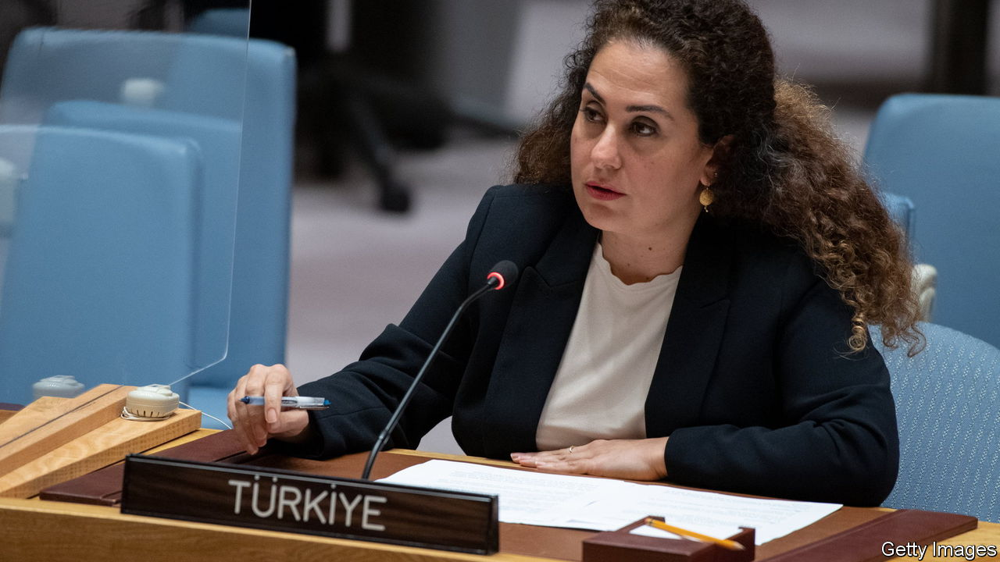

###### The Economist explains

# Why countries change names 

##### Turkey (or Türkiye) is just the latest 

 

> Jun 13th 2022 

NO MORE Turkey? The country has had it with bad jokes likening it to an ugly, gobbling bird. The UN has accepted its request to be  in English, as it is in Turkish. The country may be unusual in the reason for changing its name, but it is hardly the only one to have done so. Why do countries change names?

The most common reason is wanting to throw off the shackles of colonialism. Since the second world war, scores of countries have become independent, and then re-christened cities, institutions and even themselves to reflect native cultures, often ditching European-imposed names that were fiercely disliked. Rhodesia, which carried the moniker of the rapacious Cecil Rhodes, a British coloniser, changed its name to Zimbabwe upon majority black rule. 

This continued well after independence, as leaders sought to put their stamp on countries. Thomas Sankara changed Upper Volta to Burkina Faso in 1984. Joseph-Desiré Mobutu had a thing about names. He changed his own to Mobutu Sese Seko and obliged his countrymen to ditch Christian names, too, under a policy of “authenticity”. He also changed his country’s name from the Republic of Congo to Zaire in 1971. (Ironically, Zaire was the Portuguese name of the Congo river, derived from a Kikongo word.) After his disastrous rule ended in 1997, the country reverted to being known as the Democratic Republic of Congo. 

Other countries have been motivated by brevity. The Czech Republic has a one-word short form, Česko, in Czech, and so has asked other countries to use an English equivalent, Czechia, mostly without success. Belarus was known as Belorussia (White Russia) when it was a Soviet Republic, but upon independence opted for the shorter name, harking back to the , a proto-state from which both it and Russia emerged.

Elsewhere in Europe, North Macedonia was once the unwieldy “Former Yugoslav Republic of Macedonia”, or FYROM among diplomats. It adopted “North” to resolve a long-running spat with Greece, which insisted its use of the name Macedonia implied a claim on territory from the Greek region with the same name. The bunfight ranged from insults and airport renamings to more serious matters. Greece blocked its neighbour’s accession to NATO due to the dispute. 

If there is an overarching reason for all these, it is that countries and their leaders want to control national stories. This does not always work. People are likely to use the old name for a time, at least in private. The president of “Türkiye”, the increasingly autocratic , wants others to see his country as he sees it. Mr Erdogan enjoys practically unchecked powers. But even he will struggle to control the English language.


