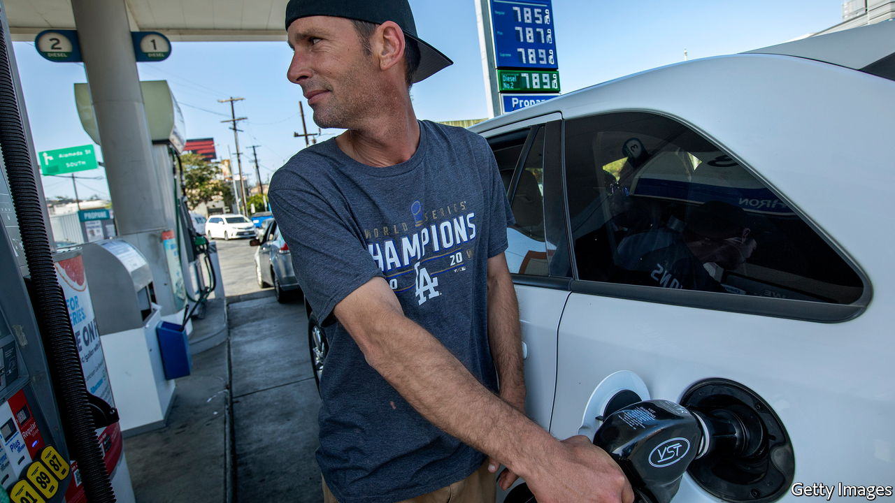
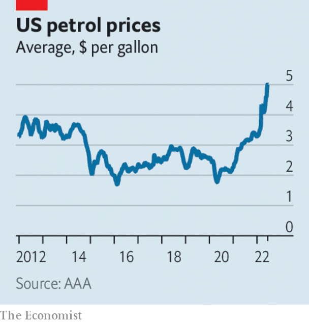

###### The world this week

# Business 

#####  

 

> Jun 16th 2022 

 


The  raised its main interest rate by three-quarters of a percentage point, to a target range of 1.5% to 1.75%, the biggest increase since 1994. It was thought the central bank would lift the rate by half a point, but a few days before its decision data showed that America’s annual  rate, as measured by the consumer-price index, increased to 8.6% in May, higher than had been expected. Grocery prices were up by an average 11.9%, the biggest increase since 1979. The average price of a gallon of petrol in America has now breached $5 for the first time, up by 50% since January. 

Financial markets also had to digest the Fed’s  programme, which began this week. The Fed is unwinding the balance-sheet of assets it accumulated since the start of the pandemic at a much faster pace than the last time it commenced such an undertaking in 2017. 

The  held an emergency meeting after government-bond yields rose sharply across the currency bloc. The pressure on government debt came after the ecb outlined an end to stimulus measures and confirmed it would start raising interest rates next month. Italy’s bonds were under the most duress. The yield on the ten-year note rose above 4%. 

Japan’s finance ministry and central bank issued a statement that they are concerned by the weak . Despite that the Bank of Japan intervened to expand its bond-buying programme when the yield on the ten-year note again breached its 0.25% cap. The policy has driven the yen to a 24-year low against the dollar. 

Beware of the bear

The s&amp;p 500 dropped by 3.9% in a day. That meant the index was down by 22% since its record high on January 3rd, making that stretch of trading a  (a fall of 20% or more from the most recent peak). The current bear market has lasted over 160 days. That is longer than the bearish 33 days over February and March 2020, but still some way behind the 517 days that ran from October 2007 to March 2009. 

 were in turmoil as more signs emerged of problems with the infrastructure underpinning digital assets. Celsius, a platform that enables its users to lend their crypto tokens for a return, stopped customers withdrawing funds. Bitcoin shed over a fifth of its price over a few days. The value of the overall crypto market has fallen from a peak of $3.2trn in November to less than $1trn.

With speculators losing their appetite for risk, the exchanges that host crypto trading are having to retrench. , the biggest such exchange in America, said it would cut a fifth of its workforce, admitting that it expanded too quickly during the cryptocurrency boom. As recently as February Coinbase and other exchanges were so confident about their business that they ran advertisements during the Super Bowl. 

Meanwhile,  denounced digital-finance assets as “based on the greater-fool theory”. Regarding non-fungible tokens (nfts), which confer ownership on things like digital art, the philanthropist mused that “Obviously, expensive digital images of monkeys are going to improve the world immensely.”

Natural-gas prices rose sharply in Europe, when the operator of one of the largest export terminals in America said that a fire at the facility would keep it offline until September. The Freeport plant in Texas has been a big supplier of lng to Europe since the start of the war in Ukraine. Russia reduced its supply of gas this week to Germany and Italy, ahead of a meeting to discuss Ukraine. 

Developing economies, and especially a “resurgent China”, will increase global demand for  by 2% next year, according to the International Energy Agency, which expects demand in rich countries to tail off because of the high prices of petrol and diesel. 

The British government ended its subsidy scheme for  with immediate effect. It said it wants to refocus on the battery-charging infrastructure, but industry groups criticised the sudden change. 

The members of bts, the  and one of South Korea’s most successful exports, said that they would take a break from performing as a group to focus on solo projects. The announcement shaved 25% off the share price of Hybe, their production company. Hybe insisted that the band wasn’t going on a hiatus.

Love yourself

Perhaps bts could be replaced by . An engineer at Google has suggested that its chatbot ai has become sentient. The application referred to itself as a “person” with a “soul” that is “alive”, concepts that philosophers usually grapple with, as have bts in albums like “Map of the Soul: 7”. 

