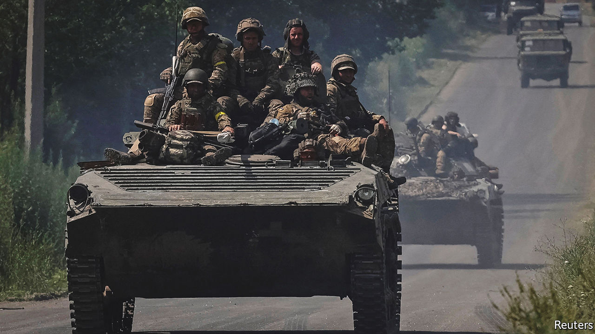
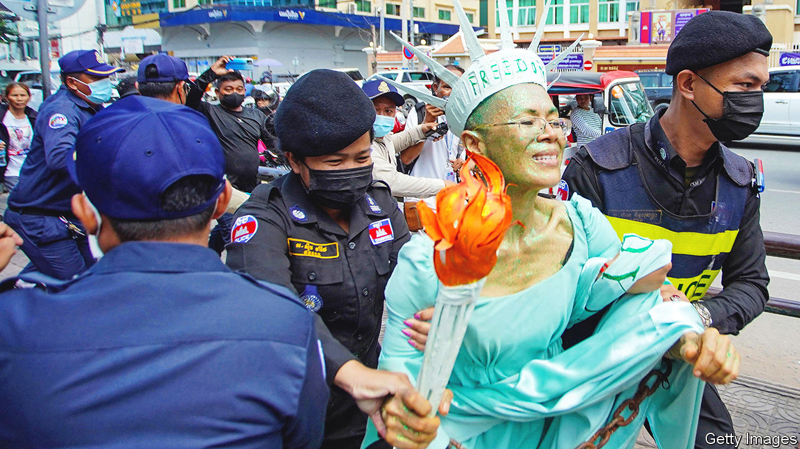

###### The world this week

# Politics 

#####  

 

> Jun 16th 2022 

Lloyd Austin, the American defence secretary, urged nato ministers meeting in Brussels to accelerate the flow of heavy weapons to , as fighting intensified in the eastern region of Donbas, especially in the town of . Although Russia has occupied most of it, Ukrainian forces are continuing to mount stiff resistance. The conflict, in its fourth month, has turned into a war of attrition, with neither side seemingly able to make big gains.

A report by the Centre for Research on Energy and Clean Air, a think-tank based in Finland, found that  earned $97bn in revenues from oil and gas exports during the first 100 days of its invasion of Ukraine. The European Union accounted for 61% of the revenues, though China was the biggest single importer, closely followed by Germany. Russian revenues dipped in April and May compared with March. The report concluded that Russia’s revenue from energy was enough to defray its expenditure on the war, which it estimated at $876m a day. 

The first round of legislative elections in  marked a serious reverse for the president, Emmanuel Macron. His alliance of centrist parties won only around the same number of votes as a radical-left grouping that is headed by Jean-Luc Mélenchon. Predictions of the final result after run-off votes on June 19th suggest that Mr Macron is in danger of losing his majority.

The British government  to override parts of the , which forms part of the Brexit withdrawal agreement but is disliked by unionists. The eu described the move as a breach of international law and announced plans for legal proceedings against Britain. 

A controversial plan in Britain to deport some  to Rwanda was delayed as the first plane prepared for take-off. The European Court of Human Rights (a non-eu body) judged that an Iraqi asylum-seeker faced a risk of harm. That opened the door to other successful appeals, and to the last-minute scrapping of the flight. The British government is undeterred, and has vowed to press ahead. 

 ethics adviser resigned. Christopher Geidt had held the job since April 2021 and is the second ethics adviser to the British prime minister to quit in less than two years. Shortly before he resigned Lord Geidt told a committee of mps that it was “reasonable” to ask whether Mr Johnson had broken the ministerial code in relation to parties held at Number 10 during lockdown.

A “ferocious” new outbreak of covid-19 in Beijing is testing  “dynamic zero-covid” strategy.  were traced to a bar in the city centre. Thousands of residents have been whisked into quarantine and neighbourhoods sealed off. In Shanghai, where a months-long lockdown has ended, the number of cases found outside quarantine remains low. Nevertheless, the city ordered most of its 25m residents to get tested.

 government gave public-sector workers Fridays off for the next three months, so that they can turn to farming to ease a food shortage. The four-day week will also reduce commuting, easing pressure on limited fuel supplies. The un warned that Sri Lanka is facing a humanitarian catastrophe, as it deals with its biggest economic shock since independence in 1948. 

Members of Congress, main opposition party, took to the streets of Delhi to protest against the questioning by authorities of Rahul Gandhi, a senior figure in the party, in a decade-old corruption case. Police detained several opposition politicians for illegal assembly. Congress claimed the police broke into its headquarters and beat up staff; the police deny this.

 


Lady liberty

Human-rights groups condemned the prison sentences handed down to 60 members of the opposition in on trumped-up charges. Sam Rainsy, who leads the Cambodia National Rescue Party, was sentenced in absentia to another prison term (he lives in exile). Theary Seng, a lawyer who holds American citizenship, was given six years. She attended court dressed as the Statue of Liberty. 

Police in  said that two bodies believed to be Dom Phillips, a British journalist, and Bruno Pereira, an indigenous expert, have been found in the Amazon. The pair had disappeared in the remote Javari Valley, after Mr Pereira received death threats for campaigning against illegal fishing. A fisherman has confessed to murdering the men.

 accused  of invading it after the m23 rebel group captured Bunagana, a strategic border town near Goma in eastern Congo. Rwanda in turn accused Congo of firing rockets into its territory.

Abiy Ahmed, the prime minister of , said for the first time that his government is open to negotiations with the Tigray People’s Liberation Front, the party-cum-militia it has been fighting since November 2020. 

The Economic Community of West African States, a regional bloc whose members include Ghana and Nigeria, said it plans to launch a  called the eco in 2027.

Joe Biden announced that he would pay his first visit to the  as president, probably in mid-July, going to Israel and then Saudi Arabia. He will meet the Saudi crown prince, Muhammad bin Salman, whom he has labelled a pariah. Mr Biden will ask him to boost the flow of oil to help lower prices. The prince may drag his feet.

A group of American senators, ten Democrats and ten Republicans, produced a framework agreement on limited  that they hope to pass by August. If passed, the bipartisan breakthrough would expand background checks for people under 21 who buy weapons. The killers in two recent gun massacres, in Buffalo and Uvalde, were both aged 18. 

America ended  requirements for international passengers flying into the country. Foreign nationals still have to prove that they are vaccinated. Airlines and tourism organisations had pressed the government to end testing. It is thought an extra 5.4m people will now visit America this year. 

Sounds like fun

The reopening of  to tourists caused much confusion. International visitors must be booked on an officially approved tour and accompanied by their guides at all times. They are also required to wear masks and compelled to buy health insurance. At restaurants they will be socially distanced from locals and will be barred from sharing dishes. 

