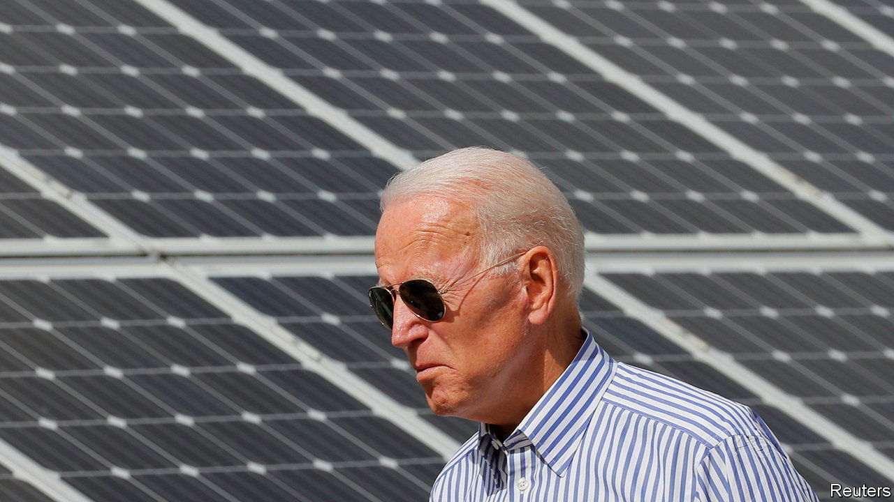

###### Wartime, all the time

# A law meant to boost America’s security becomes industrial policy 

##### Joe Biden is using the army’s procurement tool to manage the economy 

 

> Jun 16th 2022 

What do covid vaccines, solar power, lithium mines and infant formula have in common? In America, the answer is a wartime mobilisation law from 1950, which the government is increasingly using in an effort to boost the availability of important things in short supply. The Defence Production Act (dpa) was in the past mainly a procurement tool for the armed forces. Under Joe Biden, it is fast becoming a part of the government’s arsenal for managing the economy.

The dpa confers a range of powers on the government in the name of national security. It can compel firms to prioritise certain contracts and it can offer them incentives, from loans to purchase commitments. Its aim is to ensure that the private sector is producing what the public needs, and to make sure the public can get it.

For decades these powers have been applied narrowly. The Pentagon estimates that it uses the dpa some 300,000 times a year, but only as a standard contract clause: it can require firms to accept its orders when it makes hardware such as missile-defence systems. But the government has quietly expanded the dpa’s remit over the years by redefining national defence in broader terms, extending it to natural disasters, terrorism and other emergencies. 

Both Bill Clinton and George W. Bush, for instance, applied it during an energy crisis in California in 2000-01. Donald Trump invoked the dpa in March 2020 in response to the spread of covid. His administration required firms such as General Motors and 3m to make ventilators and masks. And it steered vital materials to pharmaceutical companies to expedite their production of vaccines in Operation Warp Speed.

Mr Trump was wary in his use of the dpa, even comparing it to the nationalisation of industry in Venezuela. Mr Biden, by contrast, has been far more enthusiastic. In 2021, shortly after his inauguration, he expanded its use in the production of both covid vaccines and diagnostic equipment. And in recent months it has become an obvious response to supply crises, not least because he can deploy it without getting bogged down in Congress.

First, in March, Mr Biden invoked the dpa to encourage domestic production of minerals needed to make batteries for electric vehicles. That could pave the way for the government to fund firms to extract materials such as lithium and manganese. Next, in May, with America facing a shortage of infant formula, he called upon it again (based on the notion that public health is integral to security). Formula makers can now jump the queue to order ingredients. Then, on June 6th, he used the dpa yet again, to spur the production of clean energy such as solar power.

All this has met with two strands of criticism. Some see it as a way of making the White House seem to be doing something, though without serious funding it may accomplish little. Todd Tucker of the Roosevelt Institute, a left-leaning think-tank, counters this view, noting that the government can potentially use the dpa to redirect existing funding and provide aid to firms, including gifts of equipment. “If the government uses these powers expansively, they could lead to substantial reshoring of the solar industry,” he says.

Hence the second criticism: that the dpa will, as Mr Trump warned, make for a more interventionist state, harming the economy. Its much wider use is still fairly new, and legal challenges about the stretched definitions of national defence may emerge. Still, given the depth of America’s supply problems today, it is good public policy to test the limits of the dpa, to see what it can accomplish, says Jamie Baker, a former legal adviser to the National Security Council. After all, clarity about what the law does and does not allow is yet another thing in short supply. ■


