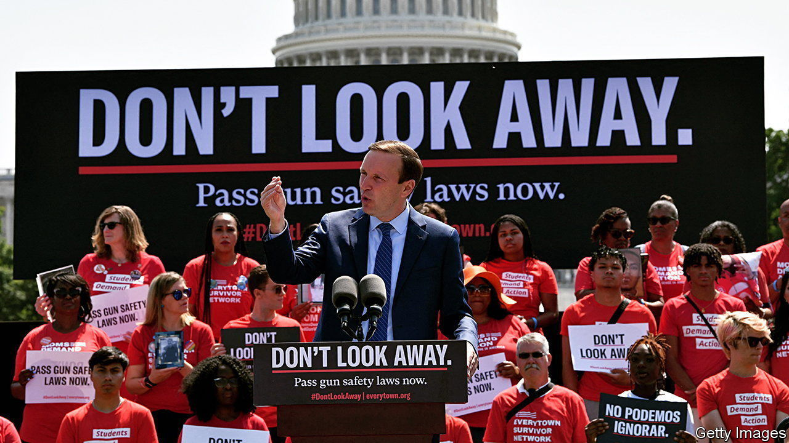

###### At last

# America’s senators manage to reach a deal on gun control 

##### The bipartisan compromise could herald the most important federal gun legislation in three decades 

 

> Jun 13th 2022 

“We have a deal,” tweeted Chris Murphy, a Democratic senator from Connecticut, announcing a bipartisan agreement to curb gun violence on the afternoon of June 12th. The deal has the support of at least ten Republican senators, which bodes well for its passage in the Senate (where 60 votes are needed to overcome a filibuster). Mr Murphy has been trying to enact a change in gun laws since the deaths of 20 six- and seven-year-olds and six adults by a gunman in a primary school in Sandy Hook in 2012. But even the murders at Sandy Hook could not persuade some politicians to vote in 2013 for a bill expanding background checks. Nearly a decade and too many  later, senators finally have a bipartisan gun-reform deal that, if passed into law, could be the most significant in 30 years. 

No one expected reform to be sweeping. Gun-control advocates, at best, hoped for . Many thought it might be limited to funding for mental health and school safety, both important but narrow. As one activist put it: “There’s value in cutting deals and showing that it is possible to get progress without the sky falling.” Robin Lloyd of Giffords, a gun-reform group, said before the deal was announced that it would be worthwhile if it saved a single life.

“I think what the senators outlined today is absolutely going to achieve that and more,” Ms Lloyd now says. Giffords was founded by Gabby Giffords, a former congresswoman from Arizona who was shot in the head in 2011. Ms Giffords had called on lawmakers to “be bold”.

Getting anything done at all might be considered bold. It seems the deal includes several measures applauded by advocates of gun control, while at the same time appealing to those worried about preserving Second-Amendment rights (the constitutional right to bear arms). As expected, the agreement envisages funding for mental health and school safety. It also includes funding to help states pass and implement crisis-intervention orders, better known as red-flag laws. These laws, which are active in 19 states, allow a judge to order the seizure of guns from people deemed a danger to themselves or others, and can prevent them from buying guns in the first place. Florida, with a Republican governor and legislature, passed a red-flag law after the mass shooting at Parkland, where 17 were killed at a high school in 2018. Since then judges have issued more than 8,000 gun-seizure orders. 

Some Republicans were hesitant to change the legal age to buy certain weapons from 18 to 21, as many Democrats, including President Joe Biden, had urged. Yet it seems they wanted to do something to make it harder for young people to acquire guns. They have agreed on enhanced background checks, including the sharing of juvenile records, for gun buyers under the age of 21, and a short wait during the check. 

Domestic-abuse cases do not get the media attention that mass shootings do, but they can be deadly. According to Everytown, another gun-reform group, the share of homicides committed by partners has been increasing for three decades; women are now as likely to be killed by dating partners as by spouses. The agreed framework would close the “boyfriend loophole”, so that no domestic abuser—whether a spouse or a serious dating partner—can buy a gun if they are convicted of abuse against their partner. 

The deal also contains what would be the first federal law against gun-trafficking and straw purchasing (buying a gun on behalf of someone prohibited from possessing one). In theory, that could help stop the illegal flow of guns into cities. “Ninety per cent of these guns don’t come from New York [which has strict gun-control laws],” Letitia James, New York’s attorney-general, said last year. “They come from states with lax gun laws.” The reforms would also provide clarification on who needs to register as a licensed gun-dealer, to make sure all commercial sellers are doing background checks. 

Mr Murphy concedes that this bill, once written, will not do everything to end America’s gun-violence epidemic, but he tweeted that “it’s real, meaningful progress”. Such progress is badly needed. According to Brady, a gun-control organisation, on an average day in America more than 320 people are shot, 111 of them fatally. 

Recent mass shootings in , where a white-supremacist killed mostly African-Americans in a supermarket, and in Uvalde, Texas, where a gunman fatally shot 19 children and two teachers in a primary school, deeply shocked Americans. One of the survivors of the Uvalde carnage, 11-year-old Miah Cerrillo, told a House committee how she covered herself in the blood of a dead classmate and played dead to save herself. When asked if she thinks it will happen again, she firmly nodded.

Perhaps that is why lawmakers’ response this time was different. The 20 senators who negotiated the deal seem to finally get it. In a statement they said: “Families are scared, and it is our duty to come together and get something done that will help restore their sense of safety and security in their communities.” They added that, “most importantly, our plan saves lives while also protecting the constitutional rights of law-abiding Americans.” That second part is why change was never going to be sweeping. 

Still, it is a start. Christian Heyne of Brady says the package represents a meaningful collection of policies that will save lives if passed. Brady was named after Jim Brady, who was badly injured in the assassination attempt on Ronald Reagan in 1981. The 1993 Brady Law, the last major gun-control legislation, was named after him. Mr Heyne, whose parents were shot in 2005, says this deal will not fix gun violence on its own. “But I do think that potentially what it represents is that we are entering into a new era for gun-violence prevention.” 


