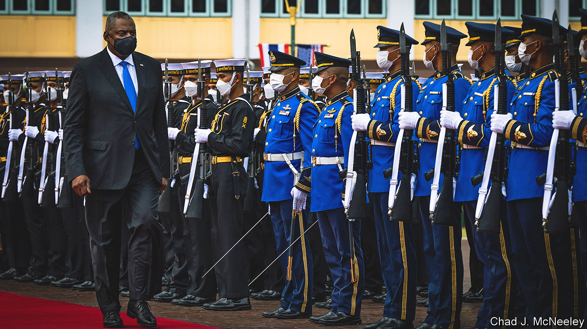
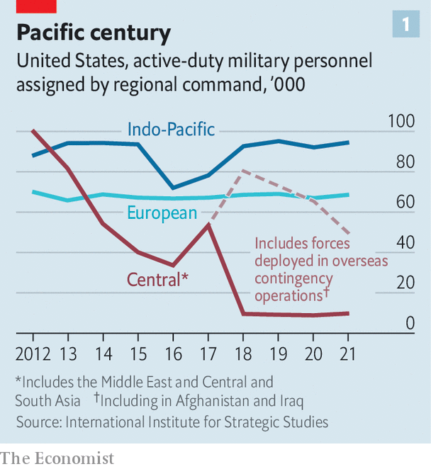
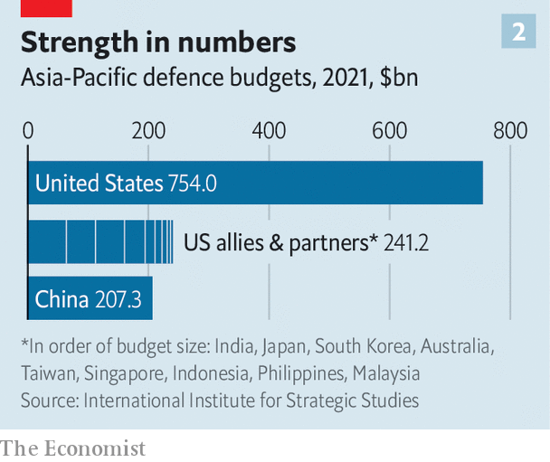
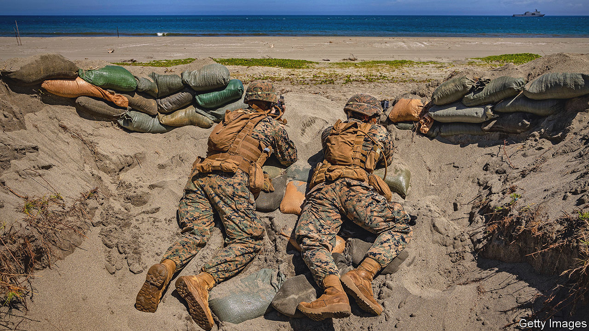

###### Walking and chewing gum

# How America tries to grapple with China while confronting Russia 

##### Travels with the defence secretary in quest of stronger ties 

 

> Jun 16th 2022 

Ramrod-straight in a crisp green uniform, General Wei Fenghe, China’s defence minister, saluted the audience before letting rip. “We require the us side to stop smearing and containing China. Stop interfering in China’s internal affairs…If you want confrontation, we will fight to the end.” His fire was aimed at the lumbering figure of Lloyd Austin, America’s defence secretary and a former general. 

Mr Austin (pictured above in Bangkok) had warned the same gathering that China was becoming “more coercive and aggressive”—militarising disputed islets in the South China Sea and provocatively probing Taiwan’s defences. “We will fly, sail and operate wherever international law allows,” Mr Austin insisted. America would continue to sell arms to Taiwan, while “maintaining our own capacity to resist any use of force or other forms of coercion”.

The finger-jabbing worried many of those attending the Shangri-La Dialogue on June 10th-12th, an annual talkfest of ministers, generals and security experts in Singapore held by the International Institute for Strategic Studies, a British think-tank. “I have a strong sense of urgency that Ukraine today may be East Asia tomorrow,” fretted Kishida Fumio, Japan’s prime minister. The fact that Generals Wei and Austin met to discuss “guardrails”—rules for encounters at sea and in the air, and hotlines—was reassuring. But it was also evidence of how fast the rivalry is deepening.

 


Mr Austin regards the Indo-Pacific, from Hawaii to the Maldives, as “the heart of American grand strategy”. It is where the country deploys the most forces (see chart 1). But can America credibly grapple with a rising China while also striving to repel Russia’s aggression in Ukraine? Yes, avers Mr Austin. “We are walking and chewing gum. We’re able to do that because of the strong network of alliances and partnerships that we have around the globe.” America’s ability to attract friends is a force multiplier (see chart 2), and ever more important as the challenges grow.

 


To travel with Mr Austin to Asia and Europe this month is to glimpse America’s military might, and how it seeks to harness the “power of partnerships”. He flew on an e4-b, “the Doomsday plane” from which American leaders can wage nuclear war, trailed by a c-17 transporter. Every few hours it was refuelled in mid-air by a daisy-chain of tanker aircraft lurking off the coasts of Alaska, Japan, Arabia and Italy. On the ground Mr Austin met Justin Trudeau, Canada’s prime minister, at an American-Canadian nuclear bunker in Colorado; 20-odd ministers in Singapore; the Thai prime minister in Bangkok; and the defence ministers of 29 nato allies in Brussels.

Yet not all allies are equal. In Europe America can rely on nato, whose members are committed to defending each other under Article 5 of the Washington treaty. In Asia China accuses America of trying to recreate nato—a contention Mr Austin denies. “We do not seek a new cold war, an Asian nato or a region split into hostile blocs,” he insisted. Rather, America operates with a patchwork of security accords.

America thinks only China can challenge its global supremacy. Yet Russia is consuming much of the country’s attention, and billions of dollars, as America seeks to help Ukraine and strengthen nato. Despite Europe’s wealth, says Eric Edelman, a former senior Pentagon official, “without the us to organise them, Europeans cannot defend themselves”.

Defence officials justify the priority given to Ukraine by arguing that, were Russia to succeed in taking land by force, it would encourage other autocrats to do the same elsewhere (eg, Taiwan). Many foreign-policy experts think the war in Ukraine, if it results in a defeat for Russia, would strengthen the West’s hand against China.

“Ukraine is facing a pivotal moment on the battlefield,” said Mr Austin, announcing another $1bn in American aid, including more artillery and longer-range missiles—though well short of the amounts requested by Ukraine. He has stopped talking about helping Ukraine “win”. The blurry aim is something less—giving it “the means to deter and to defend” itself.

American officials boast that Mr Putin’s war is strengthening nato: Sweden and Finland want to join. Yet all is not well.  is blocking their accession. And allies are drifting apart over the endgame in Ukraine. 

Hub and bespoke

nato’s summit in Madrid on June 29th-30th will focus on the threat from Russia but will keep an eye on Asia. It will probably be attended by the leaders of Japan, South Korea and Australia. This is not yet the “league of democracies” that some have dreamed of. But as a Japanese official puts it: “The message is that security in Europe and Asia cannot be separated.”

Despite Mr Austin’s denial, many in America see benefits in trying to recreate something like nato in Asia (one such body, the eight-member Southeast Asia Treaty Organisation, was dissolved in 1977). For now, America gets by with what might be called a “non-treaty organisation”: a hub-and-spokes system of bilateral defence agreements with Japan, South Korea, Australia, the Philippines and Thailand, which do not have obligations towards each other. Japan, the weightiest of these, is hamstrung by its tradition of pacifism. Taiwan, the most dangerous flashpoint, has no formal diplomatic relations with most countries, and is excluded from America’s many regional military exercises. “Strategic ambiguity” prevents America from saying clearly whether it would intervene to stop a Chinese invasion.

For want of a more coherent system, America is building a fast-expanding set of ad hoc projects—a “networked security architecture”, as one official puts it. The “Five Eyes” (with Australia, Britain, Canada and New Zealand) share intelligence; aukus (with Australia and Britain) is developing nuclear-powered submarines and other weapons; and the Quad (with Australia, India and Japan) discusses everything from vaccines to maritime security.

In Singapore Mr Austin prodded Japan and South Korea to hold three-way exercises on missile defence, spurred by North Korea’s missile tests. With Japan and Australia, he pushed for more complex war-games and co-operation on defence technology. The result, says Tanvi Madan of the Brookings Institution, a think-tank in Washington, is unusual: “It’s not hub-and-spokes. It’s not nato. It’s a spider’s web.”

This web may not be strong enough to contain China. Much depends on Japan. Mr Kishida promised a “substantial” rise in defence spending, though he did not commit himself to reaching 2% of gdp, nato’s benchmark. A law from 2015 provides more leeway to help allies. Japan and Australia have signed a deal allowing them to station troops in each other’s countries. A new national-security strategy later this year may push things further.

India, the world’s largest democracy, is the trophy in America’s quest for stronger alliances. It is increasingly at odds with China. Its help in controlling the Strait of Malacca would be invaluable in any war with China. The Quad, which has started meeting at the level of leaders, seeks gradually to draw India in. Yet India is wary of an alliance, and remains close to Russia, which supplies a lot of its weapons.

Another prize is asean, the ten-country South-East Asian club. It includes fence-sitters such as Indonesia. “We do not believe in alliances that could in the end threaten other countries,” said Prabowo Subianto, its defence minister. Indonesia holds drills with America but does not want to upset a “benevolent” China.

America has pursued softer forms of collaboration, such as helping Asian governments to police their waters, not least against Chinese illegal fishing. An American coastguard cutter will be deployed to the region. A Quad summit last month promised to help Indo-Pacific countries improve “maritime domain awareness” by sharing information on ships at sea. A Chinese military source was scathing: “Monitoring fishing vessels means also monitoring military ships,” he said.

And what about staying power?

Ashley Townshend, of the Carnegie Endowment, an American think-tank, argues that America is still not doing enough in Asia. A mutual-defence treaty between the closest allies—America, Australia and Japan—could antagonise South-East Asian countries. Better to create a joint military command between them, Mr Townshend argues: instead of a nato-like treaty in Asia, a small nato-like military structure.

 


The great game in Asia is in full swing. Many in America are only dimly aware of it. On Mr Austin’s e4-b, the screens streaming American news channels barely noticed his globe-spanning defence diplomacy. They were offering competing views of the Capitol-riot hearings, guns and more. Which raises a nagging question: does an America so polarised at home have the will to sustain its dominance abroad? ■


