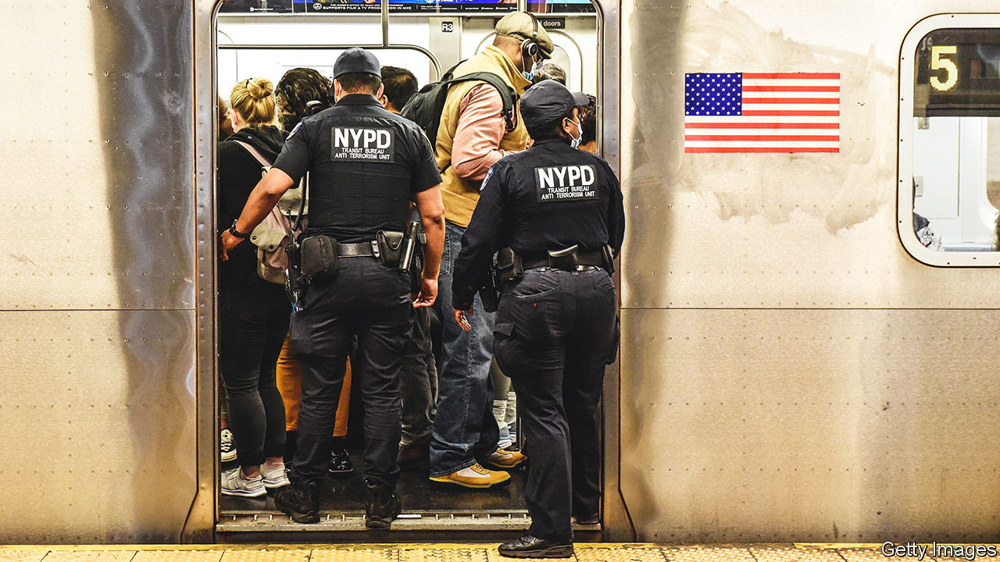

###### Angst in the city

# Safety worries are putting New Yorkers off returning to their desks 

##### Nothing to fear but fear itself? 

 

> Jun 16th 2022 

Before the pandemic, Alexa, who works in finance, did not think twice about taking the subway. She hopped on day or night, never worrying about safety. That has changed. “I avoid taking it if at all possible,” she now says. Safety concerns are one reason people are hesitating to go back to their Manhattan desks.

By late April, only 8% of New Yorkers had returned to their offices five days a week, according to a survey of employers by Partnership for New York City, a business group. On an average weekday, 38% of Manhattan office workers were in the workplace. More than a quarter were fully remote. Firms are trying to bring workers back through mandates or incentives such as free meals and Ubers. But after more than two years of remote working, people have grown used to it. Few miss the commute. Some continue to worry about catching covid-19. 

And some worry about crime. On the city’s transit systems it has increased by 56% since the start of this year. A recent report by Nicole Gelinas of the Manhattan Institute, a New York think-tank, found that as ridership gradually returned in 2021, violent crime did not decline in tandem, as some thought it might. 

Christopher Herrmann, of John Jay College of Criminal Justice, points out that crime before the pandemic was exceedingly low, which exaggerates the recent rise. “I understand the fear,” he says, but “I got a five times better chance of winning the Big Six lotto than I do getting victimised on the New York City subway.” Although ridership is still only around 60% of what it was pre-pandemic (on the London Underground, by comparison, passenger numbers are much closer to pre-covid levels), some 3m people use the subway every day without incident. Yet people fret.

“Perception is reality,” says Andrew Rigie of New York City Hospitality Alliance, which represents restaurants and bars. Those are struggling to return to normal. “Crime, or the perception of it, is impacting consumer behaviour,” says Mr Rigie.

A few high-profile murders have shaken confidence. In January Michelle Go, who worked at Deloitte, a consultancy, was fatally shoved from a Times Square subway platform onto the tracks in midmorning. In April a gunman shot ten people on a train during the morning rush hour. Last month Daniel Enriquez, who worked at Goldman Sachs, a bank, was randomly killed on the subway on his way to Sunday brunch. Last week a man stabbed two passengers without provocation.

Eric Adams, New York City’s mayor, won election promising to improve public safety. He has released blueprints for tackling violence and unveiled a subway-safety plan with Kathy Hochul, New York’s governor, who controls the subway (the nypd is charged with keeping it safe). He has put money into mental health and homeless services. He has appointed a gun-violence tsar. He may deploy officers to each train, as was done in the 1980s.

The Riders Alliance, an advocacy group, has produced its own subway-safety plan, which calls for more transit workers rather than more cops. When the Partnership for New York City asked employers to identify what would be most effective in encouraging employees to return to the office, 31% pointed to reducing the presence of homeless and mentally ill people on streets and subways; 22% pointed to expanding police presence on the streets and subways.

After Mr Enriquez’s murder, Mr Adams held a call with business leaders to reassure them. He ordered municipal office workers back to their desks. Since April his police commissioner has held public-safety briefings for firms. This has helped alleviate fears, says Kathryn Wylde of the Partnership for New York City. Another poll by the Partnership suggested that workers will resist returning to the office until the city and subway are safe. Mr Adams knows the city cannot afford to lose those workers. He has said repeatedly that “public safety is the prerequisite to prosperity”. ■


