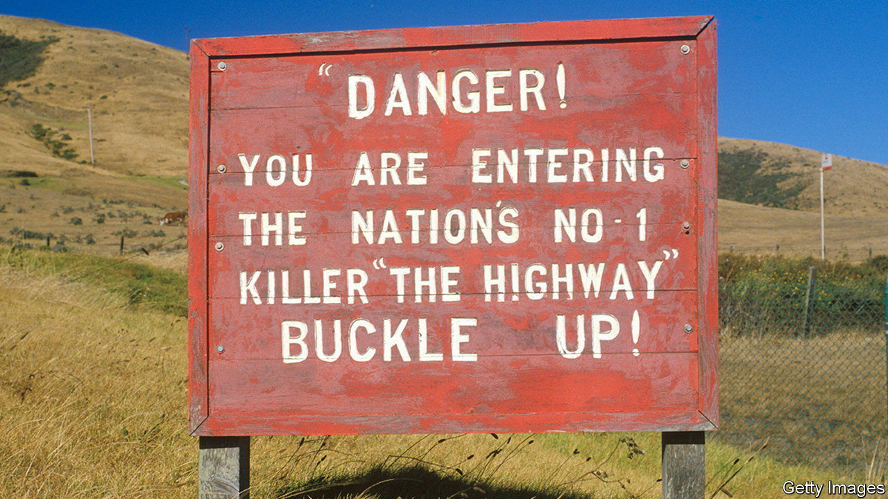
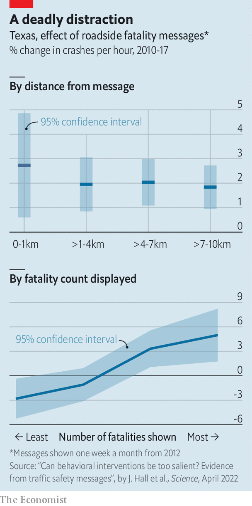

###### Road safety

# Shocking drivers with road-death statistics leads to more crashes 

##### A well-intentioned nudge backfires fatally 

 

> Jun 16th 2022 


When Joshua Madsen first saw a message like this displayed above the highway, he was confused. “It was very sobering,” he says, “but I didn’t know what I was supposed to do.” He started noticing more messages: 28 states have displayed death tolls on electronic road signs, to encourage safe driving. But in a recent paper published in , Mr Madsen and his colleague Jonathan Hall found that the messages actually increase the number of crashes. 

 


The study focused on Texas, where the year’s cumulative death toll from road accidents was displayed on highway signs one week in four. The authors found that, between 2010 and 2017, there were more accidents in the weeks when death counts were shown. Most excess crashes happened in the kilometre after a sign, but for several kilometres there was still an elevated risk (see top chart). In the 10km after a message there was a 4.5% rise in accidents—some 2,600 extra crashes and 16 deaths each year in Texas. 

The authors think that the sombre messages may be distracting drivers. Busier sections of road that required drivers to pay the most attention had the biggest proportional increase in crashes. The effect of the signs also depended on how shocking the figures were. Early in the year, when the total death count was low, there were fewer crashes in weeks with messages. But the signs had a far more negative impact as the number of deaths ticked up (see bottom chart). The study highlights how seemingly innocuous “nudges”, used by governments to try to change behaviour, can backfire. 

Luckily America’s government has given a nudge of its own. Last year the Federal Highway Administration released a memo clarifying that it was inappropriate to use electronic highway signs to display death tolls. There was no safety in numbers.


