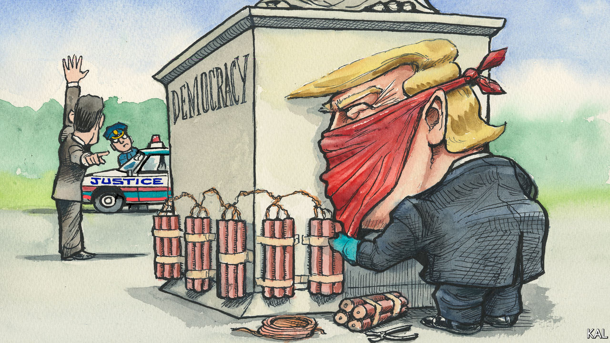

###### Lexington

# The criminal case against Donald Trump 

##### The January 6th committee is doing the Department of Justice’s work for it 

 

> Jun 16th 2022 

The house’s January 6th committee has a few aims for its public hearings this month. Some of its nine members speak of leaving a historical record of Donald Trump’s attempted election heist. Its Democratic ones must hope to give their party a much-needed bump for the mid-terms. But Liz Cheney appears wholly intent on the objective she outlined last year: ensuring that “the former president never again gets anywhere near the Oval Office”.

Abandoned by her party, the congresswoman from Wyoming cannot achieve that politically. Therefore—her opening remarks at the first hearing on June 9th suggested—she has shifted her attention to the Department of Justice.

A former lawyer, Ms Cheney laid out the case against Mr Trump in prosecutorial style. The violent insurrection after which the House committee is named, she said, was a predictable and predicted result of his big lie. He “summoned the mob, assembled the mob and lit the flame of this attack”. The arsonist, she said, then stood back to see how the violence might help him.

Mr Trump made no effort to defend the Capitol. When his advisers pleaded with him to call off the rioters, he angrily refused. The insurrection, Ms Cheney suggested, was not an unfortunate culmination of his lies; rather it represented his last throw of the dice in a “sophisticated seven-part plan to overturn the presidential election and prevent the transfer of presidential power”.

She promised that the six ensuing hearings this month would examine each of those seven parts. They are, first, Mr Trump’s effort to spread misinformation about an election he had lost; second, his scheme to replace the acting attorney-general and suborn the Justice Department; third, his leaning on the vice-president, Mike Pence, to illegally refuse to certify the electoral vote; fourth, his effort to make state election officials and legislators change their vote-counts; fifth, a scheme executed by his lawyers to persuade Republican state legislators to create false electoral slates and report them to Congress; and sixth and seventh, his summoning of the maga mob and refusal to act as it tore up the Capitol.

Though each part is familiar (and, arguably, proven), Ms Cheney’s confidence in asserting that they add up to a meticulously planned and perhaps criminal conspiracy was striking. Her remarks, and the second public hearing on June 13th, suggest this is fuelled by two factors: the evolving legal context and the quality of the evidence the committee has unearthed. 

The context owes much to a ruling by a federal district-court judge in California in March. Asked whether one of Mr Trump’s lawyers, John Eastman, could withhold a trove of emails from the committee by citing attorney-client privilege, Judge David Carter said he could not, because that privilege was obviated by a likelihood that Mr Trump used his advice to commit crimes. He considered that by leaning on Mr Pence, Mr Trump had “more likely than not” broken federal laws against “[conspiring] to defraud the United States” and corruptly obstructing government business. Though not a criminal verdict, which would require a heavier burden of proof, this was a dramatic moment in presidential history. If convicted of the crimes Judge Carter says he probably committed, Mr Trump could spend the rest of his life in prison.

Probably the biggest legal impediment to that would be the difficulty of establishing criminal intent. It would have to be proved beyond reasonable doubt that Mr Trump secretly knew that he had lost the election, so acted not merely inappropriately but corruptly. This is where the high quality of the testimonies and other evidence the committee has gathered could be telling.

The second hearing, which examined the launching of Mr Trump’s big lie, delved into the former president’s state of mind in order to portray his misinformation as a tactic, not a genuine belief. Mr Trump said, months before the election took place, that he could lose it only if it were stolen. (Pre-emptively discrediting institutions is a staple of his method.) The stunning announcement by Fox News, on election night, that he had lost Arizona made it likely that indeed he had lost. In response Mr Trump, egged on by his “inebriated” adviser Rudy Giuliani, called the election a “fraud on the American people” and declared victory.

The committee will argue that this, the first stage of Mr Trump’s “seven-part plan”, established a pattern for the rest. Whenever he was informed that his latest conspiratorial ruse was untenable, as his last two attorneys-general and other advisers said he repeatedly was, Mr Trump did not deny it but, like a cartoon character hopping from floating log to log, shifted to his next gambit. In such circumstances, he had no reason to believe that he had won the election—which would be sufficient to establish criminal intent on one of the two charges Judge Carter considered. And his tactical behaviour implied he did not believe it, which could establish criminal intent on both charges. After just two hearings, the legal case against Mr Trump is looking stronger. 

Whether Merrick Garland might charge him is another matter. While prosecuting hundreds of foot-soldiers of the Capitol riot, Joe Biden’s attorney-general has given no indication that he intends to pursue Mr Trump. A cautious institutionalist, Mr Garland is intent on removing Mr Barr’s taint of politicisation from his department. Arresting the previous president would make that hard.

Merrick’s dilemma

As Ms Cheney knows, the prospects of blocking Mr Trump electorally are receding. Most Republicans say he won the election and hardly any Republican politician dares say otherwise. On June 14th a Trump-backed primary challenger defeated Tom Rice of South Carolina, making him the fifth of the ten Republican House members who voted to impeach Mr Trump to be pushed out. Mr Trump is the clear favourite to be the Republican nominee in 2024. It is why Mr Garland’s decision looks so important. Yet that will perhaps make him even more reluctant to act. ■


