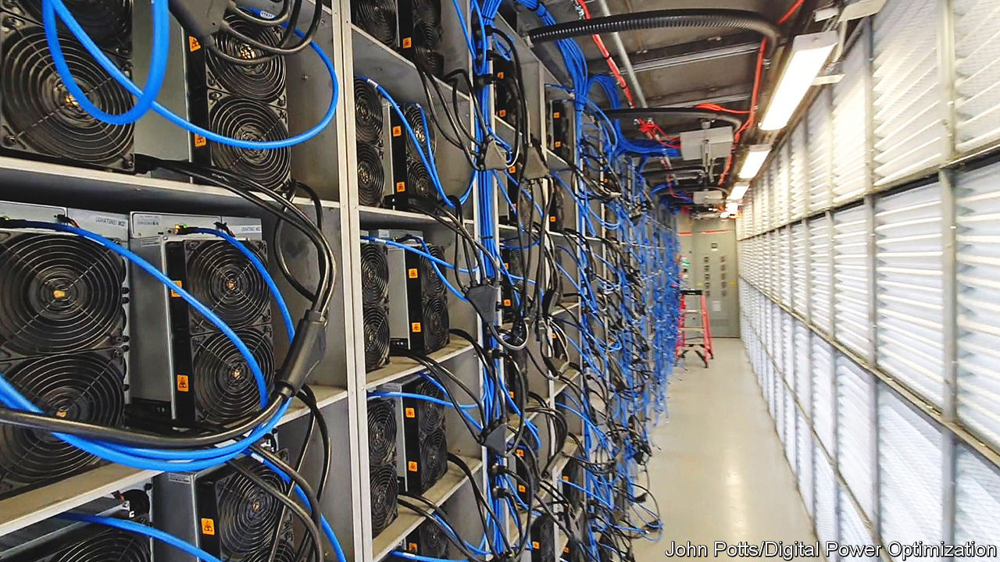

###### Crypto-energy

# The crypto crash will shake up attempts to rescue old power plants 

##### It could put some less efficient ones out of business 

 

> Jun 16th 2022 

A century ago, the hydroelectric dam at Hatfield, a tiny town on Lake Arbutus in west-central Wisconsin, was a marvel of modern engineering. The electricity generated there powered the street cars and factories at La Crosse, on the Mississippi, and in Winona, another lumber town across the river in Minnesota. Cheap power was “making this city practically an electrically operated manufacturing point”, reported the , a now-defunct newspaper, in 1922.

Nowadays, the dam and the redbrick power plant on top of it are of less use. There is less manufacturing, and west-central Wisconsin gets most of its power from much bigger coal, gas and nuclear plants. Since April, however, a new industry has quietly been humming away at the dam. Around 400 computers now use the spare electricity generated to “mine” bitcoin: that is, solving cryptographic problems in the hope of winning some of the 6.25 new bitcoin automatically created every ten minutes. 

The project, which is run by Digital Power Optimisation, a New York-based company, on behalf of the dam’s owner, is intended to “solve an energy headache”, says Andrew Webber, the firm’s boss, by using up surplus electricity. It is one of dozens if not hundreds of similar projects, of various sizes, that have been sprouting all over America in an attempt to acquire electricity cheaply at the source. The cheaper your electricity, the easier it is to make a profit from mining bitcoin.

In recent months, the cryptocurrency boom has deflated dramatically. Bitcoin has lost 70% of its value since November; it dropped by 17% on June 13th alone. Many firms that had flourished are in trouble. Coinbase, a big bitcoin exchange originally from California, which went public last August at a valuation of $86bn, this month has rescinded job offers and is cutting 18% of its staff. But mining projects, curiously, still seem to be growing. Computer farms making use of solar power, wind power and, more worryingly, gas and coal continue to be set up. In New York legislators are concerned enough about the prospect of redundant fossil-fuel plants being resurrected for crypto mining that on June 3rd they passed a law banning such projects. It remains to be seen whether Kathy Hochul, the governor, will sign it.

Given the crypto bust, why hasn’t the mining boom yet come a cropper? As Mr Webber explains, bitcoin mining has an inbuilt hedge. When the price falls, it is the miners with the least efficient equipment and the most expensive energy who are wiped out. But since the amount of bitcoin created is fixed, that means the remaining firms in the market each win more, counteracting the fall in price. 

The result is a constant rush towards cheaper electricity and more powerful computing equipment. Many of the newest projects in America are run on behalf of energy firms, says Mr Webber, which can use spare power that they could not otherwise sell. “If you’re producing low-cost energy, you’ll outlast,” he says.

Much of the mining capacity that is being wiped out is probably not in America, says Alex de Vries, a Dutch economist who runs Digiconomist, a website that tracks bitcoin’s energy use. After China banned bitcoin mining last year, a lot of Chinese mining computers ended up in places like Kazakhstan. But that equipment is ageing and the power it consumes is not so cheap. “Those are the kind of devices that will go out of business first,” says Mr de Vries. By contrast, for the newer American mines to go bust, the price of a bitcoin would have to fall from its current level of around $22,000 to perhaps half that, he says. America’s share of the “hash rate”—the computing power on the network—rose from 11% to 38% in the year to January.

In recent years many states have rushed to attract bitcoin miners. Last year Kentucky exempted them from sales tax. Texas has made it easier for oil and gas firms to sell energy to them. But bitcoin mining is, by design, a zero-sum competition: not everyone can win. New York’s new law is based on fears that mining is simply boosting carbon-dioxide emissions. The positive case for it in places like Hatfield relies on the idea that clever financial engineering can increase green electricity production by more than the computers use. ■


