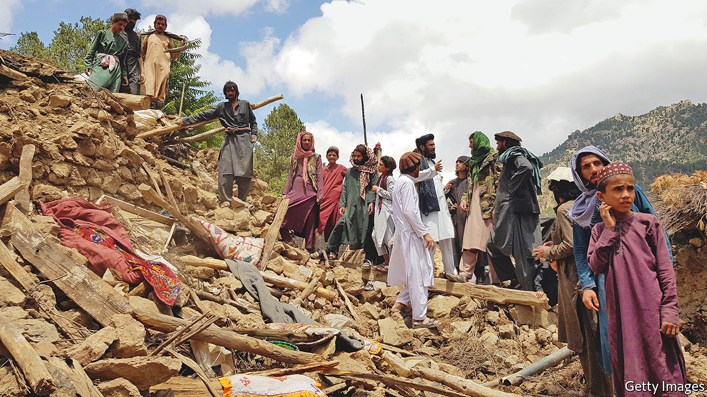

###### The latest disaster

# An earthquake kills hundreds in Afghanistan 

##### The devastated country is ill-equipped to mount a rescue effort 

 

> Jun 22nd 2022 

Afghans were already being tormented by hunger, poverty and the aftermath of war when, in the early hours of June 22nd, disaster struck once more. A 5.9-magnitude  centred in the south-eastern province of Khost, on the border with Pakistan, destroyed homes and triggered landslides in Khost and neighbouring Paktika as people slept. When dawn broke, pictures showed villages reduced to rubble or demolished by torrents of shifting earth. Residents sifted through piles of crumbled masonry and began digging graves.

The speed with which the reported death toll rose, even in an area with few communication links, is a sign of how deadly the tremor may have been. Within hours the state news agency had put the number of victims at over 1,000, with a further 1,500 injured. Those figures were expected to rise further, making the quake the country’s deadliest in recent decades. “People are digging grave after grave,” said Mohammad Amin Huzaifa, head of Paktika’s information and culture department. “It is raining also, and all houses are destroyed. People are still trapped under the rubble,” he added.

The earthquake has hit a . Drought, war and covid-19 had already left most Afghans destitute. When the Taliban took power last summer, foreign aid stopped overnight. Sanctions against its leadership halted bank transfers and paralysed commerce. Aid agencies have spent the past six months trying to save millions of people from starvation while ensuring their money does not flow into the Taliban's coffers.

The remote areas hit by the earthquake, home to poor settlements on steep slopes prone to landslides, are particularly ill-equipped to cope. Even before the Taliban returned to power, foreign aid often failed to reach far-flung places like Khost and Paktika. The south-east’s role as a heartland for the Taliban’s feared Haqqani faction meant that for years it was the site of fighting rather than economic development. A lack of money and materials has meant that many homes in the region are badly built. And although the fighting stopped once the Taliban took over, poverty has increased.

The disaster will test the Taliban’s capacity to govern. The former insurgents have taken over a state. But foreign officials in Kabul who meet them say that they struggle to run it. Taliban administrators have expressed shock at the size of the governing apparatus they have taken on. Many appear to be feeling their way around it, without much sense of what to do. “We don’t have anything resembling governance here; we have a few ministries that do their own thing,” says one foreign official. Big jobs in the administration are allocated by loyalty and seniority rather than competence. Technocrats have been replaced by fighters and clerics.

The Taliban have published a budget, and claim that Afghanistan is economically self-sufficient. But victims of the earthquake have yet to receive much help. Emergency and disaster-management teams are handicapped by a lack of airworthy planes and helicopters. Aware of their own limitations, the Taliban have called for foreign assistance. Charities and un agencies that have been feeding Afghans and running hospitals have swung into action. But for many of those whose homes have been obliterated, help will come too late. ■

