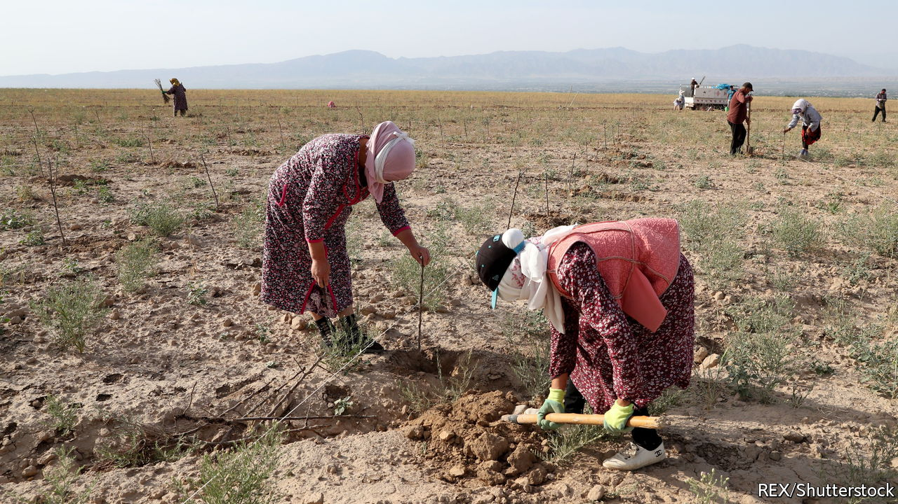

###### From Moscow with money

# Central Asian governments fret over shrinking remittances from Russia 

##### Sanctions notwithstanding, the country remains a magnet for migrants 

 

> Jun 23rd 2022 

Daniyar abdyrakhmanov, a 37-year-old from Jany-Jer, a village in the Batken region in southern Kyrgyzstan, has spent half his life toiling in warehouses and at construction sites in Russia. Two of his three brothers still work there. His wife, a schoolteacher, hails from a neighbouring village. But they met in Moscow, where she worked as a shop assistant. When their son was two years old, they left him with his grandparents and went back to Russia to earn money. 

Mr Abdyrakhmanov’s story is typical. In Batken in the Fergana Valley, close to Kyrgyzstan’s borders with Tajikistan and Uzbekistan, it is rare to find a family without at least one member working in Russia. Mr Abdyrakhmanov had no desire to leave the fertile and scenic region of his birth. But working in Moscow he made three times the average wage back home, where opportunities are mostly limited to growing rice, apricots and walnuts. 

Remittances were worth about a third of gdp in Kyrgyzstan and Tajikistan in 2021, according to the World Bank, making them some of the world’s most remittance-dependent countries. Money sent back from Russia, which is relatively cheap and easy to reach and has a familiar language, is a crucial lifeline. Last year some 82% of remittances to Kyrgyzstan came from Russia; for Tajikistan, the figure was 76%. 

Without remittances, the number of poor Kyrgyz would rise substantially, reckons the government. In Batken, the country’s poorest region, where 35% of people already subsist on just over $1 a day, the share might rise to 50%. Labour migration is so central to these countries’ economies that even the pandemic barely disrupted it. Though some migrants came home in 2020, they left again as soon as they could. Remittances to Kyrgyzstan rose between 2019 and 2021. 

But Russia’s invasion of Ukraine may cut that lifeline. The World Bank predicts that Kyrgyzstan’s economy will shrink by 5% this year. One big reason is that it expects remittances to fall by nearly a third as migrants lose their jobs in Russia’s sanctions-hit economy. The fall of the rouble earlier this year also temporarily reduced the value of the money they sent home, though the currency has since recovered. Remittances to Tajikistan will drop by more than a fifth, the World Bank predicts; gdp will shrink by 2%. The share of Tajik households who cannot afford enough nutritious and healthy food is likely to rise from 20% to 36% as a result.

The experience of Mr Abdyrakhmanov’s family suggests that life for migrants in Russia is already getting tougher: one of his brothers lost his job and is heading home. But so far, there has been no mass exodus. Migrants who still have their jobs say they are planning to stay put for now. 

Fears of an exodus from Russia have sped up the efforts of Central Asian governments to try to diversify their sources of remittances. They have been pushing migrants to seek work in richer countries that offer higher salaries and better labour rights. Government-funded training centres in Uzbekistan have begun teaching Japanese and Korean to would-be migrants. Tajik and Kyrgyz labourers have begun picking fruit and vegetables in Britain, which has emerged as an unlikely destination for Central Asian migrants because of post-Brexit labour shortages.

Nonetheless, most migrants are still heading to Russia, sanctions notwithstanding. A worried-looking man who recently dropped into a government-run support centre for would-be migrants in Osh, Kyrgyzstan’s second city, is typical. He asked staff to check if his name was on Russia’s migration blacklist, which bans labourers who break the country’s employment rules. When they told him that he was in the clear, he left the office with a wide smile on his face. ■

