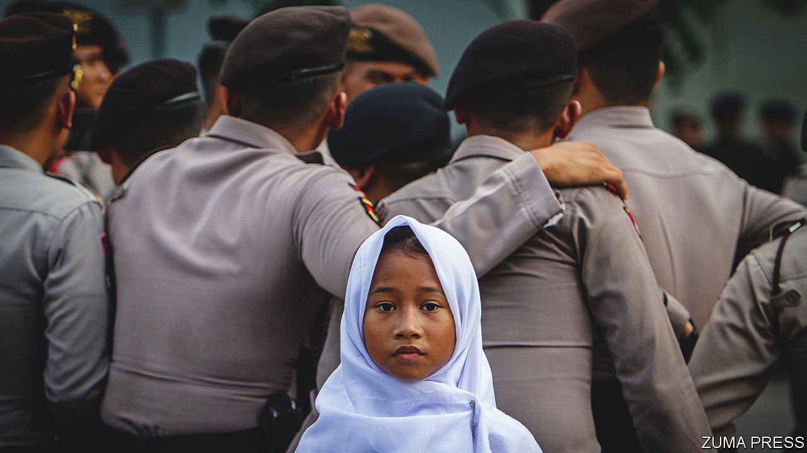

###### Illusory extremists

# Indonesia’s campaign against Islamists is a ploy to silence critics 

##### By defining radicalism broadly, it can demonise its opponents 

 

> Jun 23rd 2022 

Bureaucrats have a reputation for being boring. But not in Indonesia, whose civil service is full of dangerous radicals, according to the government itself. Officials regularly declare that a worryingly high share of public-sector workers are in fact Islamist extremists. Ministers and intelligence chiefs denounce the “radicalism” of bureaucrats and teachers, and newspapers run stories about suspected terrorists who double as local officials. 

Such concerns stem, in part, from the ruling elite’s attachment to religious pluralism. Fully 87% of Indonesia’s 274m inhabitants are Muslim, making it the world’s most populous Muslim country. But it is not a Muslim state: the official ideology emphasises pluralism. Western allies have long celebrated Indonesia for combining widespread piety with a commitment to liberal values.

Yet the attacks on the civil service also serve a less lofty purpose. The biggest source of opposition to President Joko Widodo, known as Jokowi, lies not in parliament, where his big-tent coalition includes all parties bar two, but among grassroots Islamist organisations. Their popularity has ballooned over the past two decades as many Muslims, emboldened by the freedoms afforded them by the end of the long dictatorship of Suharto in 1998, have embraced a more conservative strain of the faith. 

Politicians began to fret in 2016 when such Islamists emerged as a political force during big demonstrations in Jakarta, the capital. Hundreds of thousands took to the streets to decry supposedly blasphemous remarks by Basuki Tjahaja Purnama, the city’s governor, who was Christian and a close ally of Jokowi. His bid for re-election faltered. Since Jokowi’s first campaign for president in 2014, his opponents have encouraged fundamentalist vigilantes and protest groups such as the Islamic Defenders Front (fpi), who accuse the president of not being “Muslim enough”. 

In an echo of Suharto, Jokowi has responded with repression. In 2020 he banned the fpi; six of its supporters were killed in a shoot-out with police that year. He also targeted the public sector. In 2019 he formed a task force to remove extremists from its ranks. The members of the force were drawn from ministries and intelligence agencies, but the government encouraged members of the public to alert it to the extremist views of civil servants via a dedicated website. It also began screening civil-service applicants to assess their religious beliefs. Government agencies now hold seminars designed to instil loyalty to the state in their employees. The security services have delivered lists of members of staff who supposedly hold extremist views to administrators at public universities and the bosses of state-owned firms. Those named are warned that their views will hurt their careers. 

The lists suggest that state agencies are conducting extensive surveillance of the public sector, writes Gregory Fealy of Australian National University. Tjahjo Kumolo, the minister of civil-service reform, has warned civil servants that the government can detect their “digital footprint”. The government justifies such intrusions by claiming that Muslim extremism is “penetrating deep into the organs of state, resulting in the capture of whole sections of the bureaucracy”, Mr Fealy writes. 

Concerns about radicalism have some merit. Indonesia has a recent history of violent extremism, with terrorist attacks on tourist sites killing scores of people in the early 2000s. Large minorities of civil servants support radical Islamism. In 2017 Alvara research centre, an Indonesian pollster, found that one in five civil servants and one in ten state-enterprise workers wanted Indonesia to become a Muslim theocracy. A survey conducted a year later found that nearly 60% of Muslim schoolteachers are intolerant of other religions. 

Yet the government’s claim of state capture by extremists is overblown. “There is no evidence to suggest the systemic prevalence of terrorism or violent extremism within the civil service,” says Sana Jaffrey of the Institute for Policy Analysis of Conflict, an Indonesian think-tank. In its first two years the government’s anti-extremism campaign officially sanctioned a mere 38 civil servants, according to A’an Suryana, a researcher at the iseas Yusof Ishak Institute, a think-tank in Singapore. That is a minute percentage of the country’s 4.3m public employees.

This is despite the fact that the government is using a broad definition of “radicalism”. Making remarks that “insult” the government, or sharing what the task force deems to be “fake news” on social media can be enough to attract its attention. The nebulous criteria, in turn, make it easy to sideline opponents by accusing them of being extremists.

In September 57 employees of the Anti-Corruption Commission experienced this first-hand when they were sacked on the pretext of having failed a civil-service exam. The commission had doggedly rooted out corruption within the highest echelons of Indonesian politics, making powerful enemies. After the officials’ dismissal, celebrities on social media with ties to the government put it about that they were members of the Taliban. One of the former officials who got the boot, Giri Suprapdiono, says he and his colleagues were in fact dismissed because they refused to kowtow to the government. But many members of the public, he says, believed the claims that they were “radical”. That is absurd, he argues: some of those who lost their jobs were not even Muslim. 

The government is “blurring the line between having views that are critical of the government, having Islamist views, and just being called a terrorist”, says Ms Jaffrey. Many conservative Muslims now feel they must be “very careful” when expressing themselves online, says Muhammad Kholid, the spokesperson of the Prosperous Justice Party, a Muslim opposition party. Thousands are subject to discrimination on the basis of their religious and political views, reckons Mr Fealy.

Jokowi hopes that by repressing conservative Muslims, he will prompt them to moderate their views and thereby protect the country’s pluralism. Since the killings of the six fpi supporters in 2020, Islamist agitation has died down. But the peace that Jokowi has bought may not last. His tactics are likely to anger Muslims and drive extremists underground. On June 7th the police announced the arrest of the leaders of Khilafatul Muslimin, an Islamist group which taught students at its 31 schools that Indonesia ought to be a caliphate. It would be better for them, and Indonesia’s democracy, if they were taught the value of pluralism. Too bad that their president is not leading by example. ■

