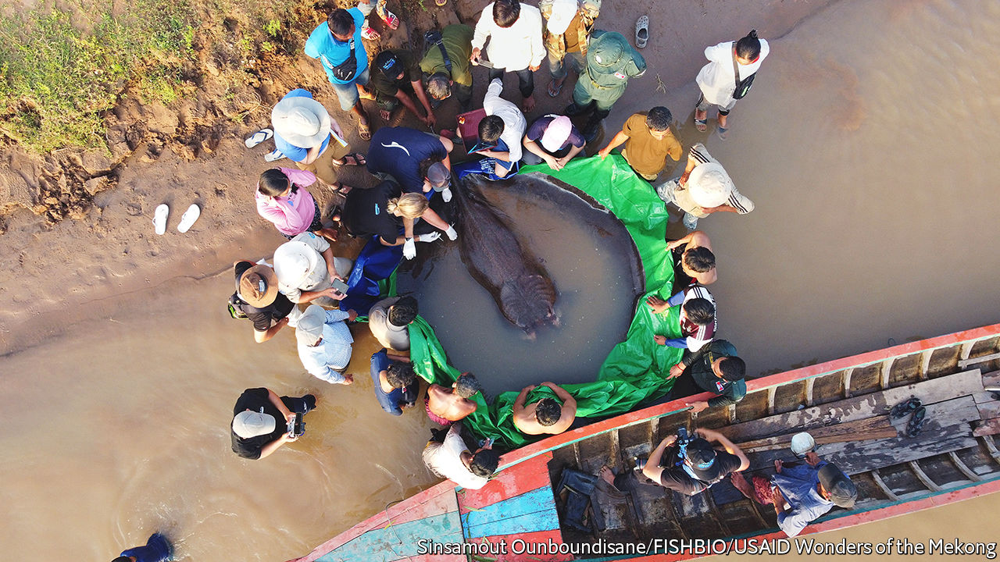

###### A big catch

# What a giant stingray says about the Mekong 

##### The discovery of the world’s biggest freshwater fish spells hope for the struggling river 

 

> Jun 23rd 2022 

It took a dozen men to load Boramy, a giant stingray, onto the scales. At just under 300kg, she is the biggest freshwater fish ever weighed. She was caught by a Cambodian fisherman on the Mekong, South-East Asia’s longest river, on June 13th. She was the fourth giant stingray recorded in the area in the past few months. She swam away tagged. 

The discovery of such a large fish has cheered conservationists. The Mekong river, which starts in the Tibetan plateau and snakes through China, Myanmar, Laos, Thailand, Cambodia and Vietnam, feeding some 66m people along the way, is home to more species of huge freshwater fish than any other in the world. But they are suffering. In the past 50 years the population of giant fish has dropped by 94%. 

Dams are part of the problem. Over 140 of them have been built on the Mekong and its tributaries to feed the region’s growing demand for electricity. Dozens more are under construction. Dams alter the amount and quality of water and nutrients in the river. They also block fish from migrating. 

Changing weather patterns do not help. The wet season is shorter than it used to be and tends to start later, says Courtney Weatherby of the Stimson Centre, a think-tank. Between 2019 and 2021, the water level in the Mekong was the lowest since records began 60 years ago. Poor dam management, climate change and El Niño, a weather pattern that affects rainfall in the region, are all thought to contribute to the problem.

That Boramy is both massive and alive shows that pockets of the river remain resilient and worth protecting. Her discovery also points to improving relations between fishermen and conservationists. Her captor could have sold her as food. Instead he called Wonders of the Mekong, a local conservation group, which paid him some $600 to keep Boramy alive so that she could be tagged and released. Villagers along the river are also paid modestly to maintain the acoustic receivers that pick up signals from the group’s tags. 

Conservationists hope that by tracking Boramy, they will learn which parts of the river to protect, including breeding and birthing spots. But big fish may yet lose out to big hydropower. A new dam is being proposed just upstream of where Boramy was found. 

