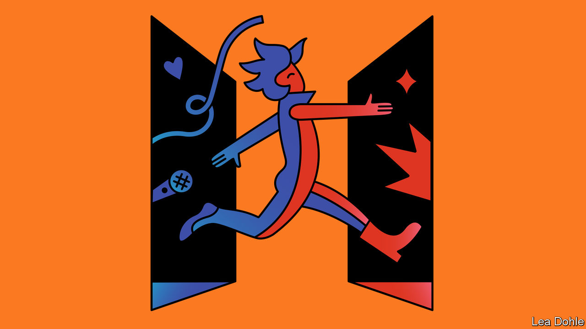

###### Banyan

# What is the legacy of BTS, the world’s biggest boyband? 

##### As they announce a break, they leave behind contradictions 

 

> Jun 23rd 2022 

One pre-pandemic estimate put the annual economic impact of bts, a South Korean boyband, at $3.7bn a year, making them the most valuable pop act ever. Wherever they go, the seven members sprinkle gold dust on clothing, cosmetics, tourism and food. Ahead of their first tour since the pandemic, stadium concerts in Seoul, Los Angeles and Las Vegas sold out in minutes.

The band also has a fan base of unprecedented reach and engagement. To ignore bts, as E. Tammy Kim writes in the , is “to risk missing something bigger than Beatlemania”. The commitment of bts fans, known as armys (the acronym stands for “Adorable Representative mc for Youth”), shows an intensity that goes well beyond confessing “biases” for favourite members. They translate bts’s interviews, songs and social-media posts into countless languages and organise to boost the band’s streaming numbers. Their devotion to textual analysis of social and other media is “astonishing”, writes Ms Kim. 

Equally notable is their activism in opposing movements they deem to run counter to bts’s values. In 2020 big numbers of armys registered but did not show up for a rally Donald Trump, then America’s president, was holding in Oklahoma, leaving empty seats that made Mr Trump look unloved. (In the Philippines this year they were less successful in an attempt to support opponents of Ferdinand “Bongbong” Marcos, son of a heinous dictator.)

So it came as a shock when bts released a video last week in which they announced that they would stop performing together. Gathered around a table laden with food and wine, band members took turns to rue the band’s high-pressure work and the constant demand for new music. One member, rm, said he didn’t “know what kind of group we were any more”. He added that he felt as if he was “trapped and couldn’t get out”—years as a k-pop idol had constrained his personal growth. The band said they would take a break and pursue individual careers.

The effect was instant. The share price of the band’s production company slumped by over a quarter and has yet to recover, despite reassurances that the break is temporary (looming national service for some members may be a factor in the break-up). armys feel bereft, for bts has a different image from other k-pop acts. Their faces and clothes are as flawless as those of other idols, but a confessional streak has long been part of their shtick. They admit to frailties and insecurities—but also emphasise self-belief. 

The combination, more than anything, strengthened the bond with young fans struggling to forge an identity for themselves. In South Korea, it appealed to youngsters coping with the pressures of a hyper-competitive education system, dwindling job prospects and rigid social expectations. Many families, for example, still demand that their kids zip up their emotions. Abroad, bts won hearts and minds by embracing causes such as Black Lives Matter, and appearing at the un to call for children to be better protected from violence. They also helped shift macho norms, at least a little. With their androgynous looks and confessional approach, Hyeouk Chris Hahm, a professor at Boston University, says they have “reimagined the Asian male”. 

With so much emotional capital invested, it is little wonder that their fans are mourning. But as bts leave the stage, they also leave behind contradictions. For all the solace they provide from rigid social expectations, they are the product of an industry that contractually regulates the minutiae of its stars’ lives, including banning them from having romantic relationships. Even the most competitive Korean employers in other industries do not demand that. 

Likewise, bts may have embraced popular progressive causes abroad, but they have not done the same in their own conservative country. Efforts to introduce laws to protect people from discrimination on the grounds of race, sex, nationality or sexual orientation or to improve the rights of gay people, which are close to the hearts of many of their fans, would no doubt have benefited from their support. And for all their emphasis on self-care, they have done little to encourage other-care in their fans’ online conduct. armys can be some of the worst social-media bullies.

Carefully calibrating displays of vulnerability and avoiding controversial causes has been a big part of bts’s success. Maybe breaking up will in time let its individual stars break character.


