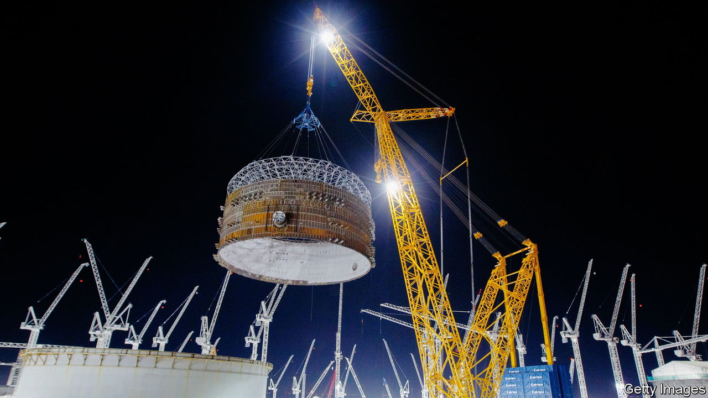
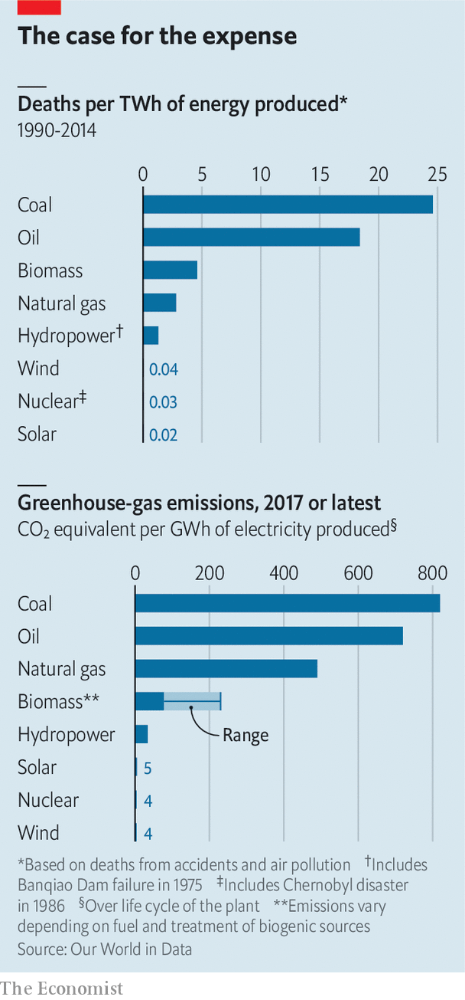
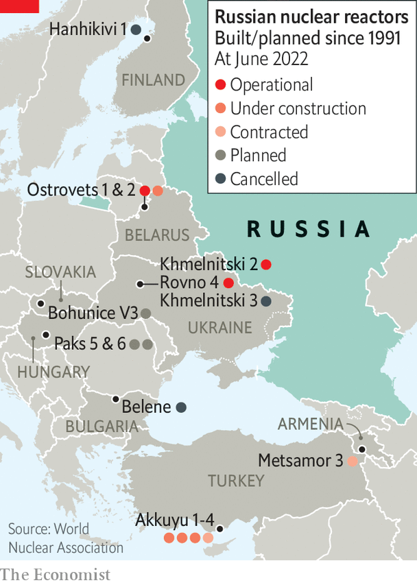
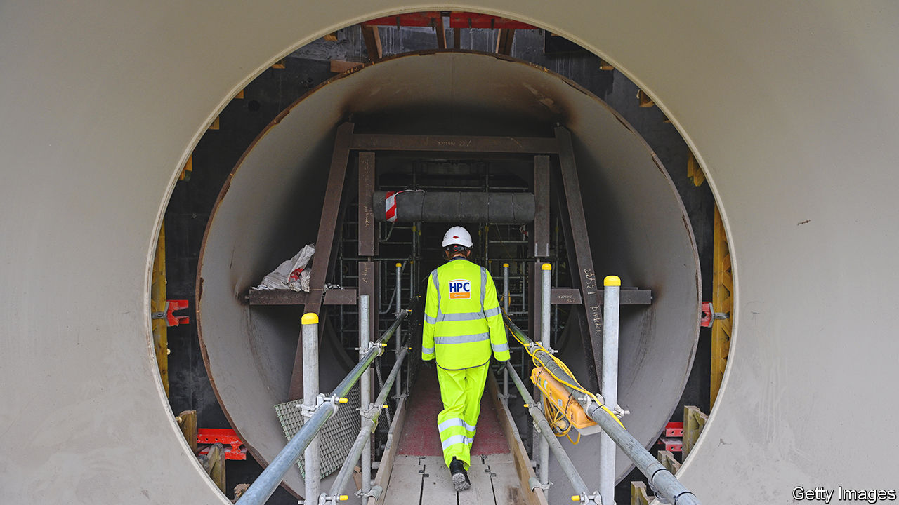

###### Nuclear family

# Energy security gives climate-friendly nuclear-power plants a new appeal 

##### To make good on it they have to get easier to build 

 

> Jun 23rd 2022 

The world’s largest crane, Big Carl, trundles up and down the railway which bisects the site. To the south are cavernous temporary structures which serve as factory floors, sheltered from the elements, cranking out modules of steel and concrete. Big Carl (pictured, above) takes gentle hold of these components, lifts, turns and gently sets them down. Piece by gigantic piece, the newest nuclear power plant in the Western world is taking shape. When it is finished its two nuclear reactors will be able to supply Britain’s grid with 3.2 gigawatts (gw) of power, providing about 7% of the country’s electricity needs.

Over the four years that Hinkley Point c (hpc) has been under construction on the edge of the Bristol Channel in the west of England, it has consistently been held up as an example of the industry’s current problems. Nuclear energy’s long-standing cost and schedule issues used to mean it was hard put to compete with natural gas and coal. Now they make it hard for nuclear to compete with ever-cheapening renewable energy. 

When the British government and edf Energy, the plant’s owner, signed the relevant contracts in 2013, hpc was expected to produce a megawatt-hour for £92 (then $145). The same amount of energy from a new offshore wind farm was at the time expected to cost £125. Nine years on, hpc is two years behind schedule and £10bn over budget; so its power will cost more. Offshore-wind producers, for their part, are offering energy at less than £50 (now $60) per megawatt-hour. The cost of electricity from solar panels has fallen yet further. Campaigners who have long seen nuclear as dangerous can now call on economists who say it is just too expensive. 

Beyond all that, the plant faces the problem of being built by a company in increasingly dire straits. The other European plants based on the reactor design edf calls epr—the design used at Hinkley—are also behind schedule. Its existing reactors in France are causing concern, too. Corrosion problems discovered in 2021 have seen a number of them shut down for inspection and repair at a time when the cost of natural gas, and thus electricity, has soared. 

High prices have meant the amount the company has had to pay to cover its lack of performance is particularly high; in March it announced its profits would be €11bn lower as a result. Another €8.4bn hit came through the French government’s order that edf supply electricity to re-sellers below the wholesale market rate to protect consumers from cost increases. 

For all its woes, though, by the standards of Western-designed and -built nuclear plants, hpc is ahead of the curve. The eprs at Olkiluoto in Finland and at the Flamanville c plant in France started construction in 2005 and 2007 respectively. Neither has yet been paid for a watt fed into the grid. The same is true of Vogtle, an American plant designed around two Westinghouse ap1000 reactors which began construction in 2009; by 2017 it had driven Westinghouse into bankruptcy. All three are between two and three times over their original budget and getting on for a decade behind schedule. 

To see reactors completed and connected to the grid with any degree of regularity and timeliness you must go instead to China and Russia. Between 2008 and 2021 Rosatom, a state-owned firm, started and completed ten reactors at five power plants in Russia. China has been building reactors of various designs, including ap1000s and eprs. The China General Nuclear Power Group set to work on its two eprs in Taishan, in southern China, after construction was already under way at Olkiluoto and Flamanville and finished by 2019.

This has meant that those Western countries still interested in building nuclear power plants have increasingly looked to non-Western companies to build them. At the beginning of this year Rosatom was expecting to build four reactors in the eu, 7% of the 70gw of nuclear capacity it has plans for beyond Russia’s borders. In February Britain’s nuclear regulator approved the Hualong One, a Chinese reactor design, for use at Bradwell, a nuclear site in Essex. 

Then came the war in Ukraine. On February 15th, as Russian forces massed on Ukraine’s border, Bulgaria definitively nixed any Russian involvement with a nuclear plant that was to be built next to the northern town of Belene. Finland’s Minister for Economic Affairs, Mika Lintila, has repeatedly said that it would now be “absolutely impossible” to grant a permit for a planned Russian-built nuclear plant in Hanhikivi to go ahead. In March the Czech Republic excluded Russian reactors from a tender for which they had previously been the leading candidate. 

Heat and light

Hungary's opposition has been attacking plans for two new Russian reactors at the Paks plant in the centre of the country on the basis that they would expose the country to untenable Russian influence. Viktor Orban, the pro-Russia prime minister, might be immune to their arguments. But Western sanctions make it doubtful that Rosatom could complete the build. A more general worry about inimical control over such assets has seen the Chinese plans for Bradwell put in doubt.

At the same time as sending countries already interested in new nuclear plants in search of new companies to build them, the invasion of Ukraine also underscores a more general energy-security argument in favour of nuclear power plants: they can afford their owners a security of electricity supply. The eu’s reliance on Russian gas has boosted Russia’s income even as its artillery flattens Ukrainian cities; since mid-June, Russian moves to limit that supply have sent prices through the roof. 

If European countries had more nuclear plants, their reliance on Russian gas would be reduced; there is a reason why Finland, where the practical alternative has long been Russian gas, is keen on the technology. When President Emmanuel Macron of France announced on February 10th that the country would be building a new set of nuclear plants, he praised renewables and nuclear as the “most sovereign” way of producing electricity. During a visit to hpc in April, British prime minister Boris Johnson was explicit that the reactor was part of an “energy-security strategy”: “We cannot allow our country to be dependent on Russian oil and gas.”

 


As Mr Macron noted, energy security adds to the technology’s pre-existing appeals; it is comparatively safe and it is climate friendly, both of which make it preferable to fossil fuels (see chart). According to an analysis by Our World in Data, a research organisation, burning coal to generate a terawatt-hour (twh) of electricity is associated with some 24.6 deaths, largely because of particulate air pollution. Natural gas is about ten times less deadly. Including roughly 4,000 deaths linked to the Chernobyl disaster and the 573 people who, according to , a newspaper, died as a result of “fatigue or the aggravation of a chronic disease due to the [Fukushima] disaster” the number for nuclear is just 0.03 deaths per twh. 

As to climate, if industrialised countries are to do their bit in keeping the rise in global average temperature, compared with that of the pre-industrial age, well below 2°C—the target set in the Paris agreement of 2015—they need quickly to purge fossil fuels from electricity grids. Plausible models show clearly that, even with big grids and a lot more energy-storage capacity than is available today, this is much cheaper when the grid includes not just wind and solar, which are both intermittent, but also “firm” generation which produces electricity at a relatively steady rate. 

 


It has long been argued that this role might be taken by fossil-fuel-powered plants fitted with technology for carbon capture and storage (ccs) and that may yet be the case; but there has been almost no deployment of the technology at large scale yet. Hydroelectricity and nuclear power are the only methods of producing such power without emitting carbon dioxide that have ever been deployed on a large scale. And sites suitable for big new hydroelectric plants in developed countries are very few and far between. 

Saving the planet

The climate case for nuclear has given rise to a lot of excitement about new types of reactor, notably smaller ones which make more use of components created in factories far from their sites. But these small modular reactors (smrs), promising as they may be, are still for the most part at early stages of development. The only proven form of nuclear power that can be expected to provide fresh gigawatts to rich-country grids in the 2030s is the form that is around today: big, slow-to-build and cumbersome reactors like the epr. 

This means that hpc is not just the latest in a line of thousand-days-late, billions-of-dollars-short boondoggles. The plant is a crucial test of whether Western financing, construction and supply chains can be improved in ways that curb the industry’s chronic time and cost overruns. To the extent that it can be built more efficiently than its predecessors, and pave the way for future construction to be better still, it is a bellwether for the industry. 

One of the reasons that nuclear plants have to be built better is that they need to cost less. Financing is always going to be a bit expensive, because even before you take the almost certain delays into account the time frame for building them is a lot longer than that for other sorts of large power plant. “You don’t start getting paid until you produce electricity on the grid,” says Julia Pyke of edf, who leads the financing for the next British plant the company is planning, Sizewell C. “The longer your construction period, the more you roll up interest.” 

If the time required was long but predictable that would be one thing. But the risk that the project will run into trouble which sees the schedule drawn out further, or even cancellation, means the plants do not just have to borrow for a long time, they also have to borrow at high rates. 

These uncertainties reflect the fact that nuclear construction often fails to meet the high standards to which it is understandably held. When regulators notice things, they have to be put right. The concrete used at Olkiluoto was initially not up to scratch, with too much water in the mix. Then there were problems with the systems used to monitor and control the plant, leading to legal battles with two contractors, France’s Areva and Germany’s Siemens. Flamanville is dogged by faulty welding. According to Reuters, a news agency, 800 of the 3,000 people working on the plant are repairing bad welds.

In one way these delays can be seen as reassuring badges of the technology’s safety; regulators came, found shortcomings and had them fixed. It is hard to be sure that the same would happen on Russian and Chinese projects, either at home or in export markets such as Egypt or Pakistan. And there is some reason to believe that a system where there was more experience with new builds would see fewer such cock-ups. Unfortunately the cock-ups, by adding to the costs, make new reactors rarer and building up that experience harder. 

No Western country has a workforce with experience in making the things both well and quickly (hpc is the first to be built in Britain for 30 years). Supply chains are not only hugely complicated but also bespoke, not routine. They thus tend towards the crufty. This results in failure reinforcing failure. Building goes badly; investors, aware of the risks of delay or cancellation, charge a lot for the money they provide; demand for new plants goes down; no one learns to do the building better. 

To break this cycle requires both better building and new financing models. The construction at hpc is using modern planning and prefabrication techniques which are designed to make the build more likely to come in on time. Instead of being welded piece-by-piece, in situ, reactor components are built “offline”, away from the reactor itself, then hoisted into place: hence the need for a very big crane. Similar sorts of reform have been tried before; the ap1000, in particular, was designed with this sort of approach in mind. This time they may actually be working. Simon Gould, a specialist welder with tissot Industrie who worked on both Flamanville and Olkiluoto calls the Hinkley system “a game changer”. edf says construction of the second of hpc’s reactors is going 30% faster than construction of the first did as the new approach hits its stride.

Sizewell c should benefit not just from this process improvement, but also from a financing regime called the Regulated Asset Base (rab). Already used in other British infrastructure projects, it allows interest payments to be covered by charges to consumers’ bills during the construction period. Similar arrangements have been tried before for American nuclear plants. Britain’s National Audit Office thinks the version it has designed is better.

Paying for it all

Having consumers pay off interest during construction reduces the size of the principal on which interest must be paid in future, thereby reducing overall costs. For example, for a loan of £8bn with an interest rate of 9%, which is the rate at which edf was able to borrow money for Hinkley, the accumulated interest on the loan is larger than the principal by the time construction is completed. The company reckons that some 60% of hpc’s final cost will be the cost of financing its construction. 

On March 31st Parliament passed legislation allowing rab to be adopted for Sizewell c. The decision to go ahead with the plant is expected any day. Ms Pyke expects the rab deal will not just allow interest to be paid off before earnings begin but also lower the rate at which lenders charge interest in the first place, though by how much she cannot say. In return for their enforced upfront generosity, consumers should, in the long term, get cheaper electricity. At hpc, edf was able to get the government to agree to a high price for its electricity more or less in perpetuity to overcome the acknowledged hurdle of the financing costs. At Sizewell it will face a regime that allows prices to come down over time on the say-so of a yet-to-be-instituted regulator. 

 


Other companies based in democracies make nuclear plants, but they are untried in Europe. Japan’s nuclear industry has built many power plants at home, and after restarting those closed down post-Fukushima, has plans for more. But it has never built overseas. Two Japanese plants planned for Britain have fallen through in the past decade. Westinghouse, now owned by a private equity group, makes money on refuelling and maintenance but, understandably after its losses at Vogtle, has no firm construction plans. 

That said, Westinghouse is in talks with both Poland and the Czech Republic about the reactors they want to build. Poland has also been talking to Korea Electric Power Corporation, better known as kepco. The company has never yet built a plant in Europe, but it has built one overseas, in the uae, and is owned by a democratic and friendly government. In March that government’s new leader, President Yoon Suk-yeol, said he would abandon the previous government’s policy of phasing out nuclear energy, and committed to boosting the export of nuclear reactors. 

New vendors could improve the outlook. So might the eventual deployment of smrs. An American company called NuScale has a deal to build a set of six small reactors in Romania which together would supply 462mw to the grid. Rolls-Royce, a British engineering company, is touting larger smrs, each of which produces more than all six of those NuScale ones; it, too, is in talks with Poland. 

If such designs really do allow power plants to get up and running in just a few years, new interest could bloom in both Europe and America. But that is not a reason for abandoning attempts to make big nuclear plants cheaper and easier to build. To replace the electricity generated by burning Russian gas and substitute Western-designed nuclear plants for cancelled Russian ones, Europe would need at least 40gw of new nuclear capacity over the coming decade and a half. That is plenty for all. And if Europe could get good enough at big plants to offer them for export that would be a significant bonus. A world in which all new nuclear programmes have to rely on China and Russia is geopolitically unappealing. 

Big Carl, it seems, must do more than lift the 1,000-tonne loads he faces at hpc. He has a potentially world-improving industry to set straight. ■


