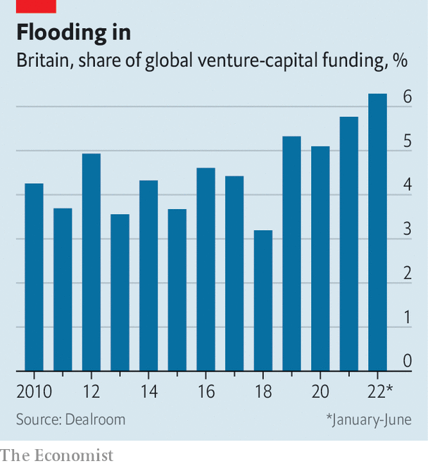
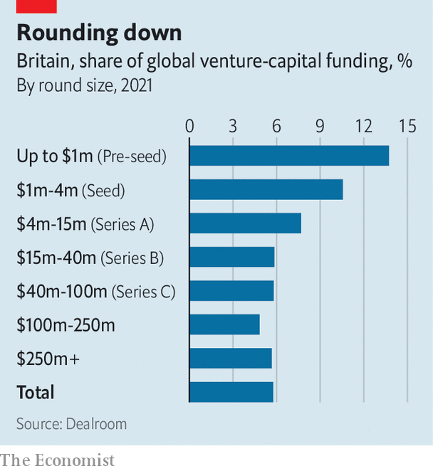

###### Britain’s growth crisis

# Britain is a great place to start a company, but a bad one to scale it up 

##### Too often, the equity capital dries up along the way 

 

> Jun 21st 2022 

The macmillan report of 1931 was nothing if not ambitious. Commissioned by the Treasury, its objective was “to inquire into banking, finance and credit…and to make recommendations calculated to enable these agencies to promote the development of trade and commerce and the employment of labour”. Today it is best known not for its musings on  or the gold standard, but for its diagnosis of the “Macmillan gap”. 

Wall Street “devoted itself” to , the report said. Germany owed its “great industrial development” to an “entrepreneur spirit in banking”. But the City’s strengths lay in international commerce and foreign bonds. So the Square Mile was of limited use to domestic firms trying to raise long-term equity capital—and particularly to small and medium-sized companies looking for up to £200,000 (£9.5m, or $11.6m, in today’s money).

Freshen the language and adjust the figures, and the report might have been written today. Britain’s financial-services industry employs 1.1m people, generates 7% of the country’s economic output and contributes a tenth of the Treasury’s tax revenue. But this clout is not harnessed to build the industries of the future. Too often, when it comes to scaling a promising startup into a domestic heavyweight, equity capital dries up along the way. 

 


Of America’s five biggest firms by market capitalisation (Apple, Microsoft, Alphabet, Amazon and Tesla) three were founded after 1990, and the others in the 1970s. Four have valuations in the trillions. The average age of the five biggest firms with headquarters in Britain (Shell, AstraZeneca, Linde, hsbc and Rio Tinto) is 135. None is worth over $250bn.

To see where the problems lie, look at the typical life cycle of a company. Most entrepreneurs begin their businesses with their own money and that of friends and family. Once they need sums in the hundreds of thousands, however, they usually sell a proportion of the firm’s ownership to institutional investors (a “pre-seed round”, in the jargon). Further rounds follow when the startup needs to raise more money: “seed” once it’s around a million, “Series a” when it’s closer to five million, “Series b” when it’s more, and so on until the letters run out. Eventually, a successful firm may be trying to raise such a hefty amount that its best option is to list on the stockmarket.

 


At the early stages, Britain excels. Venture capital (vc), once the preserve of Silicon Valley, has flooded into Europe in recent years, with Britain being the prime beneficiary. British startups raised 14% of the money invested globally in pre-seed rounds in 2021, and 11% of the total in seed rounds. (For comparison, the country accounts for around 3% of global gdp.) “Any decent entrepreneur with a decent idea can get seed capital,” says one investor. But move up the scale, and raising capital gets progressively harder (see chart on next page). By the time they are after $15m or more, British startups’ share of global funding has more than halved. A modern-day Macmillan gap still yawns.

“Deep tech” ventures, which try to develop truly innovative technologies like artificial intelligence or quantum computing, face particular difficulties in attracting scale-up capital. Such firms are essential to building new industries—research into search engines was once a niche pursuit. But spending on research and development chews through cash, and any revenue is likely to depend on a small number of clients or pilot schemes.

As a result potential investors “can’t just look at a set of financials and say ‘this is a business that is working’”, says Anne Glover of Amadeus Capital, a vc firm. Instead, they need to understand how the prototype works, the industry it is trying to disrupt and how long it will take to make a viable product. Almost by definition, such investors are thin on the ground. “There are easier bets to make,” says Harry Nelis of Accel, another vc firm.

That is a problem everywhere, but it is more acute in Britain than in other comparable countries. According to an analysis by British Patient Capital, a government-owned investor, just 49% of British deep-tech firms reach their second funding round, compared with 63% for American ones. By the sixth funding round, the average American deep-tech firm has raised £113m; the average British one just £25m. After adjusting for gdp, deep-tech firms in America, China, Israel and Sweden are all better funded than British ones.

For firms that do manage to scale up, other sources of capital become available. By the time they are looking to raise hundreds of millions of dollars, they can tap the private-equity market. Private-equity investors struck deals worth $1.1trn in 2021, around a fifth of which was for British firms. But as firms grow bigger still, they often seek amounts that can only be found on the public market. And here another funding gap opens up. Britain’s stockmarket is a shadow of its former self.

Until relatively recently, the London Stock Exchange was an international hub for raising equity capital. In 2006 18% of the funds invested in initial public offerings (ipos) globally were raised in London. No longer. Over the five years to 2021 that figure was 4%; so far in 2022 it is below 1%. The City’s biggest ipo, for Glencore, a mining giant, was more than a decade ago. 

One big reason is the behaviour of sources of long-term capital with a natural slant towards British markets. New Financial, a think-tank, reckons that defined-benefit pension schemes, whose assets total £1.8trn, have reduced their allocation to London-listed equities from 48% in 2000 to less than 3% today. Of the £6trn of assets in British insurance funds, pension schemes and retail holdings, only 12% is invested in Britain’s stockmarket.

Tech firms perceive mainstream British asset managers as being somewhere between indifferent and hostile, prizing earnings today over the promise of growth tomorrow. Although tech stocks have endured a hammering everywhere recently, those listed in London have fared especially poorly. One vc investor, asked whether he would consider listing a promising British startup in London rather than on the New York Stock Exchange or on the Nasdaq, responds with laughter. Even as scale-up investors try to build a ladder for fledging firms to climb, says Ms Glover, “it is as if the top rungs have been removed”. 

You only need to look to Germany’s  companies, which employ over half of the country’s workers, to see that creating American-style behemoths is not the be-all-and-end-all of growth. But it is common lore among vc investors that the most potent spurs to entrepreneurship and innovation are examples of wild, untrammelled success. Writing as the Depression set in, the authors of the Macmillan report understood that encouraging early-stage companies to grow would be key to reviving Britain’s economy. That is as true today as it was 90 years ago. ■

