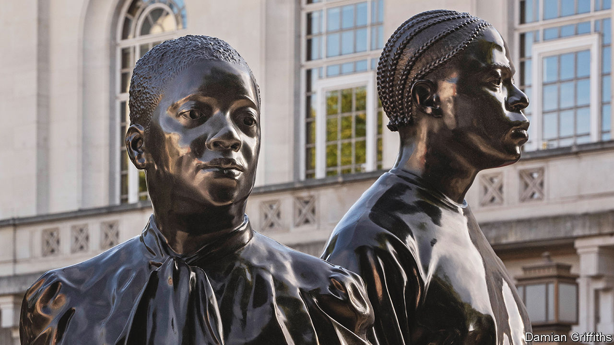

###### Public art

# Britain puts up statues to commemorate black migrants 

##### Two commissions, two very different artistic approaches 

 

> Jun 23rd 2022 

As the passenger ship  chugged towards Britain in 1948, carrying hundreds of Jamaicans, the government shuddered. “This unorganised rush is a disaster. We knew nothing about it,” an official told the  newspaper. Another warned that “it will be difficult, if not impossible” for the new arrivals to find jobs. 

If Afro-Caribbeans felt a little unwelcome then, they received an even clearer signal decades later. In 2018 it transpired that Caribbean-born Britons were being harassed and even deported on the ground that they could not prove their legal status. They had entered the country as British subjects before immigration rules tightened in the early 1970s. They had no immigration papers because there was no need. 

Now the government is trying to atone. On June 22nd, exactly 74 years after the  arrived, Prince William unveiled a state-funded statue in Waterloo railway station. A Jamaican sculptor, Basil Watson, has portrayed a man, a woman and a child dressed in 1940s clothes and hats standing on old-fashioned suitcases. 

The sculpture aims for historical accuracy. But some argue that it misses. “It’s not good history,” says Arthur Torrington of the Windrush Foundation, a charity. The earliest migrants did not pass through Waterloo, although later ones did. And it is a little odd to portray them as awed travellers. Many had been stationed on Royal Air Force bases during the second world war, and knew Britain. 

On the same day two other bronze figures were unveiled in Hackney, in east London. Thomas J. Price digitally scanned 30 local people who feel a connection to the Windrush migrants. Then he used the images to create statues of a man and a woman. The figures wear modern clothes and stand on the ground; the man has sloping shoulders and a hand in his pocket. Rather than depicting a historical event, Mr Price has folded the past into the multi-racial present. “No trilby hats,” he says. “It’s about celebrating who’s here now.”

