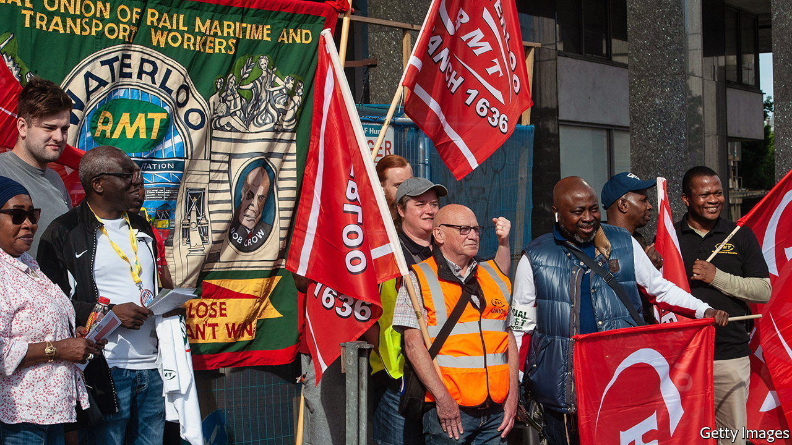
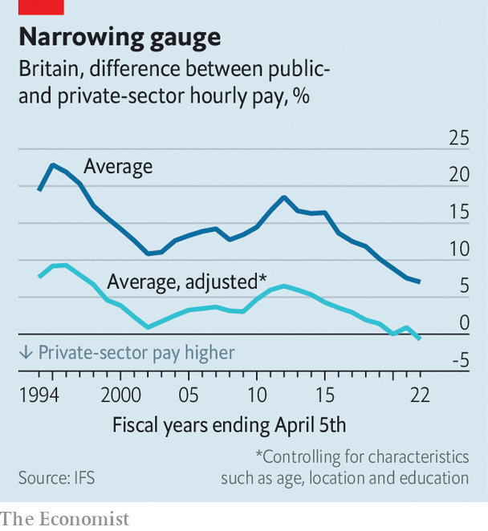

###### Wage fright

# Britain’s government is restraining public-sector pay to curb inflation 

##### The rail strikes are one consequence. There may be others 

 

> Jun 22nd 2022 

Britain’s train network came to a halt on June 21st and June 23rd as striking rail workers protested against a below-inflation pay offer, among other things. With further strikes planned for June 25th, the disruption threatens to endure. It also threatens to spread. The biggest teachers’ union has warned of industrial action in the autumn. Doctors, nurses and local-government employees could go on strike, too. Together the health-care and education sectors account for around 60% of public-sector employment. 

The underlying problem is that high inflation is eating into people’s income. In May prices rose at an annual rate of 9.1%, the highest level since 1982 and much more than was expected when the government set departmental budgets last October. The Bank of England expects the inflation rate to hit double digits later in the year.

That has made conflict over wages all but inevitable. Public-sector employees want their pay to keep pace with rising prices: one teachers’ union is demanding a 12% pay award, for example, against a government suggestion of 3%. But each one-percentage-point increase in the wage bill would cost the government around £2.4bn ($2.9bn), or 0.1% of gdp. That would require offsetting spending cuts, higher taxes or more borrowing.

Reconciling these tensions will not be easy. Beyond the expense, the government fears that giving in to unions’ demands would encourage workers in the private sector to raise their pay requests, too, risking a wage-price spiral. It also worries that higher borrowing could boost demand at a time when the economy would struggle to absorb it; tighter monetary policy would be the result. And the Treasury has already announced measures designed to offer the most vulnerable households protection against rising prices. An inflation-matching pay rise could compensate people twice, at least in the short term. 

Arguments line up on the other side, too. Trade unions are not wrong to say that many staff will struggle to make ends meet. Next April the state pension will rise by at least September’s rate of inflation—why should public-sector employees not be afforded the same protection as pensioners? It is ultimately for the Bank of England to keep inflation under control, and for the government to set the level and quality of public services it desires. 

 


One increasingly salient consideration is the risk of public servants fleeing to the private sector—or not joining at all. Over the three months to April pay in the private sector, excluding bonuses, grew at an annual rate of 4.8%, compared with just 1.8% in the public sector. According to Ben Zaranko of the Institute for Fiscal Studies, a think-tank, average pay in the public sector is still higher than in the private sector but the gap between the two has narrowed significantly (see chart). Indeed, if you adjust for differences in the two workforces for factors like age and education, the premium disappeared altogether in 2021-22, although this does not account for relatively generous public-sector pensions. 

Over the coming months the government will consider recommendations from eight pay-review bodies, and then haggle with an array of unions over the amounts. The upshot will be variety in the generosity of pay deals, both within and across occupations. Within occupations, workers at different levels of seniority are likely to get different pay bumps. During the austere 2010s, for example, more experienced teachers and higher-paid nhs staff got smaller increases than junior and lower-paid colleagues.

As for differences between industries, outcomes depend on everything from average salaries to political sensitivities. Workers in the National Health Service (nhs) will be trickiest to handle. Health-care workers draw on a deeper reservoir of public sympathy than, say, rail workers; reducing nhs backlogs is a political priority; and rising demand for private-sector health-care gives workers other options. Last year they were among the few groups of public-sector employees to receive a cash pay rise. One study found that 10% growth in the pay of nhs nurses in London, relative to the private sector, would enable a 7% increase in their employment. A shift in the other direction would pile more pressure on to a creaking system. Deals will eventually be struck. But expect more disputes in the meantime. ■

