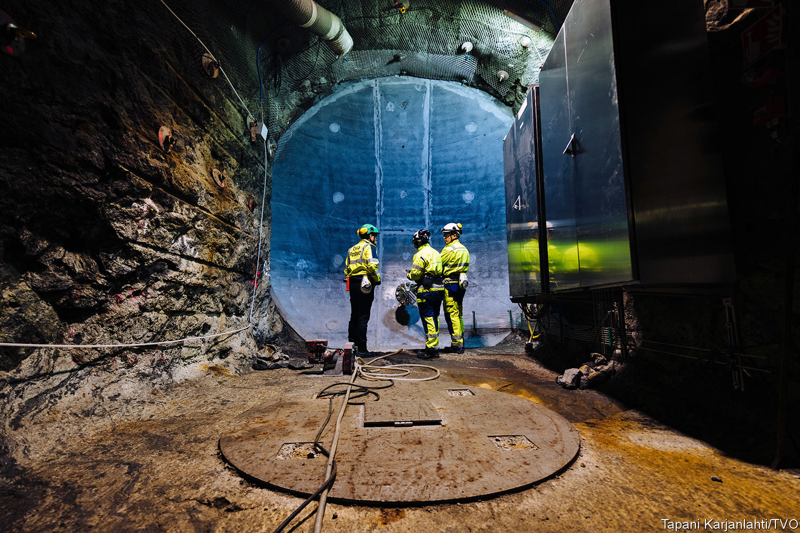

###### Science friction

# Leaving Horizon would jeopardise research in Britain and the EU 

##### British participation in a huge scientific-funding programme is threatened by the row over the Northern Ireland protocol 

 

> Jun 17th 2022 

Kevin lam is a chemist at the University of Greenwich working to kill two birds with one stone. He hopes to develop chemical reactions that can produce hydrogen without any carbon emissions while creating by-products of value to other industries. That would increase the availability of a clean source of energy and simultaneously incentivise its production.

But Dr Lam’s challenges are not restricted to the lab. His research is caught up in the dispute between Britain and the eu over the Northern Ireland protocol, a part of the Brexit withdrawal agreement that keeps the province inside the eu’s single market for goods. The British government recently introduced legislation to  unilaterally, ramping up tensions with Brussels. 

Science is an unlikely hostage in this stand-off. Should Britain scrap the protocol, the eu has warned that it will, among other things, throttle the access that British-based boffins have to Horizon Europe, the world’s biggest multilateral . Previous versions of this programme have helped to finance everything from vaccine research to the Large Hadron Collider, the world’s largest particle accelerator. This iteration, which runs from 2021 to 2027, will make over €95.5bn (£82bn) available to researchers in participating countries.

Being cut off from Horizon would hurt. Although it has been a big contributor to the budget for European research funding, Britain has enjoyed disproportionate benefits from the programme. In Horizon 2020, the predecessor scheme to Horizon Europe, Britain provided the most lead researchers and received the second-most funding of any member country. 

Britain has not been a full member of Horizon since leaving the eu but the Trade and Co-operation Agreement signed in December 2020 provisionally accepted it as an “associated” country. Under this compromise arrangement British researchers could still bid for Horizon funding in exchange for an estimated £14bn contribution to the eu, to be paid over seven years. “It was the best possible deal from both sides,” says Beth Thompson at the Wellcome Trust, a medical-research charity.

But the country’s associate status has not been ratified and is now in jeopardy. Many of those who have already received grants have been told that they must move to an eu member state to be sure of retaining access to the funds. Some researchers will choose to leave. Others may cancel their plans to move to Britain. For Dr Lam, who is due to receive over £420,000 as part of a multinational project, the worry is that British collaborators are now seen as more trouble than they are worth given uncertainties over funding and other Brexit-related hassles.

The British government is working on a “Plan b” to make up for the missing funding if Britain is not part of the programme. If that were to happen, the pain would be felt on both sides. “We will lose as a consequence of not being part of Horizon. But of course Horizon will lose because we’re not part of it,” says Robin Grimes, foreign secretary of the Royal Society, the national academy of sciences. “Which is increasingly, it seems, the road we are on.” 

Yet Britain stands to suffer more. Its scientific success is partly based on the opportunities for co-operation that Horizon membership brings. Over half of Britain’s collaborative papers are with eu partners; these relationships risk being eroded. Winning a competitive eu-wide grant looks good on a cv, a perk that cannot be replicated by a domestic programme. “The reality is that money alone can’t make up the gap,” says Ms Thompson.■


