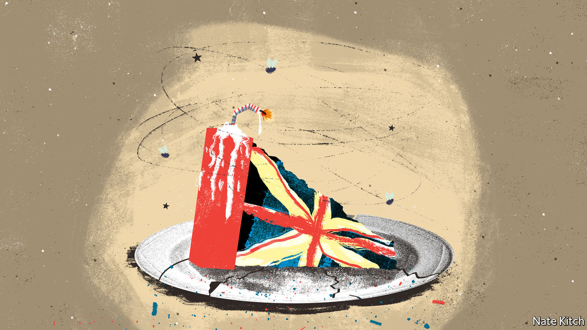

###### Bagehot

# The case for a softer Brexit is clear. How to get one is not 

##### With each anniversary, almost everything Remainers feared would happen has come to pass 

 

> Jun 23rd 2022 

It was the autumn of 2016 and Brexiteers were still high on the fumes of the eu referendum earlier that year. Everything, they agreed, was going to be terrific. Seventy-five Tory mps called for a new royal yacht to mark Britain’s rebirth. As for the fiddly detail of Britain’s new relationship with the eu, Boris Johnson, then the foreign secretary, had it covered. “Our policy is having our cake and eating it. We are Pro-secco but by no means anti-pasto.” 

Donald Tusk, the Polish president of the European Council, saw Britain’s predicament rather more clearly. Its wish to avoid the eu’s legal jurisdiction and to end the free movement of people left only the choice of a hard Brexit or no Brexit at all. The cosy deal many Britons imagined could be cooked up was, Mr Tusk thought, an illusion. “There will be no cakes on the table. For anyone. There will be only salt and vinegar,” he warned. 

The divorce has proved as bitter as Mr Tusk foresaw. The row over the Northern Ireland protocol has soured any hopes of a new era of friendship. The economic damage is plainer by the day. Britain’s gdp was 5.2% lower by the end of last year than it would have been if Brexit hadn’t taken place, calculates John Springford of the Centre for European Reform, a think-tank. Brexit has caused a sharp decline in Britain’s trade openness that will drag on productivity and wages in the years to come, according to a new Resolution Foundation paper. The Centre for Economic Policy Research reckons Brexit added 6% to food prices in two years. A promised burst of deregulation has not materialised. Salt and vinegar are plentiful; of cake, barely a crumb.

As a result Remainers are finding their voice again. Tobias Ellwood, a Tory critic of Mr Johnson, has called for Britain to rejoin the single market. Stella Creasy, the leader of the Labour Movement for Europe, urges her party not to let the prime minister define Britain’s relationship with the eu. Even pro-Brexit newspaper columnists call for a thaw with Brussels.

But if the damage from Brexit is obvious, the remedies are not. Since the referendum in 2016 opponents have failed to rally around an alternative model, flitting between softening Brexit and fighting it altogether. The Conservative right soon jettisoned fuzzy thinking in favour of a hard and unified negotiating strategy. The Remain movement is still prone to its own version of Mr Johnson’s cake-ism: offering up vague aspirations that ignore the structural difficulties of a closer relationship with the bloc.

Imagine that Sir Keir Starmer, the leader of the Labour Party, becomes prime minister in 2024. Relations with Brussels would improve overnight: no longer would the British government threaten to violate treaties it did not like. In time, life could become a little jollier for Britons who still feel themselves European. A new government could pursue the perks that Mr Johnson spurned, such as participation in Erasmus, a worthy student-exchange programme, and visa-free travel for artists and athletes. If the arrangements for Northern Ireland were settled, the door would open to Britain staying in Horizon, a huge scientific-funding programme. 

Just like its Leave counterpart, the Remain movement was largely propelled by culture. These signs of rapprochement would cost little and assuage some. But easing the economic damage caused by Brexit is far harder. Britain could try to rejoin the eu, which polls suggest four in ten Britons favour. But no British prime minister will hurry to reopen the wounds of the referendum, whose sixth anniversary fell on June 23rd. Any campaign for re-entry must confront the fact that it would mean a far deeper form of integration than the one that went before, including a commitment to join the euro. The insincere, pick-and-choose membership Britain once enjoyed is gone for good. 

Mr Ellwood’s plan for Britain to rejoin the single market as a non-voting participant has many backers. But the problems that caused Theresa May to reject this arrangement have not gone away. Even if Britain came round to the free movement of people, an essential part of the pact, it would also have to swallow outsourcing the most sensitive questions of regulatory policy on banking, data, mergers and labour markets to its competitors in perpetuity. Such a deal works for Norway, a small country whose biggest exports are oil, gas and fish. For Britain, a quarrelsome services-based economy, it would be inherently unstable. Rejoining the customs union would bring modest benefits but it would require abandoning the independent trade policy built up over six years. Control, once taken back, is hard to surrender.

That leaves only tinkering. A deal on food standards that eases flows at the border is possible. So too, in time, would be streamlined customs rules and mutual recognition of the qualifications of architects and lawyers. But such improvements would only marginally reduce the costs of Brexit. 

Spongy thinking

There is very little middle ground between the trade deal Britain has now and the freedoms granted by the full-fat single market. Mrs May tried to forge a bespoke deal, only to be thwarted by European leaders who saw it as cherry-picking. The arrival of a friendlier prime minister wouldn’t much change how the eu regards its fundamental economic interests, says Georg Riekeles, a former adviser to Michel Barnier, the eu’s chief Brexit negotiator. When Mr Johnson ordered a hard Brexit, the eu was happy to serve it up.

Tory Brexiteers warn darkly of a fragile Brexit being killed by stealth if they lose power. Were it so easy. To deepen Britain’s trade agreement would require clear objectives and a willingness to chisel away at the eu’s position, year after year. Fitful Britain lacks this strategic patience. It is more likely that the country will be stuck with Mr Johnson’s deal, perhaps for decades. With each anniversary, almost everything Remainers feared would happen has come to pass. Yet they still do not have a plan for what they saw coming. It is vindication, but it does not taste sweet. ■


