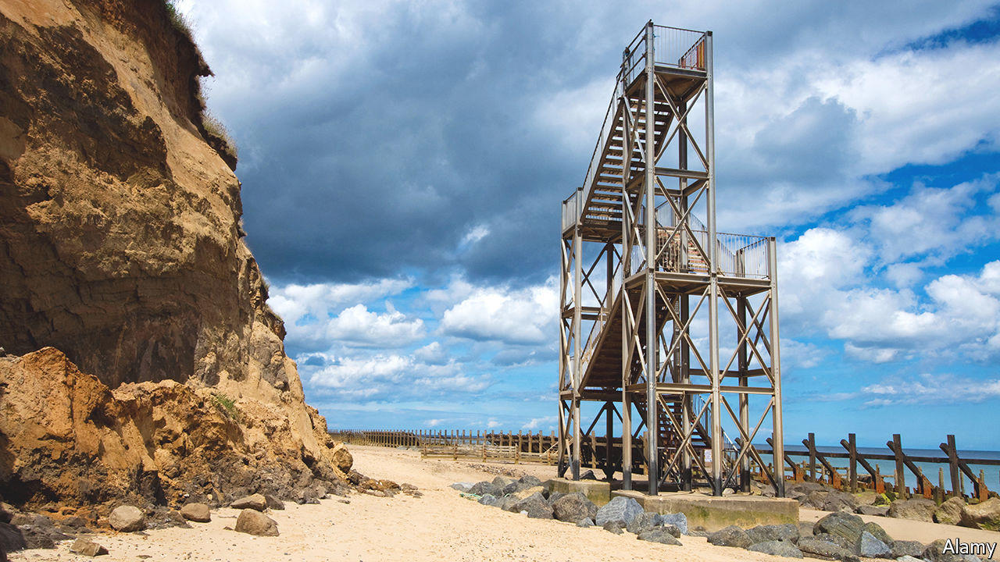

###### Uncertain shore

# The challenge of coastal erosion in Britain 

##### Stark choices along the Norfolk coastline 

 

> Jun 23rd 2022 

The hill house inn, a pub in Happisburgh on the Norfolk coast, has hosted a beer festival in its garden for 20 years. How long the tradition will continue is uncertain. By 2055 the heart of Happisburgh—including the pub and a 14th-century church—will be at risk of toppling into the sea. One part of the village has already disappeared: a holiday caravan site, whose old groundworks stick out of the cliffside. 

Norfolk, a county on the east coast of England, loses an average of 0.4-2 metres of coastline every year, depending on the precise location, and climate change will make the problem worse. Its cliffs are made of clay and sand: when high waves or storms wet them, they can simply slide into the water. Three kilometres from Happisburgh, the old fishing village of Eccles on Sea has almost entirely gone; the site of another medieval village, Shipden, has long been submerged. The Committee on Climate Change, which advises the government, reckons that up to 82,100 properties across England could fall into the sea by the end of the century; most of those at risk in the next two decades are in Norfolk or up the coast, in Yorkshire. 

For years, following a storm surge in 1953 in which 307 people drowned, the policy in Norfolk was to hold the line against the sea wherever possible. Concrete sea walls and timber revetments absorbed the energy of the waves; wooden groynes kept sand from washing downshore. But in the 1990s, as defences aged and the cost of upkeep ballooned, attitudes shifted. Guided by the Environment Agency, the local authorities now choose where to strengthen the shoreline and where to let erosion run its course based on cost and an area’s economic value. 

On some parts of the coast, nature does a lot of the protective work already. Where the shoreline curves to the west, salt marshes protect some towns from flooding. To the south, in places like Winterton-on-Sea, large sand dunes help to slow erosion. Elsewhere mankind lends a hand. Sea walls protect towns like Sheringham and Cromer. In 2019, 1.8m cubic metres of sand was placed along the coastline near the Bacton gas terminal; among other things, this “sand engine” absorbs energy from the waves that would otherwise batter the cliff.

But Happisburgh and other rural villages lack the natural protection, economic heft or strategic infrastructure to justify costly defences. Indeed, further down the coast, Great Yarmouth relies on sediment from Happisburgh’s eroding cliffs to maintain its own dunes. In 2004 the local authorities and the Environment Agency released a draft of a new shoreline-management plan to let Happisburgh’s coastal defences fail. That approach still prevails; signs at the beach warn of debris from eroding revetments and groynes. 

The question that arises as a result is what to do about the people whose property is at risk of disappearing. Property owners cannot buy insurance for erosion. Nor does the Environment Agency want to overcompensate homeowners for houses lost to the sea, for fear it would incentivise new clifftop construction or hand cash to owners of second homes. But there is a moral case for offering help, especially to buyers who purchased their properties before the policy shifted from holding the line to letting defences fail. 

Some experiments have already taken place. In one such, North Norfolk District Council attached the right to build on other sites in Happisburgh or nearby towns to nine at-risk houses in the village and to the caravan park. The theory was that this planning permission would be valuable enough on its own for private developers to buy the land that was about to fall into the water, giving homeowners a way to move without relying on the government to buy them out. In reality, the sea wasn’t prepared to hang around to see whether the scheme worked; the district council had to step in with an offer to relocate people before they lost their homes. But a government review of the programme did not rule out trying something similar again. Details of a new scheme are due to be unveiled next year. 

Back at the Hill House Inn in Happisburgh, the owner, Clive Stockton, is unsure if he would move even if he could sell up. He and his wife bought the pub before news of the plan to stop defending Happisburgh’s coast; the business was meant to provide them with backup income after he had gone into freelance work. Mr Stockton has since accepted that some people will have to move. But when it comes to whether he would leave or just wait until the pub tumbles into the water, he says: “I’d have to think long and hard about it.” ■

