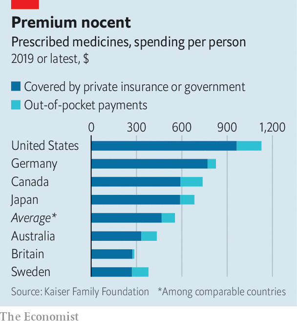

###### New pharm hands

# A billionaire wants to shake up America’s drugs market 

##### Mark Cuban, entrepreneur and “Shark Tank” judge, is not alone in trying to bring down the cost of medicines 

 

> Jun 23rd 2022 

If there is one thing guaranteed to get Americans to stand to attention it is cheap Viagra. On June 2nd a firm owned by Mark Cuban, a billionaire investor (as well as a judge on “Shark Tank”, a tv show for budding entrepreneurs, and the owner of an nba basketball team), caused a stir by reducing the price of the blue pill—whose patent expired two years ago—from several dollars a pop to 11 cents. It was one of 87 drugs that the Mark Cuban Cost Plus Drug Company added to its growing assortment of cheap off-patent medicines. A new study finds that Mr Cuban’s prices might have saved Medicare, a federal health scheme for the elderly, $3.6bn on $9.6bn-worth of drugs it had bought in 2020. 

 


Drugs in America are notoriously dear. In 2019 spending on prescription medicines came to $1,126 per citizen, twice the figure in other rich counties (see chart). Critics like Mr Cuban seek to shake things up. He intends to offer thousands of cheaper drugs by the end of the year. His company buys these directly from manufacturers and sells them to consumers at cost, plus a 15% mark-up and a $3 pharmacy fee. The idea is to make drugs affordable to the 31m Americans who lack health insurance and the many more whose policies make them pay hefty fees for prescriptions. Patients have thanked him on social media for slashing the cost of drugs to treat conditions ranging from heartburn to cancer. 

Mr Cuban is not the only one to have lost patience with America’s current set-up. CivicaScript, from Lehi, Utah, is also trying to bring down the price of generics. In March it said it would manufacture a generic insulin at no more than $30 a vial, down from $300 for today’s branded versions. At the innovative, patented end of the market, meanwhile, eqrx and Checkpoint Therapeutics are developing new cancer and immunology drugs with the explicit intention of undercutting expensive existing therapies from big pharma.

Competing on price seems like an obvious thing to try in America’s overpriced drug market. A lack of such competition suggests that obstacles get in the way. 

Some of these are practical. Certain off-patent drugs take years to copy, manufacture, test and win regulatory approval. Insulin, a complicated biological molecule, is one of them. Having borne the expense of copying and certifying its insulin, CivicaScript may find that the incumbents, which have long since recouped their development costs, simply lower the price of their branded products to undercut it instead. Ned McCoy, CivicaScript’s boss, insists this would make him happy; the firm’s goal, he says, is to bring about change in the market. The firm is set up as a public-benefit corporation that is not seeking profits but rather a “positive impact on society”. But it cannot do that if it goes out of business. 

In the American market for patented medicines, the drug’s inventor has a great deal of pricing power, which has driven prices higher. Developing new therapies is a costly gauntlet of research, clinical trials and regulatory hurdles. All too often it ends in failure. Risks can be reduced by picking well-understood diseases. Nevertheless, to succeed in the long run, eqrx will need to make up with volume what it forgoes on margins, observes Daniel Chancellor of Informa Pharma Intelligence, a research firm. The same applies to others who choose this model, like Checkpoint. Britain’s government has indicated that it would make large-scale purchases from eqrx’s pipeline of cancer drugs if those gain regulatory approval. Though this will not help American patients in the near term, it is good news for the company if it helps scale up production. 

The final wrinkle is that any medicine-seller who undercuts incumbents becomes a target for acquisition by them. It is easy to imagine a pharma giant launching a takeover bid for the firm, and if successful simply jacking up prices to what the market will bear—which in America is a lot more than what eqrx wants to charge. After buying a biotech startup that had developed a hepatitis drug in 2011, one big drugmaker, Gilead, charged much more for the treatment than its target had planned. 

On June 13th Goldman Sachs, an investment bank, noted that the market was undervaluing the drugs being developed by eqrx. On the topic of being acquired, eqrx’s boss, Melanie Nallicheri, remarks cryptically that the firm has put thought into how “not to let that happen”, but declines to give details. Mr Cuban shares the sentiment: “I don’t have a reason to sell…I can afford to absorb the losses that come from starting the company.” CivicaScript, too, has made itself an unattractive investment by ceding control over a lot of what it can do to a second non-profit sister company, Civica. The poison pill, it seems, has a place in the pharma business. ■


