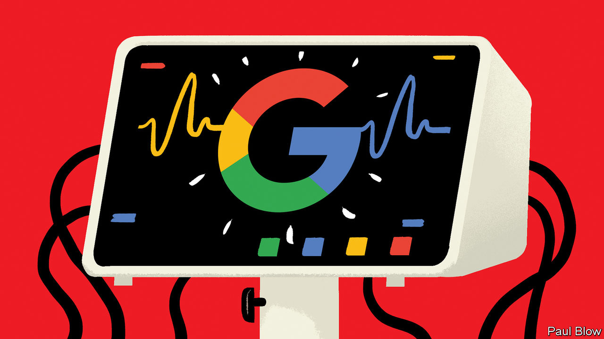
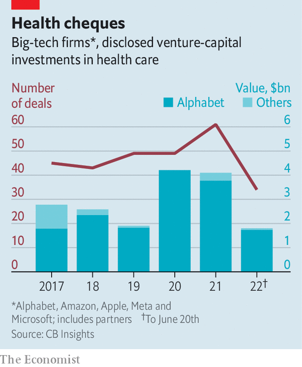

###### Doctor Google will see you now

# Alphabet is spending billions to become a force in health care 

##### Can it finally shake up the stodgy multi-trillion-dollar industry? 

 

> Jun 20th 2022 

Rich countries pour heart-stopping amounts of money into health care. Advanced economies typically spend about 10% of gdp on keeping their citizens in good nick, a share that is rising as . America’s labyrinthine health-industrial complex consumes 17% of gdp, equivalent to $3.6trn a year. The American system’s heft and inertia, perpetuated by the drugmakers, pharmacies, insurers, hospitals and others that benefit from it, have long protected it from disruption. Its size and stodginess also explain why it is being . Few other industries offer a potential market large enough to move the needle for the trillion-dollar technology titans.

America’s five  have spent billions on various health-care bets. Some of their earlier  are starting to pay off. Amazon runs an online pharmacy and its telemedicine services reach just about everywhere in America that its packages do, which is to say most of it. Apple’s smartwatch keeps accruing new health features, most recently a drug-tracking one. Meta scrapped its own smartwatch plans earlier this year but offers fitness-related fun through its Oculus virtual-reality goggles. Microsoft keeps expanding its list of health-related cloud-computing offerings (as is Amazon, through aws, its cloud unit). 

 


Yet it is Alphabet, Google’s corporate parent, whose health-care ambitions are the most vaulting. Between 2019 and 2021 Alphabet’s venture-capital arms, Google Ventures and Gradient Ventures, and its private-equity unit, CapitalG, made about 100 deals, a quarter of Alphabet’s combined total, in life sciences and health care. So far this year it has injected $1.7bn into futuristic health ideas, according to cb Insights, a data provider, leaving its fellow tech giants, which have invested around $100m all told, in the dust (see chart on next page). Alphabet is the fifth-highest-ranking business in the Nature Index, which measures the impact of scientific papers, in the area of life sciences, behind four giant drugmakers and 20 spots ahead of Microsoft, the only other tech giant in the running. The company has hired former health regulators to help it navigate America’s health-care bureaucracy. 

Alphabet’s approach to innovation—throw lots of money at lots of projects—has served it well in some other businesses beyond its core search engine. It has given rise to clever products, from Gmail and Google Docs to the Android mobile operating system and Google Maps, which support people’s digital lives. Alphabet thinks that some of its health offerings will become as central to their physical existence. Is that an accurate prognosis?

Alphabet has dabbled in health care since 2008, when Google (as it was then known) introduced a service that allowed users to compile their health records in one place. That project was wound up in 2012, resurfaced in 2018 as Google Health, which included Google’s other health ventures, and was again dismantled last year. Today Alphabet’s health adventures can be divided into four broad categories. These are, in rough order of ambition: , health records, health-related artificial intelligence (ai) and the ultimate challenge of extending human longevity.

Google threw itself into the wearables business in 2019 with the $2.1bn acquisition of Fitbit. That firm’s popular fitness tracker has been counting steps and other exertions on around 100m wrists. It has come a long way since the Nintendo Wii motion-detecting game console that inspired Fitbit’s founders. A new feature—a sensor which monitors changes in the heart rate for irregularities that can lead to strokes and heart failure—has just been been approved by America’s Food and Drug Administraton (fda). Google is also trying to boost the health-care potential of its other devices. To help it along, it has enlisted Bakul Patel, a former official tasked with creating the regulatory classification of “software as a medical device” at the fda.

The fda’s stamp of approval for the Fitbit sensor is a big deal. It should make it easier to get a similar thumbs-up for Google’s higher-end Pixel Watch, which uses a lot of the same technology and is due out this autumn, as well as other gadgets. For example, the camera on its Pixel phones can be used to detect respiration and heart rates by tracking the subtle colour difference brought about by the fact that blood with fresh oxygen in it is slightly brighter. Google’s Nest smart-thermostat-turned-home-assistant can listen to snoring to assess your sleep. 

As significant, if not more, is that Google considered the regulatory go-ahead worth getting. It signals that the company intends its products to be more than fun consumer gadgets, actually able to influence the practice of medicine.

Google is also giving health records another whirl. The new initiative, called Care Studio, is aimed at doctors rather than patients. Google’s earlier efforts in this area were derailed in part by hospitals’ sluggishness in digitising their patient information. That problem has mostly gone away but another has emerged, says Karen DeSalvo, Google’s health chief—the inability of different providers’ records to talk to each other. Dr DeSalvo has been vocal about the need for greater interoperability since her days in the Obama administration, where she was in charge of co-ordinating American health-information technology. Until that happens, Care Studio is meant to act as both translator and repository (which is, naturally, searchable).

Place your Alpha bets

Alphabet’s ai projects are also beginning to produce results. Starting in 2016 DeepMind, a British firm bought by Google in 2014, used data from Britain’s National Health Service (nhs) to create diagnostic tools, in one case training an ai algorithm to detect retinal diseases. (DeepMind’s co-founder sits on the board of ’s parent company.) It made headlines last year with AlphaFold, a groundbreaking piece of software that can predict the structure of proteins, which is responsible for many of the complex molecules’ characteristics. Alphabet has also launched another subsidiary, Isomorphic Labs, which will be run by DeepMind’s boss and use machine learning to build on AlphaFold to accelerate (and cheapen) drug discovery. 

The most out-there part of Alphabet’s health portfolio is an effort to slow the ageing process—or stop it altogether. The idea is that ageing should be viewed not as an immutable aspect of life but as a condition that can be managed and treated, or a problem that can be solved with the right technology. To that end, one of Alphabet’s life-sciences subsidiaries, Calico, is looking into age-related diseases. Last year its $2.5bn partnership with firms including AbbVie, a big drug firm, was extended until 2030. Another Alphabet subsidiary, Verily, is working with L’Oréal, a French beauty giant, to better understand how ageing affects the biology of the skin—and in the process create better skincare. 

Inspiring stuff, to be sure. But obstacles remain. Some are technical. The nhs data proved hard for DeepMind’s ai to digest. The firm’s ai assistant for doctors, called Streams, is being discontinued. Still, given the strides being made in machine learning, it may be only a matter of time before something like Streams is resuscitated. 

Other hurdles may be harder to overcome. Trustbusters are increasingly wary of letting through deals that might be seen as stifling nascent rivals. In Europe competition authorities have forbidden Fitbit (but not the Pixel watch) from favouring Google’s own phones and operating system, or from using user data to sell advertising. Governments also fret about privacy breaches, which are more sensitive still when it comes to medical information. Last month plaintiffs filed a class-action lawsuit against DeepMind for misuse of nhs patient data. DeepMind has not made a public statement on the case. 

Last, good ideas are not the same things as a good business. The wearables market is highly competitive. So, increasingly, is the one for electronic health records. Google’s reputation for technical brilliance has not exactly made Care Studio into an overnight success; the system is reportedly used by just 200 or so clinicians. Verily, which besides solving ageing also offers various diagnostics, signed $50m-worth of contracts for covid-19 testing during the pandemic, a tidy sum but chump change next to Alphabet’s total annual revenues of nearly $260bn. DeepMind as a whole reportedly turned a profit for the first time in 2020 (seemingly from selling services back to the rest of Alphabet) but it gives away its flagship health product, AlphaFold, for nothing. Calico could be years away from generating real revenues, let alone profits. 

These are open-ended wagers that a company of Alphabet’s size can absorb with relative ease. In the next decade the challenge will be to show they can graduate from being experiments and vanity projects to something transformative for the firm—and for Americans’ health. ■


