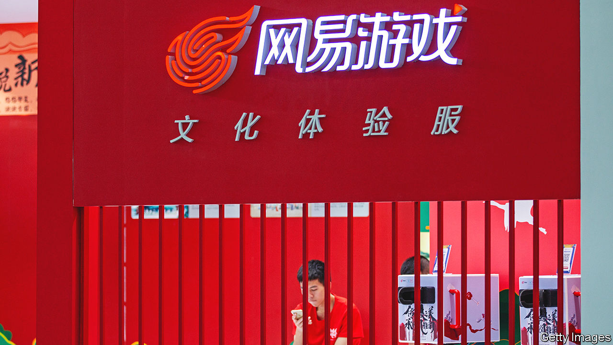

###### NetUnease

# China’s crackdown on the fun industry continues 

##### Second-guessing Communist Party censors is becoming part and parcel of doing business 

 

> Jun 23rd 2022 

In china’s world of video-game warcraft the phrase  describes the storming of a castle before you are equipped with the right weapons and armour. More recently the term has been used to refer to an equally foolhardy and even more treacherous act: posting risky comments or content on Chinese social media knowing full well that this will incur the wrath of censors, or even higher-level officials.

NetEase, a Chinese games developer, is familiar enough with the first meaning.  is, after all, a staple of “Diablo Immortal”, a hugely popular role-playing game set in medieval times. The firm was due to release the Chinese version of the game, developed together with Activision Blizzard, an American gaming giant, on June 23rd. On June 19th it delayed the roll-out, supposedly to further optimise the new version, prompting a 10% slide in its share price. Rumours swirled that ’s second interpretation played a role. 

In late May the firm’s official “Diablo Immortal” account on Weibo, China’s Twitter-like service, posted a controversial question: “How has the bear not stepped down yet?” The cryptic message was widely interpreted as a reference to Xi Jinping, China’s president, who has often been likened online to Winnie the Pooh (apparently because he resembles the podgy bear’s Disneyfied depiction). The Weibo account was banned in June, shortly before the game’s scheduled release. Many Chinese netizens immediately spied . 

It wouldn’t be the first time inopportune online content has cost a Chinese tech company dearly. Last year Wang Xing, founder of Meituan, a delivery super-app, posted on Weibo a 1,000-year-old Tang dynasty poem. After certain internet users construed the verse as an affront to Mr Xi, investors fearful of state reprisal dumped Meituan stock. The firm’s share price fell by 14% over two days, erasing about $26bn in market value. 

On June 3rd a live-streamed broadcast of Li Jiaqi, an online influencer known to his millions of fans as Lipstick King, was suddenly cut off after he was presented with a piece of cake shaped like a tank. He has not appeared on his show since—a blow to Taobao, the e-commerce platform on which he plies his trade (as well as to international make-up brands), ahead of a big Chinese shopping holiday. Mr Li’s disappearance is widely assumed to be linked to the anniversary of the Tiananmen Square protests, in whose bloody suppression tanks played a role. The vehicles’ likenesses are thus scrubbed from the internet around the anniversary, lest they remind anyone of what happened that day in 1989. 

In recent months Chinese authorities have been signalling that their two-year crackdown on the consumer internet—which at its worst lopped some $2trn off the market value of Chinese tech firms, compared with late 2019—was easing. This month, for example, regulators even approved a new batch of games. The Diablo debacle and the Lipstick King’s predicament imply that any respite may be short-lived and selective. So do new rules requiring internet platforms to review user comments before they are posted, a draft of which was unveiled on June 17th.

It is unclear if either NetEase’s alleged Pooh, Mr Wang’s poem or Mr Li’s pudding was in fact a defiant act of . Mr Li’s turreted, cookie-wheeled ice-cream cake certainly does not smack of premeditated subversion; the Lipstick King had not previously shown a dissident streak and it is hard to imagine him wilfully sacrificing a lucrative gig. Mr Wang’s sin may well have been to fail to consider all the possible interpretations of his post. Whether or not the managers of NetEase’s Weibo accounts knew what they were getting into, their plight—and that of Messrs Li and Wang—suggests that divining censors’ thought processes is becoming an ever bigger part of doing business in China. ■


