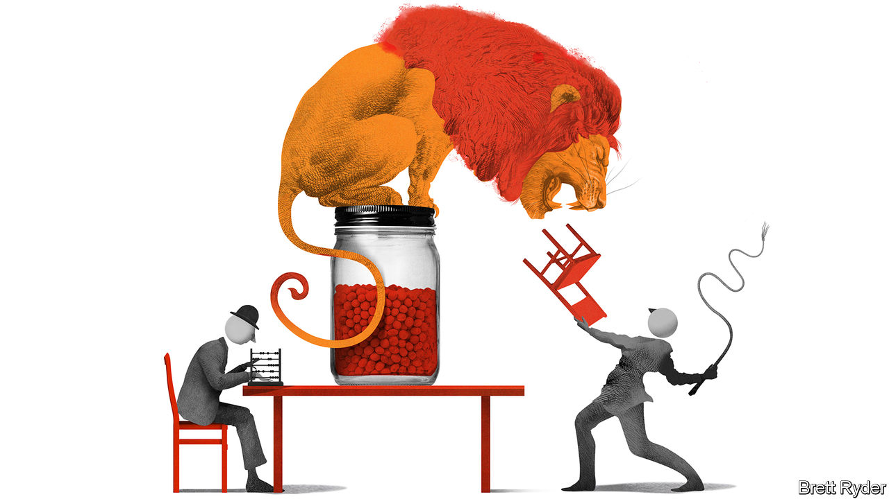

###### Schumpeter

# In EY’s split, fortune may favour the dull 

##### Bean-counters v lion-tamers 

 

> Jun 23rd 2022 

In a monty python sketch from 1969, the middle-aged Mr Anchovy, played by Michael Palin, wants to give up what he calls the desperately dull world of chartered accountancy in order to become a lion-tamer. His “vocational guidance counsellor”, aka John Cleese, suggests he consider an interim career path—banking, say—while he works towards lion-taming. “No, no, no, no, no,” Mr Anchovy interrupts. “I don’t want to wait. At nine o’clock tomorrow I want to be in there, taming.”

Echoes of Mr Anchovy’s yearnings can be heard in the haste with which ey, one of the Big Four accounting firms, is considering spinning off its fast-growing consultancy practice from the unfashionable audit side of the business. Not only is it a bold move by the standards of book-keeping firms—to the point, says Michael Izza of the Institute of Chartered Accountants in England and Wales, that ey’s three rivals, Deloitte, pwc and kpmg, will be considering their next steps in light of its decision. There is also a hint of Pythonesque farce about it. Such is the excitement that details of a proposed initial public offering (ipo) in 2023 were leaked to the which published them on June 20th. They included the size of the potential bonanza for some of the firm’s 13,000 partners—something ey’s bean-counters of old would much rather have kept under their bowler hats. 

The firm insists no final decision has been made. Yet a split would make sense. Regulators worry that consulting services generate conflicts of interest for firms also carrying out statutory audits. After a string of accounting scandals in recent years they are urging the auditors to stand on their own two feet. As for an ipo, that is bound to set consultants’ hearts racing. But like Mr Anchovy, they should think twice before they leap into the lion’s den. In the long run, audit may well be the more prudent bet. 

Make no mistake, the advisory practice is the red-blooded side of the business. It accounted for two-thirds of ey’s $40bn in revenues last year. Unshackling much of the tax, consulting, strategy and transactions work from audit would give the consulting arm more room for manoeuvre and free it from a partnership model that smothers quick decision-making. The new advisory firm could raise capital more easily to invest in technology, as well as developing trendy outsourcing businesses such as fully running multinationals’ tax affairs. It could bolster its fortunes by offloading niche businesses. (Not that it needs to wait for an ipo to do that: last year pwc sold one that handles global companies’ foreign postings to a private-equity firm for $2.2bn, its biggest divestment in nearly two decades.) 

There is an even more enticing precedent. Accenture, which was spun off from Arthur Andersen and then went public a year before the accounting firm collapsed in 2002, has soared in value to $190bn. ey’s consulting arm would not be worth close to that. However, the leaked documents, based on recent market conditions, suggest it could raise $10bn by selling a 15% stake. The partners who join it would receive 70% of the shares (the remaining 15% would be for lowlier staff).

It is not all upside for the consultants, though. The split would involve a cash payout from the spun-off company to partners remaining in the rump ey, and would cover potential claims against the firm for problems such as those at Wirecard, a failed German payments company, and nmc Health, a collapsed British hospital chain, both of which ey audited. To make the payment, the new firm would reportedly borrow $17bn—a large sum considering that publicly traded rivals like Accenture and tcs have low debts.

Those are not the only competitors, either. Barriers to entry in consulting are low. Big tech firms such as Microsoft and data-miners such as Palantir may try to muscle into the space. The ey brand may have raised the stature of the consultancy practice, but it will probably be floated with a new name. Like some other consultants, it could fall victim to delusions of grandeur.

That is why, despite being the pedestrian side of the business, audit could be a dark horse. Its shortcomings are well known: lack of trust, conflicts of interest, low pay compared with other professional services, the risk that ai-powered “audit bots” will crawl over its business model. Yet it has some advantages. 

For one thing, it remains an entrenched oligopoly. The Big Four audit 99% of firms in the s&amp;p 500 index. Moreover, structural changes are afoot that could benefit it. The first is regulatory. As the Big Four auditors are forced to become more independent, they are raising fees. As pressure mounts to improve audit quality, they will charge more for it. The second change is to their scope. The firms are expecting a lot of new work as regulators force companies to disclose more about their climate impact. Much of this will have to be checked and approved by auditors. One senior accountant talks excitedly about hiring “thousands of eco-warriors”.

If history is any guide, the windfall from the split may favour the auditors, too. Though the partners remaining on the audit side would receive lower payouts than those departing with the consultancy, cash in hand is precious, especially in times of volatile markets. The last time ey split off its consultancy, selling it to Capgemini, a French firm, in 2000, the partners who received cash, not shares, did better. And after that the auditors simply rebuilt the consulting side of the business. Even now they plan to retain elements of advisory work, such as parts of the tax practice. These could again be reconstructed into something bigger.

Ants in the pants

Those with long memories, such as the older partners, will know all this. Many of the more junior ones may find themselves lured by the eat-what-you-kill excitement of consultancy. But if they ignore history, they should not ignore comedy. Mr Anchovy never did become a lion-tamer. What he thought was a lion was instead an anteater. Shown a photo of a real lion, he passed out. ■


