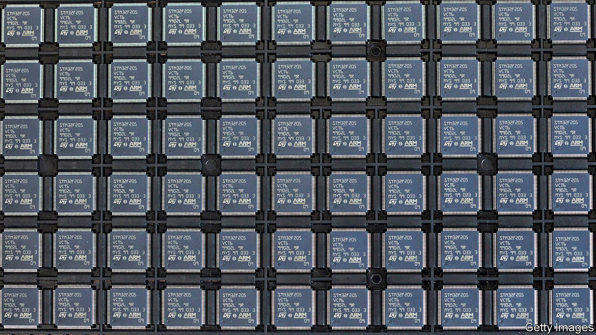
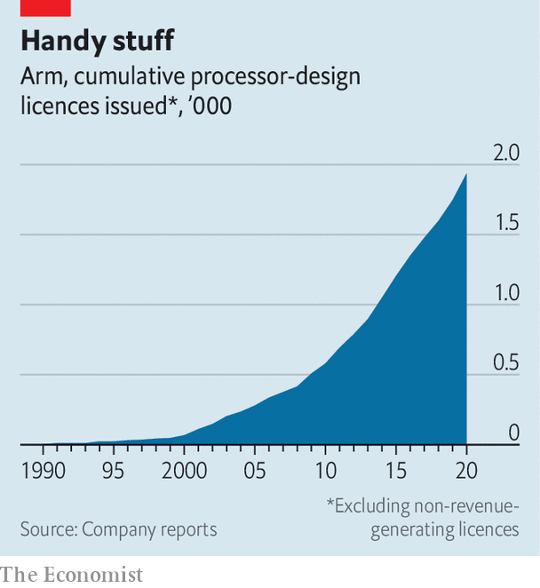

###### Arm twisting and turning

# Why everyone wants Arm 

##### The British chip designer’s modest size belies its central role in the digital revolution 

 

> Jun 22nd 2022 

Tech giants, governments, trustbusters, investors: all eyes are on the much-anticipated stockmarket listing of Arm. Despite the recent rout in tech stocks, SoftBank, the Japanese group that paid $32bn for the British chip designer in 2016, still plans to refloat its shares by next March. On May 30th Cristiano Amon, boss of Qualcomm, an American chipmaker, told the he would like to create a consortium with rivals like Intel or Samsung, either to buy a controlling stake in Arm or to purchase it outright—as Nvidia, another American firm, tried to do in 2020 in an abortive $40bn deal. Some British politicians argue that Arm is so critical that the government should take a controlling “golden share”. On June 14th it was reported that, perhaps in response, SoftBank was considering a secondary listing in London alongside the primary one in New York. 

Look at Arm’s finances and the interest seems puzzling. Its sales rose by 35% last year to $2.7bn—not bad, but peanuts next to the giants of chip design. Its valuation, as implied by the Nvidia deal, has risen by a quarter in six years. In the same period Qualcomm’s market capitalisation is up by half and Nvidia’s has risen 13-fold, recent market carnage notwithstanding.

There are two explanations of the mismatch between Arm’s size and the covetousness it elicits. The first is the ubiquity of its products. Spun out of the wreckage of Acorn Computers, a British maker of desktops, in 1990, Arm has grown to the point where nearly all big tech firms use its designs. Most modern phones contain at least one chip built atop its technology. That makes it a keystone in the $500bn chip industry. Arm’s second selling point is its potential. After years of trying, its designs are making inroads into lucrative markets such as personal computers and data centres. They could also power everything from cars to light bulbs as more everyday objects become computers. 

Start with the ubiquity. Unlike firms such as Intel, which sells chips that it both designs and manufactures, Arm trades only in intellectual property (ip). For a fee, anyone can license one of its off-the-shelf designs, tweak it if necessary, and sell the resulting chip. Besides licensing revenue, Arm takes a small royalty from every sale of a chip built with its technology. In 2021 licensing revenues accounted for a bit over $1bn, while royalties brought in $1.5bn.

 


Removing the need to design a chip—a complicated, highly specialised job—has made Arm’s off-the-shelf designs popular, especially as chips have become more and more complicated. New Street Research, a firm of analysts, reckons Arm has a 99% share of the $25bn market for smartphone chips. Its products are widely used in everything from drones and washing machines to smart watches and cars. Arm says it has sold just under 2,000 licences since its founding (see chart). More than 225bn chips based on its designs have been shipped. It hopes to hit 1trn by 2035. 

The firm’s long customer list explains the backlash against Nvidia’s proposed buy-out. Simon Segars, who stepped down as Arm’s boss this year, used to describe the firm as the neutral “Switzerland of the tech industry”. Other chipmakers feared that giving a rival control of it would undermine this neutrality, explains Geoff Blaber of ccs Insight, a research firm. So did trustbusters in big markets, whose concerns derailed the deal. Few were reassured when Jensen Huang, Nvidia’s ceo, insisted that he had no plans to use Arm to stymie rivals. 

Arm’s ability to attract so many customers points to another explanation for the mismatch between its importance and its finances. A big reason why Arm’s technology triumphed over rival chip architectures was low prices. New Street reckons that Arm earns royalties of just $1.50 from the sale of a high-end smartphone, for which a consumer may fork out $1,000 or more. Cheaper gadgets might earn it a few cents.

The firm has raised its royalty rates over time, notes Pierre Ferragu of New Street, often when a new version of its designs is released. According to one insider, SoftBank wanted to increase them further. But, he says, the plan caused friction with Arm’s bosses, who worried this would irk existing customers. It could also jeopardise Arm’s effort to conquer new markets. 

In 2020 Apple, which has long used Arm chips in iPhones, began replacing Intel silicon in its laptops and desktops with Arm-based designs. Although Apple is not as big in this area as it is in smartphones, it was a vote of confidence for Arm in what had been foreign territory. 

Arm has also increasingly been competing in the high-margin business of servers, the high-spec machines found in data centres. That market has for decades been dominated by Intel, but in recent years Arm has scored notable victories. Amazon Web Services, the e-commerce giant’s cloud division, now uses lots of Arm-derived “Graviton” chips. Ampere, an American firm that sells data-centre chips, also bases its products on Arm’s designs, as do several makers of specialised processors for tasks such as managing networks. TrendForce, another research firm, predicts that Arm processors could account for 22% of installed server chips by 2025. 

Under SoftBank’s ownership Arm has put lots of money into research and development, says Mr Blaber. That will help it maintain its technological edge. It is nevertheless limited in how much it can charge for its products by the emergence of a new challenger: risc-v. This is a novel chip architecture that lacks royalties and licence fees entirely. In 2020 Renesas, an Arm licensee, announced it would use risc-v for a new generation of products. Intel, Qualcomm and Samsung, among others, are also eyeing the technology. Whatever Arm’s fate, then—as a public company, a state-controlled one or the ward of a consortium of chip-industry heavyweights—its future will therefore probably resemble its past: vital but, by Silicon Valley standards, a minnow. ■


