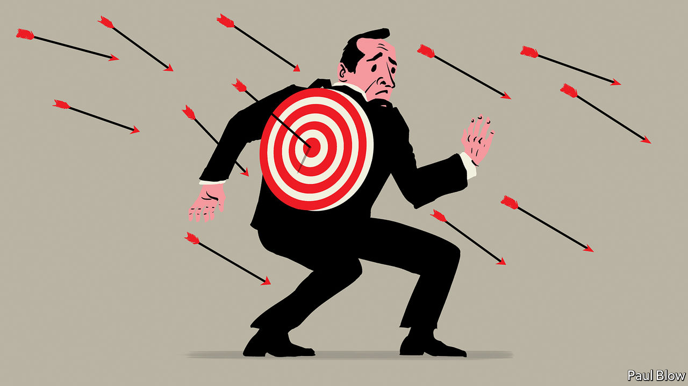

###### Bartleby

# Why managers deserve more understanding 

##### Don’t overdo the sympathy, but the job is both necessary and demanding 

 

> Jun 23rd 2022 

Management is not a heroic calling. There is no Marvel character called “Captain Slide Deck”. Books and television shows set in offices are more likely to be comedic than admiring. When dramas depict the workplace, managers are almost always covering up some kind of chemical spill. Horrible bosses loom large in reality as well as in the popular imagination: if people leave their jobs, they often do so to escape bad managers. And any praise for decent bosses is tempered by the fact that they are usually paid more than the people they manage: they should be good. 

A world without managers is a nice idea. But teams need leaders, irrespective of the quality of the people in charge. Someone has to take decisions, even if they are bad ones, to prevent the corporate machine gumming up with endless discussions. That is true even of flatter organisations. In a paper published in 2021, researchers described an experiment in which a number of different teams took part in an escape-room challenge. Some randomly selected groups were asked to choose a leader before the task began; the rest were not. The teams with leaders did much better: 63% of them completed the challenge within an hour, compared with only 44% of those in the control group.

The difference between good bosses and bad ones is striking. In one paper published in 2012, a trio of academics looked at the output of workers in a large services company who frequently switched between different supervisors. They found that the gap in output between the best and worst bosses was equivalent to adding an extra person to a nine-member team. Even the average boss enhanced their team’s productivity by enough to justify their higher salary. 

Managers are needed, but they do not have it easy. The job is structurally difficult. Most managers have to meet the expectations, sometimes unreasonable, of people below them and above them. The blurring of work-life boundaries as a result of the covid-19 pandemic seems to have made life tougher for them. Gallup, a pollster, found that in 2021 managers suffered higher levels of self-reported burnout than workers, and that the gap between these groups had widened considerably over the previous year. 

They are subject to conflicting demands. They are meant to care about members of their teams and be ready to get rid of them. They are supposed to give people agency while making sure that things are done in the way the organisation wants. The concept of the “servant leader” is utter nonsense. (What next? The weepy psychopath? The serf dictator?) It is also a reflection of the different directions in which bosses are pulled. 

Many of those in positions of power don’t want to be managing at all. True, some of them have found their way into management because of thrusting ambition. But others have wound up there because it is the only route available to more pay and greater influence. Hence another screwed-up office character: the “reluctant leader”. 

Managers are also handling the most baffling material on Earth: people. A study conducted by researchers in Germany found that handing out monetary bonuses for good attendance to apprentices in retail stores led to sharp rises in absenteeism (paying for behaviour that was previously considered normal seems to have made people feel licensed to bunk off). Another piece of research, by academics at iese Business School and the Poole College of Management, found that empowering employees could lead to more unethical behaviour if workers felt under greater pressure to perform. The law of unintended consequences runs through the workplace.

Managers are allegedly human, too, and also susceptible to bias. Bosses who take steps to encourage employees to contribute their ideas are doing the right thing by their organisations and by their teams. But according to research by Hyunsun Park of the University of Maryland and her co-authors, the more they solicit input, the less likely they are to reward people for speaking up. Instead, they credit themselves for creating the right kind of environment. Laudable, no. Natural, yes. 

It is true that managers do not save lives or nurture young minds. Even the best ones spout jargon and cause unholy amounts of irritation. The worst ones make life a misery. But the job that managers do is almost always necessary, often unpopular, sometimes done reluctantly and pretty difficult to boot. Every so often that is worth remembering. 


