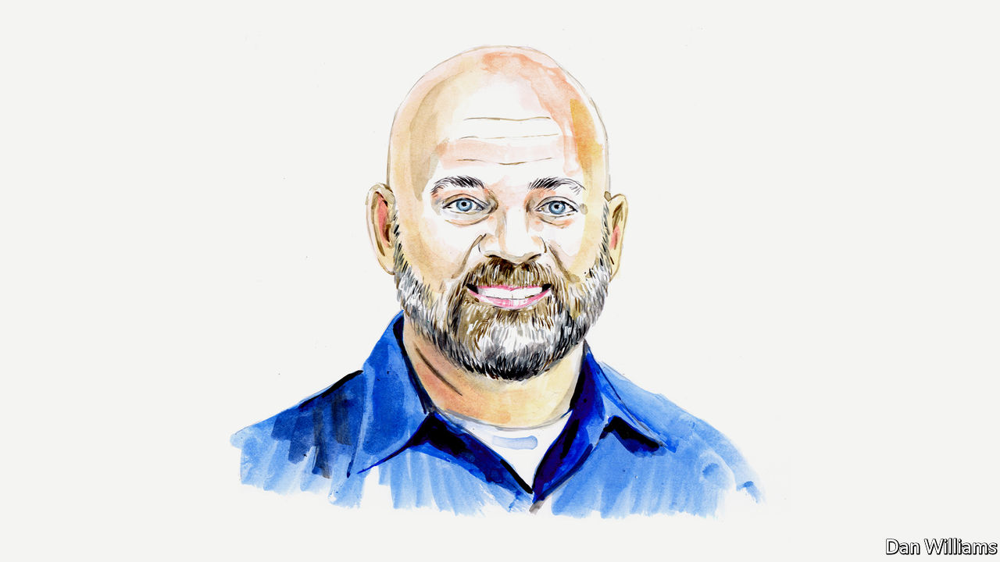

###### Roe v Wade

# Abortion would be best governed by legislatures, says O. Carter Snead 

##### The law professor says such a change would bring America into line with many other countries 

 

> Jun 22nd 2022 

THE SUPREME COURT may very well be on the cusp of overturning , the judicial precedent that declared a fundamental unwritten constitutional right to abortion in 1973. Such a move by the court would return the matter of abortion to the political branches of government. For the first time in nearly 50 years, we in America are poised to rejoin our friends and neighbours around the world who live in the supermajority of nations that govern themselves on the vexed issue of abortion through the deliberative democratic process rather than via the fiat of unelected judges. To do so wisely, justly and humanely will require the practice of civility, charity and honesty.

We’re not off to a good start. The leak of Justice Samuel Alito’s draft opinion last month was itself a shocking breach of longstanding norms. The reaction to the leak has included protests in front of the homes of the Supreme Court’s justices and even credible threats of violence against them. The public discourse is overheated, rife with personal attacks, exaggerations and misstatements, some born of confusion and others perhaps even meant to mislead. A first step in the right direction is to strive for truth and accuracy in our public discourse. We can start by accurately describing Justice Alito’s draft opinion and its consequences. 

Yes, the draft opinion overturns both and , the decision in 1992 that reaffirmed the central holding in with some modifications. But contrary to the suggestions of some, this is not the first time the Supreme Court has reconsidered and retracted a previously granted unenumerated individual right. For example, in 1937 it overturned 40 years of past precedents that had held that there was an unwritten individual “liberty of contract”, which had been invoked to nullify various state economic regulations. Even the fundamental right to abortion announced in  was downgraded to a lesser protected “liberty interest” in some 30 years ago. It also abolished ’s trimester framework, shifted the normative justifications for the right from privacy to liberty and changed the legal standard for evaluating abortion laws.

Moreover, overturning and related precedents does not, contrary to the views of many Americans (as represented in public opinion surveys) “criminalise abortion”. Rather, it simply returns the matter of abortion to the states to be regulated according to the norms and policies favoured by citizens, as reflected by the actions of their elected representatives. Some states will choose severely to restrict abortion. Others will promote access to it. If legislators overreach or fail to regulate enough, they will be accountable to voters.

Some have raised the spectre of women being prosecuted, losing access to emergency medical care for ectopic pregnancies and miscarriages, or losing access to IVF and contraception. Here again, such claims bear little relationship to reality.

There is no documented case in America of a woman being prosecuted for seeking an abortion since 1922. There has been only one case of a woman being convicted for unlawful self-management of abortion, and that was vacated on appeal. Prosecutors who have used “feticide laws” to charge women for self-induced abortion have been corrected by courts for exceeding the authority of those statutes. All modern abortion laws immunise the woman seeking abortion from liability. Aside from a handful of highly publicised comments by stray state legislators, the suggestion that women should be prosecuted in a post- world has been roundly criticised and rejected by pro-life leaders and elected officials alike, and has no realistic chance of becoming law. Just last month in Louisiana such a proposal was quickly rejected by pro-life state representatives and the pro-life governor, with the strong support of prominent local and national right-to-life advocates.

There is also no serious likelihood of the incidental criminalisation of contraception, IVF and management of ectopic pregnancy or miscarriages. It is a longstanding principle of criminal law that the state must declare with specificity what it means to make illegal. One court captured the point thus: “Even though an act may fall within the spirit of a statute, it will not constitute a crime unless it is also within the words of the statute.” A law that bans abortion but nowhere mentions IVF will not be construed to forbid that practice. Indeed the widely-adopted statutory definition of abortion as an action performed on a “pregnant woman” would rule out any impact on IVF, which is only performed on women who are not yet pregnant.

Moreover, even the most restrictive abortion statutes, such as those recently enacted in Texas, Alabama and Oklahoma, make clear that they do not apply to treatment of ectopic pregnancy or post-miscarriage management. And if that were not enough to allay concerns, all such abortion bans include explicit exceptions for medical emergencies. Many such laws also include within the definition of medical emergency not merely threats to the mother’s life, but also conditions that present a “serious risk of substantial impairment of a major bodily function”. This is true in both Texas’s and Alabama’s laws; Oklahoma’s lacks this language. 

Use of contraception is constitutionally protected by Supreme Court precedent dating back to 1965. Justice Alito’s draft explicitly leaves those judicial decisions unchanged. A right to abortion is also conceptually distinguishable from contraception in that it involves the intentional killing of a prenatal human organism. Moreover, there is no evidence of an appetite to ban contraception in any state. Indeed, even the strict abortion laws recently adopted in Texas and Oklahoma specify that they do not limit access to contraception, the Plan B morning-after pill or devices such as IUDs.

The bottom line is that Justice Alito’s draft opinion simply declares that abortion is not a fundamental right, as it has never been deeply rooted in American law or legal tradition and the precedents that declared it so were not only mistaken but imposed an unstable, unworkable and extreme legal framework more permissive than the vast majority of nations around the world. 

If his draft becomes the opinion of the Supreme Court, we should come together in the political process to seek common ground so that we might care rightly for mothers, children (born and unborn) and families, throughout their entire lives.■

_______________


