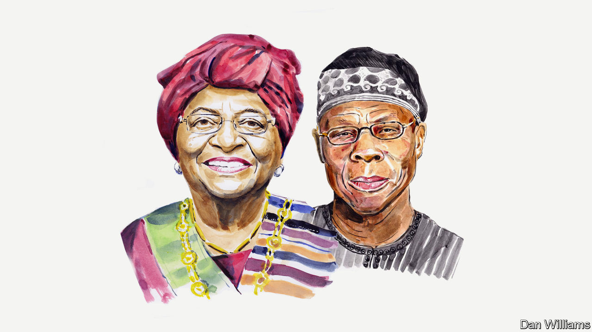

###### Russia and Ukraine

# There will be African victims of Russia’s war, warn Ellen Johnson Sirleaf and Olusegun Obasanjo 

##### The former presidents of Liberia and Nigeria believe the UN is no longer fit for purpose 

 

> Jun 19th 2022 

THE CONTINUATION of the  is of great concern to Africa. It is time that Africans spoke out in our continent’s interests. 

Even before the war, Africa faced a perfect storm. It suffered from isolation from  during covid-19, stalling the economic recovery that was beginning to take shape. A , with 25 African countries in debt distress or at high risk of defaulting, with Zambia and Nigeria among the worst affected. This is all happening against the backdrop of a rapid demographic change. The continent’s  to 2.5bn over the next generation, and most of this new cohort will live in cities. Although the shift will bring advantages, it will also place greater pressure on food supplies and on infrastructure.

Now the , too, hangs over Africa. It has been accelerated by the war in Ukraine, which will affect the cost of food in particular. Many countries across north Africa and regional powers such as Ethiopia and Kenya depend on imports from Ukraine or Russia. According to the African Development Bank, wheat prices have risen by no less than 60% in recent months. To compound the shortages, there is likely to be a 2m-tonne deficit in fertilisers for African fields, resulting in a 20% smaller harvest.

Unlike covid-19, this unfolding catastrophe is a choice. Whether we like it or not, that choice is primarily in the hands of Russia’s President Vladimir Putin, who has the power to stop the war and to allow the resumption of wheat exports from the conflict zone.

Although most African countries have called on Russia to stop the invasion through a UN resolution, many others have chosen the path of silence or neutrality. This, too, is not the right path. But criticism of the decision to invade Ukraine will not, on its own, produce the conditions for a peaceful outcome. What is needed is an acceptable off-ramp for both sides that silences the guns and leads to a return to respect for sovereignty, dialogue and a political solution. 

We need a strong drive for peace, security, co-operation and stability in Russia-Ukraine relations. To achieve this requires three components: strong external pressure on warring parties to talk and to keep talking until there is a resolution; an internal willingness among all parties to prefer peace to war; and, possibly most important, strong leadership willing to bring the peace process to a conclusion and to accept necessary compromises.

Yet the absence of a united stance among African countries has allowed a sophisticated game of diplomatic charades. Most recently, the chair of the African Union, Senegal’s President Macky Sall, met Mr Putin. Mr Sall said that sanctions against Russia were the reason why grain stocks and fertiliser were not being exported from Ukraine and Russia.

At that very moment, however, Ukrainian wheat stores and supplies were being destroyed and stolen by Russian soldiers. Ukraine used to supply half of the world’s exports of sunflower oil. When a two-storey silo containing sunflower meal is destroyed, the cost to Africa is immediate and immense.

We need to act to end this war. Russia, which launched the conflict, has to accept the primary responsibility for initiating action to stop it. And Ukraine must be ready to respond positively. But a permanent solution is wider than the current protagonists alone. It must encompass a reset in our global security architecture.

Its dysfunction can no better be illustrated than by the participation of one of the five permanent members of the UN Security Council members in the war. This neuters the UN’s response. The institution is no longer fit for purpose. It is time for a re-ordering of international relations.

The UN Security Council is an artefact of the cold war. It needs overhauling so it becomes more representative. Africans must have a voice and cease to be passive spectators as global events pummel our continent.

UN agencies need more resources so as to minimise disruption to the flow of basic commodities such as grains and fertilisers. If disruption occurs, they must ensure that Africa is not the continent left behind while the wealthier world secures supplies.

We write as African leaders who have acted to end vicious, destructive wars in our own countries and to pursue the establishment of credible, lasting peace. Such processes are fraught and difficult. Leadership is required to stay the course and keep talking even when your friends and allies want war to continue. Those in power must consider the consequences of their actions for humanity. And the watching world should push for a resolution in Ukraine. We hope one can be found before millions are harmed and killed in the developing world. The time for peace is always now.■


