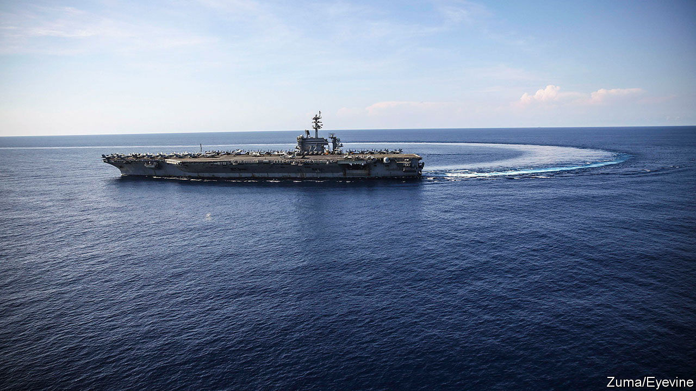
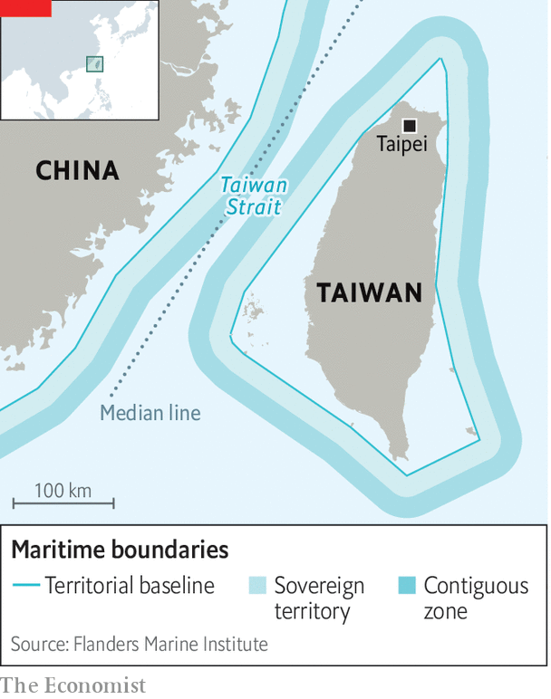

###### Whose is it?

# America and China spar over the Taiwan Strait 

##### Tensions in the region are simmering, not least over use of the waterway 

 

> Jun 23rd 2022 

To chinese nationalists, keen to see America pushed from their country’s backyard, the words of a foreign-ministry official have brought hope. Describing the Taiwan Strait as international waters is a “false claim”, the spokesman said on June 13th. China, he insisted, has “sovereignty, sovereign rights and jurisdiction” over the waterway. His words were aimed at America, which calls it international waters and often angers China by sailing warships through it. Soon “the dragon will fight the tiger” in the strait, a Chinese academic warned in an online article. 

The strait is an important thoroughfare for commercial shipping as well as foreign naval vessels. The latter are mainly American, but in recent years—as a gesture of support—some American allies have also occasionally sailed their warships through. The Chinese spokesman was responding to a report by Bloomberg, a news agency, that Chinese military officers, during meetings in recent months with American counterparts, have repeatedly asserted that there are no international waters there. It said this had caused concern among senior American officials.

At least in public, China’s argument does not appear to have changed. It does not explicitly say that all waters in the strait are its sovereign territory. The words “sovereignty, sovereign rights and jurisdiction” refer to the various types of control to which it claims a right in different parts of the strait, which varies in width from 70 to 220 nautical miles. 

 


China gives these areas the same names, and specifies their width, as other countries do under the un Convention on the Law of the Sea, or unclos (which China has ratified and America has not). It counts the area between its “territorial baseline” and a parallel line 12 nautical miles seaward as sovereign territory (see map). It claims the next 12 nautical miles beyond that as a “contiguous zone” where it has broad law-enforcement rights. That zone, and a band of sea beyond that, form the country’s “exclusive economic zone”, or eez. If there were space (which there is not in the Taiwan Strait), this could stretch to 200 nautical miles from the baseline. 

Like most other countries, America treats eezs as the high seas, accepting only a few restrictions such as on rights to fishing and the extraction of minerals. China has a more sweeping view of its rights. It objects to any intelligence-gathering or exercises by military vessels or aircraft in its eez. It also demands that foreign military vessels passing through the first 12-nautical-mile band (exercising “innocent passage”, as unclos calls it) get permission first. America refuses to comply. 

China’s public statements often use language that blurs the distinction between sovereign waters and the eez. That may be intentional. It would clearly like others to believe it can veto any military passage through the strait. It regards transits by Western powers as expressions of solidarity with Taiwan, which China claims as its territory. In a commentary in the , a nationalist tabloid in Beijing, the newspaper’s former editor said all of America’s transits were “blatant declarations of support for the Taiwan authorities and muscle-flexing against the mainland” as well as “infringements against China’s sovereign rights”—implying that those rights extend far beyond the economic realm in the eez.

America would be right to worry. Tensions are simmering in the region. On June 21st Taiwan scrambled jets after 29 Chinese military aircraft entered its air-defence zone. In recent years Taiwan has often reported such forays. In May it said a Chinese attack helicopter had crossed the “median line” in the strait, the first such incursion across that informal military boundary since 2020. The probes appear to be aimed in part at showing displeasure with American gestures of support for Taiwan.

China’s nationalists bray for their country to get tougher. “When a friend comes, there is good wine, and when a jackal comes, there is a shotgun to greet it,” thundered an editorial in the . “Here is our advice to those foreign warships which want to make provocations in the Taiwan Straits: Look out!” China’s government may not be so explicit in its public language, but its frustrations are clear. ■

